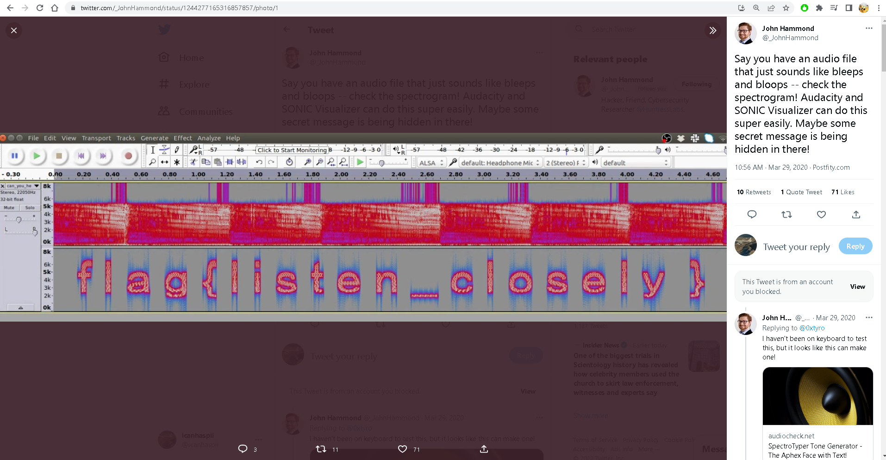

# icanhaspii-CTF CheatSheet
## These are my CTF Hacks!  I hope you enjoy!

   
  
[Linux Analysis Commands - file]

Run this to determine what type of file you are dealing with:  
  

   
  
[Linux Analysis Commands - binwalk]

Run this to view a summary of the file contents:  
  

   
  
[Linux Analysis Commands - strings]

Run this to get the list of printable characters from files.  You can even run strings on a Pcap!  Or, say for example, that you have something you think contains a flag and you know that flag is in the typical CTF format of flag{some_bonus}, you can run the following to cut down on the amount of data you have to parse through. The following will only yield lines of 8 characters or more:  
  
You can also combine strings and grep:  

   
  
[Linux Analysis Commands - java -jar]

The java -jar command will open a .jar file:  
  

   
  
[Linux Analysis Commands - java]

The java command will open a .java file:  
  

   
  
[Linux Analysis Commands - base64]

The base64 decode command will decode a b64 string.  There’s more than one way to invoke the base64 decode command, here are few:  
1. Grab a base64 encoded string such as: Umlja19SMGxsM2Q=  
2. Type the following into your Linux command prompt to echo/print to screen:  
echo 'Umlja19SMGxsM2Q=' | base64 -d  
3. Hit ENTER  
  
4. If you’re feeling really fancy, and you are playing a CTF, you can run the following to echo/print your decoded b64 in standard flag format to your screen:  
echo "flag{$(echo 'Umlja19SMGxsM2Q=' | base64 -d)}"  
  
-Here’s another way:  
1. Grab a base64 encoded string such as: Umlja19SMGxsM2Q=  
2. Type the following into your Linux command prompt:  
Base64 –d  
3. Hit ENTER  
  
4. At the prompt, paste in your base64 encoded string:  
  
5. Hit ENTER again:  
  
6. Finally, hit Control-D on your keyboard:  
  
-And yet another method:  
1. Save your base64 encoded string into a text editor:  
  
2. Type the following into your Linux command prompt to echo/print to screen:  
base64 -d dns.txt >decoded.txt  
  
3. Open your new file, “decoded.txt”:  
  
If you run across encoding similar to below:  
IO.Compression.DeflateStream([IO.MemoryStream][Convert]::FromBase64String  
[IO.Compression.CompressionMode]::Decompress  
You can try the following “Recipe” in CyberChef to decode:  
(a)From_Base64('A-Za-z0-9%2B/%3D',true,false)  
(b) Raw_Inflate(0,0,%5B'Adaptive','Block'%5D,false,false)  

   
  
[Linux Analysis Commands - ifconfig]

To find your ip address and network configuration, you can use the old ifconfig command (considered depreciated), or the newer ip address command.  It works with any of the following, and of course more in depth combined with switches:  
  
  
  

   
  
[Linux Analysis Commands - realpath]

realpath converts each filename argument to an absolute pathname, which has no components that are symbolic links or the special . or .. directory entries. Each path component in the filename must exist, otherwise realpath will fail and non-zero exit status will be returned.  
href="https://www.google.com/url?q=https://linux.die.net/man/1/realpath&amp;sa=D&amp;source=editors&amp;ust=1699590511374365&amp;usg=AOvVaw1FkT0L7tNSOCrQIqhPv2FA">https://linux.die.net/man/1/realpath</a>  

   
  
[Linux Analysis Commands - SSH]

To find your ip address and network configuration, you can use the old ifconfig command (considered depreciated), or the newer ip address command.  It works with any of the following, and of course more in depth combined with switches:  
https://www.lrz.de/services/compute/courses/x_lecturenotes/191007_OpenSSH_Tutorial_2019.pdf  
https://opensource.com/article/20/9/ssh  
  

   
  
[Linux Analysis Commands - chmod]

chmod +x  
Note: chmod +x (plus x) stands for execute.  
Question:  
I want to write the Ubuntu analogue of a "batch file" (a shell script). But I don't know how to use chmod +x filename command to make it so that the script can be run. Nor do I know where to use it.  
Answer:  
chmod +x on a file (your script) only means, that you'll make it executable. Right click on your script and chose Properties -> Permissions -> Allow executing file as program, leaves you with the exact same result as the command in terminal.  
If a file you want to change permissions on is located within the systems directory you may need to be root, like so: (be careful, while using sudo command)  
sudo chmod +x /usr/share/testfolder/aFile  
https://askubuntu.com/questions/443789/what-does-chmod-x-filename-do-and-how-do-i-use-it  
Question:  
What is the difference between chmod u+x and just chmod +x? I have seen a ton of tutorials that say to use u+x to make scripts executable. However, omitting the u doesn't seem to have any effect.  
Answer:  
The man page of chmod covers that.  
u stands for user.  
g stands for group.  
o stands for others.  
a stands for all.  
That means that chmod u+x somefile will grant only the owner of that file execution permissions whereas chmod +x somefile is the same as chmod a+x somefile. 
<a href="https://askubuntu.com/questions/29589/chmod-ux-versus-chmod-x" target="_blank">https://askubuntu.com/questions/29589/chmod-ux-versus-chmod-x</a>  

   
  
[Linux Analysis Commands - chown]

To give a file permissions so that a regular user can move it or edit it, you can run the following:  
# chown kali NTUSER.DAT.dat  

   
  
[Linux Analysis Commands - Bash]

Bash (Bourne-Again SHell) is one of the most commonly used Unix/Linux shells and is the default shell in many Linux distributions.  
<a href="https://www.freecodecamp.org/news/bash-scripting-tutorial-linux-shell-script-and-command-line-for-beginners" target="_blank">https://www.freecodecamp.org/news/bash-scripting-tutorial-linux-shell-script-and-command-line-for-beginners</a>  
Some of the main delimiters (terminators or redirectors) for Bash commands are as follows: 
whoami; whoami 
whoami| 
> (output to) 
|| (double pipe) 

   
  
[Linux Analysis Commands - grep]

Some common grep options:  
  
  
grep example: cat cowrie.log.wwhf2020_lab2 | grep CMD  
  
  
Count w/ grep:  
  
  

   
  
[Linux Analysis Commands - curl]

Curl is useful in transferring data without user interaction.  
curl http://nidus-setup:8080  
curl -X POST http://nidus-setup:8080/api/cooler -H "Content-Type: application/json" --data-binary '{"temperature":1000}'  
  

   
  
[Pcap Analysis - strings]

You can run strings on a Pcap! Below are a couple examples (I like to pipe my results to a .txt file for easier review):  
  

   
  
[Pcap Analysis - TShark]

<a href="https://osqa-ask.wireshark.org/questions/38071/how-to-extract-ip-addresses-from-cap-file-to-text-file" target="_blank">You can extract ip addresses from a Pcap using Tshark</a>  
To extract just the destination ip, type the following command:  
  
To extract both the destination ip and the source ip, type the following command:  
  

   
  
[Pcap Analysis - Zeek]

Zeek installs itself here:  
  
To export logs from a Pcap into Zeek format, type the following syntax (r is for read):  
  

   
  
[Pcap Analysis - RITA]

RITA (Real Intelligence Threat Analytics):  
<a href="https://www.activecountermeasures.com/free-tools/rita" target="_blank">RITA is named in honor of John Strand’s mother who is no longer with us but will always be remembered in this loving way</a>  
<a href="https://www.youtube.com/watch?v=QcQmG5KTLpo&ab_channel=ActiveCountermeasures" target="_blank">Chris Brenton has a fantastic install video</a>  
To import logs from Zeek format into RITA, navigate via command line to the folder where your exported Pcap logs are:  
  
Next, type the following syntax (LogsOily was the name of my pcap, so I called the output folder for RITA the same name):  
  
RITA will tell you when it’s done:  
  

   
  
[Pcap Analysis - TCPflow]

TCPflow is a command-line tool for processing streams. 
<a href="https://linux.die.net/man/1/tcpflow" target="_blank">https://linux.die.net/man/1/tcpflow</a> 
<a href="https://www.geeksforgeeks.org/tcp-flow-analyze-and-debug-network-traffic-in-linux/#" target="_blank">https://www.geeksforgeeks.org/tcp-flow-analyze-and-debug-network-traffic-in-linux/#</a> 
<a href="https://simson.net/ref/2013/2013-12-05_tcpflow-and-BE-update.pdf" target="_blank">https://simson.net/ref/2013/2013-12-05_tcpflow-and-BE-update.pdf</a>  
  
  

   
  
[Audio - Decoders/Analyzers]

Note from Dcode regarding T9 vs Multitap Confusion: 
Multitap ABC should not be confused with T9 predictive text. For example,'DCODE' is written '3222666333' in Multitap and '32633' in T9. 
<a href="https://twitter.com/_johnhammond/status/1244277165316857857?lang=en" target="_blank">https://twitter.com/_johnhammond/status/1244277165316857857?lang=en</a>  
  
<a href="https://www.audacityteam.org/download" target="_blank">https://www.audacityteam.org/download</a> 
<a href="https://www.sonicvisualiser.org/download.html" target="_blank">https://www.sonicvisualiser.org/download.html</a> 
<a href="http://dialabc.com/sound/detect/index.html" target="_blank">http://dialabc.com/sound/detect/index.html</a> 
<a href="http://www.polar-electric.com/DTMF/Index.html" target="_blank">http://www.polar-electric.com/DTMF/Index.html"</a> 
<a href="https://forums.radioreference.com/threads/twotonedetect-beta.120010" target="_blank">https://forums.radioreference.com/threads/twotonedetect-beta.120010</a> 
<a href="https://onlinetonegenerator.com/dtmf.html" target="_blank">https://onlinetonegenerator.com/dtmf.html</a> 
<a href="https://www.venea.net/web/dtmf_generator" target="_blank">https://www.venea.net/web/dtmf_generator</a> 
<a href="https://github.com/ribt/dtmf-decoder" target="_blank">https://github.com/ribt/dtmf-decoder</a> 
<a href="https://www.dcode.fr/multitap-abc-cipher" target="_blank">https://www.dcode.fr/multitap-abc-cipher</a> 
<a href="https://www.dcode.fr/t9-cipheraudi" target="_blank">https://www.dcode.fr/t9-cipheraudi</a> 
<a href="https://www.windows7download.com/win7-dtmf-tone-decoder/mgbuqfct.html" target="_blank">https://www.windows7download.com/win7-dtmf-tone-decoder/mgbuqfct.html</a>  
<a href="http://www.windows7download.com/win7-dtmf-tone-decoder/download-mgbuqfct.html" target="_blank">http://www.windows7download.com/win7-dtmf-tone-decoder/download-mgbuqfct.html</a>  
<a href="https://www.windows7download.com/win7-dtmf-tone-decoder/download-mgbuqfct.html" target="_blank">https://www.windows7download.com/win7-dtmf-tone-decoder/download-mgbuqfct.html</a>  
<a href="https://dtmf.netlify.app" target="_blank">https://dtmf.netlify.app</a> 
<a href="https://jpinsoft.net/deepsound/download.aspx" target="_blank">https://jpinsoft.net/deepsound/download.aspx</a> 
<a href="https://www.youtube.com/watch?v=VZbZa99ocPU&ab_channel=mdthib" target="_blank">https://www.youtube.com/watch?v=VZbZa99ocPU&ab_channel=mdthib</a> 
<a href="https://www.youtube.com/watch?v=rAGkm4pv44s" target="_blank">https://www.youtube.com/watch?v=rAGkm4pv44s</a> 
<a href="https://www.aperisolve.com" target="_blank">https://www.aperisolve.com</a> 
<a href="https://www.aperisolve.com/cheatsheet" target="_blank">https://www.aperisolve.com/cheatsheet</a> 
<a href="https://www.dcode.fr/spectral-analysis" target="_blank">https://www.dcode.fr/spectral-analysis</a> 
<a href="https://gqrx.dk" target="_blank">https://gqrx.dk</a>  

  
[Audio - Extract Morse Code from an audio file]

<a href="https://morsecode.world/international/decoder/audio-decoder-adaptive.html" target="_blank">https://morsecode.world/international/decoder/audio-decoder-adaptive.html</a> 
<a href="https://databorder.com/transfer/morse-sound-receiver" target="_blank">https://databorder.com/transfer/morse-sound-receiver</a>  

  
[Large Number/Big Integer/Big Number converter]

<a href="http://www.onedollardata.com/encoder.php" target="_blank">http://www.onedollardata.com/encoder.php</a>  

  
[Stego - Some Resources]

https://fareedfauzi.gitbook.io/ctf-checklist-for-beginner/steganography 
<a href="https://www.kali.org/tools/steghide" target="_blank">https://www.kali.org/tools/steghide</a> 
<a href="https://steghide.sourceforge.net" target="_blank">https://steghide.sourceforge.net</a> 
<a href="https://www.geeksforgeeks.org/how-to-install-steghide-tool-in-linux" target="_blank">https://www.geeksforgeeks.org/how-to-install-steghide-tool-in-linux</a> 
<a href="https://stegonline.georgeom.net/upload" target="_blank">https://stegonline.georgeom.net/upload</a> 
<a href="http://magiceye.ecksdee.co.uk" target="_blank">http://magiceye.ecksdee.co.uk</a> 
<a href="https://manytools.org/hacker-tools/steganography-encode-text-into-image" target="_blank">https://manytools.org/hacker-tools/steganography-encode-text-into-image</a> 
<a href="https://www.mobilefish.com/services/steganography/steganography.php" target="_blank">https://www.mobilefish.com/services/steganography/steganography.php</a> 
<a href="http://stylesuxx.github.io/steganography" target="_blank">http://stylesuxx.github.io/steganography</a> 
<a href="https://futureboy.us/stegano" target="_blank">https://futureboy.us/stegano</a> 
<a href="https://neatnik.net/steganographr" target="_blank">https://neatnik.net/steganographr</a> 
<a href="https://wiki.bi0s.in/steganography/zsteg" target="_blank">https://wiki.bi0s.in/steganography/zsteg</a> 
<a href="https://github.com/zed-0xff/zsteg" target="_blank">https://github.com/zed-0xff/zsteg</a> 
<a href="https://github.com/ragibson/Steganography#WavSteg" target="_blank">https://github.com/ragibson/Steganography#WavSteg</a> 
<a href="https://github.com/ragibson/Steganography#lsbsteg" target="_blank">https://github.com/ragibson/Steganography#lsbsteg</a> 
<a href="https://github.com/ragibson/Steganography#stegdetect" target="_blank">https://github.com/ragibson/Steganography#stegdetect</a> 
<a href="https://github.com/pavanchhatpar/wav-steg-py" target="_blank">https://github.com/pavanchhatpar/wav-steg-py</a> 
<a href="https://0xrick.github.io/lists/stego" target="_blank">https://0xrick.github.io/lists/stego</a> 
<a href="https://www.linuxlinks.com/wavsteg-uses-least-significant-bit-steganography" target="_blank">https://www.linuxlinks.com/wavsteg-uses-least-significant-bit-steganography</a> 
<a href="https://www.abc.se/~re/Coagula/Coagula.html" target="_blank">https://www.abc.se/~re/Coagula/Coagula.html</a> 
<a href="https://www.stenge.info/post/steganography" target="_blank">https://www.stenge.info/post/steganography</a> 
<a href="https://cheatography.com/aleksandrm/cheat-sheets/coagula-cheat-sheet" target="_blank">https://cheatography.com/aleksandrm/cheat-sheets/coagula-cheat-sheet</a> 
<a href="https://github.com/zardus/ctf-tools/blob/master/stegsolve/install" target="_blank">https://github.com/zardus/ctf-tools/blob/master/stegsolve/install</a> 
<a href="http://www.caesum.com/handbook/Stegsolve.jar" target="_blank">http://www.caesum.com/handbook/Stegsolve.jar</a> 
<a href="https://www.hanynet.com/isteg" target="_blank">https://www.hanynet.com/isteg</a> 
<a href="https://github.com/rafiibrahim8/iSteg" target="_blank">https://github.com/rafiibrahim8/iSteg</a>  

  
[Stego - iSteg]

https://github.com/rafiibrahim8/iSteg 
1. Navigated to: https://github.com/rafiibrahim8/iSteg/releases/tag/v2.1. 
2. Downloaded the file: iSteg-v2.1_GUI.jar. 
3. Ran chmod +x on the download file to give it executable permissions. 
└─# chmod +x iSteg-v2.1_GUI.jar 
4. Launched the program in Java: 
└─# java -jar iSteg-v2.1_GUI.jar 
  
5. Chose the hidden.png file and it opened to the flag, flag{YouFoundMe}: 
  

  
[StegSolve]

https://github.com/zardus/ctf-tools/blob/master/stegsolve/install 
http://www.caesum.com/handbook/Stegsolve.jar 
1. wget http://www.caesum.com/handbook/Stegsolve.jar -O stegsolve.jar 
2. chmod +x stegsolve.jar 
3. Run by typing: java –jar stegsolve.jar (make sure you’re in the same directory) 
4. Choose “File” --> Open and load your picture: 
  

